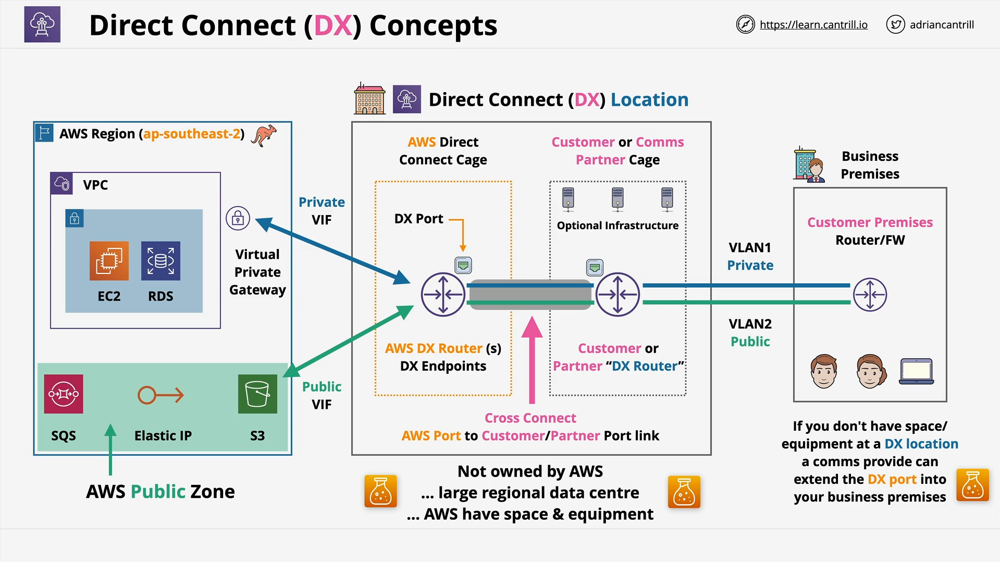

# AWS Direct Connect

## Overview

**AWS Direct Connect** (DX) provides a **dedicated physical connection** between your business premises and an AWS region.  
It enables **low-latency**, **high-speed**, and **consistent** network connectivity without using the public internet.

## Key Concepts

### 1. What is AWS Direct Connect?

- A **physical network connection** to an AWS region.
- Provisioned at **1 Gbps**, **10 Gbps**, or **100 Gbps** speeds.
- Slower speeds are available via separate options (covered later).
- Connects **three main points**:
  - Your **business premises** (Customer Router)
  - A **Direct Connect (DX) location** (Data center)
  - An **AWS Region** (Cloud infrastructure)

### 2. Ordering a Direct Connect

- When you order Direct Connect, you are **ordering a network port** at a DX location.
- AWS only **allocates the port**.
- **Connection responsibility**:
  - You must arrange connection between your premises and the DX port.
  - This could involve your own setup or hiring a **communications partner**.

### 3. Direct Connect Costs

- **Hourly port cost**:
  - Depends on **speed** and **location**.
- **Outbound data transfer cost**:
  - **Inbound data transfer is free**.

### 4. Important Characteristics

- **Provisioning Time**:
  - AWS port allocation may take time.
  - Additional weeks/months needed to physically connect your network.
- **Resilience**:
  - A **single DX connection has no built-in redundancy**.
  - To achieve resilience, provision **multiple DX connections**.
- **Latency**:
  - Provides **low and consistent latency** because it avoids the public internet.
- **Speed**:
  - Offers **higher and more reliable speeds** compared to VPNs.
- **Access**:
  - Access **AWS private services** (VPC resources) and **public AWS services**.
  - **Cannot access the public internet** directly without additional appliances (e.g., proxy servers).

## Physical Architecture of AWS Direct Connect

```
Business Premises > DX Location > AWS Region
```

### Components:

#### Business Premises:

- Equipment like:
  - **Customer Premises Router (CPR)** or **Firewall**.
- Staff users (e.g., Bob and Julie).

#### DX Location:

- A **third-party datacenter** where AWS rents space.
- Includes:
  - **AWS Cage** (AWS DX Routers)
  - **Customer Cage** or **Communications Partner Cage**:
    - Your own router
    - Or partner’s router if you lease from a comms provider.
- **Cross Connect**:
  - A **fiber cable** connecting the AWS port and your router (or comms partner’s).

#### AWS Region:

- Services inside the VPC (private networking).
- AWS public services (like **S3**, **Elastic IPs**, **SQS**).
- High-speed links between the DX location and the AWS infrastructure.

## Logical Architecture - Virtual Interfaces (VIFs)

Over the physical Direct Connect line, **Virtual Interfaces (VIFs)** must be configured:

### Types of VIFs:

| Type            | Purpose                                                                       |
| :-------------- | :---------------------------------------------------------------------------- |
| **Transit VIF** | Used with AWS Transit Gateway.                                                |
| **Public VIF**  | Access AWS public services (e.g., S3, DynamoDB).                              |
| **Private VIF** | Access private services inside VPCs (e.g., EC2 instances, private endpoints). |

Each VIF determines **which AWS resources** your Direct Connect line can reach.

## Visual Architecture Summary



# Additional Notes

- DX locations are **not owned** by AWS, but third-party datacenters.
- **Cross Connect** setup is **mandatory** — physical cabling between AWS equipment and yours or your partner’s.
- **Low Latency & High Bandwidth**:
  - Ideal for **hybrid cloud** architectures where consistent performance is critical.

# Conclusion

AWS Direct Connect is the preferred method when you need:

- **High performance** networking,
- **Low, predictable latency**,
- **Consistent throughput**, and
- **Access to AWS services** without exposing traffic to the public internet.
