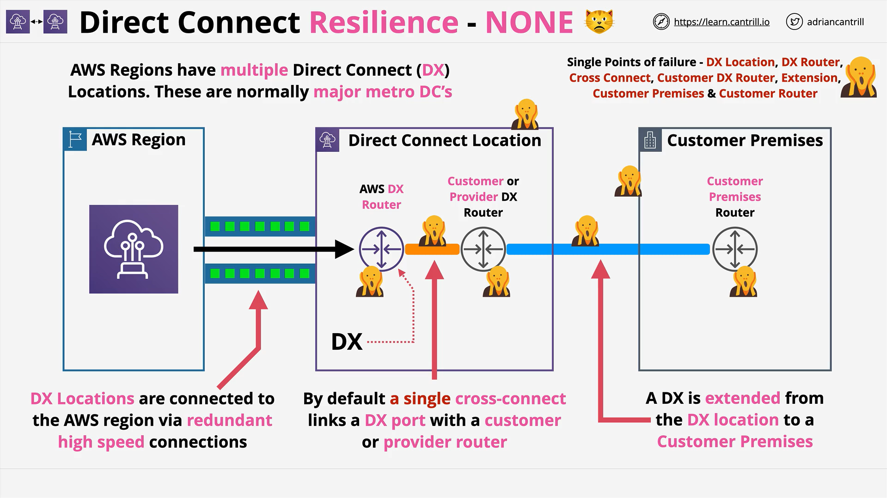
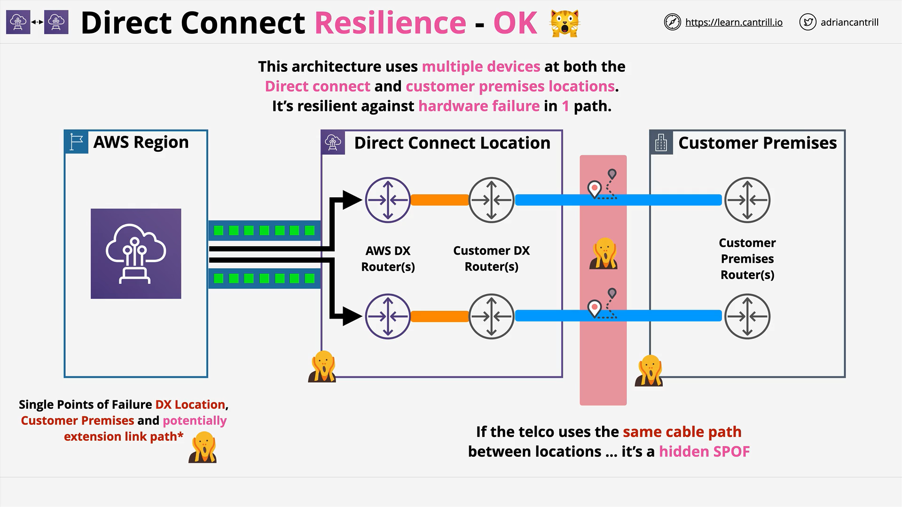
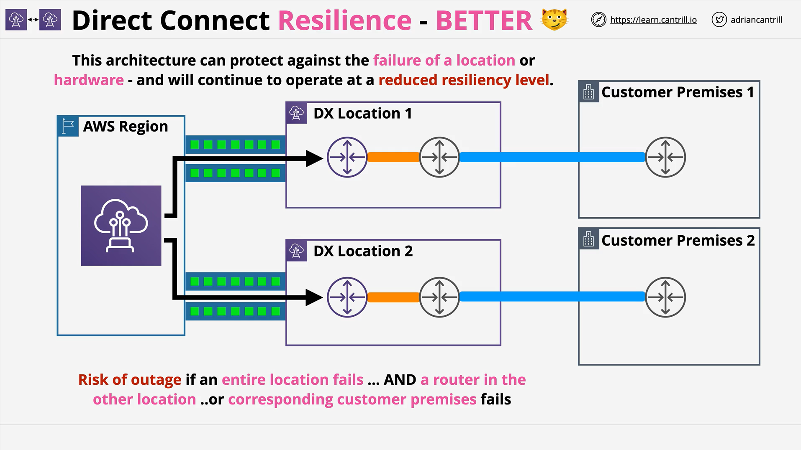
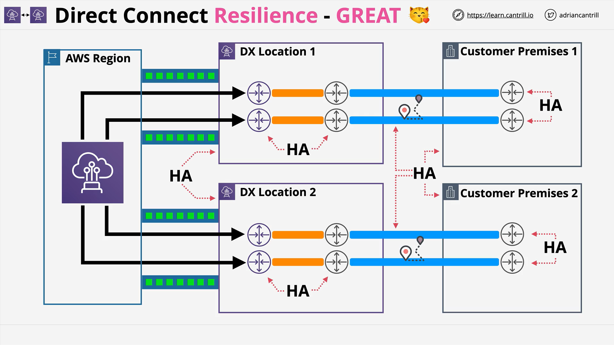

# AWS Direct Connect (DX) Resilience Architectures

## Overview

As a cloud architect, understanding failure points and how to design **resilient AWS Direct Connect (DX) architectures** is critical. Direct Connect is not inherently resilient — resilience must be **intentionally designed**.

## Basic Direct Connect Architecture (Non-Resilient)

A typical DX deployment includes:

- **AWS Region**: The AWS services infrastructure.
- **DX Location**: A physical data center with AWS DX routers.
- **Customer Premises**: Customer office or data center.

**Connection Flow:**

1. AWS Region connects to DX Location (high-speed, highly available).
2. At DX Location:
   - AWS DX Router (AWS-owned).
   - Customer or Provider DX Router (customer or telco-owned).
3. A **cross-connect** (physical cable) links the AWS DX router and the customer/provider DX router.
4. **Extension**: Connection extends from DX Location to the customer premises.

> ⚡ **Key Point:**
> Every link in this chain is a potential **single point of failure**.

## Identified Single Points of Failure

- **DX Location failure** (e.g., power outage, building collapse).
- **AWS DX Router failure**.
- **Cross Connect failure** (cable damage).
- **Customer DX Router failure** (hardware fault).
- **Extension cable failure** (external works damaging cables).
- **Customer Premises failure**.
- **Customer Premises Router failure**.

> **Misconception:** Many think Direct Connect is resilient by default — **it is not**.

## Improving Resilience: Basic Redundancy

### Architecture Enhancements

- **Multiple AWS DX Ports** in a **single DX location**.
- **Multiple AWS DX Routers**.
- **Multiple Customer Routers**.
- **Multiple Cross Connects**.

> 🛡️ **Result:**
> Resilience against hardware failure in routers or cable failures.

### Remaining Risks

- **DX Location failure** still impacts connectivity.
- **Single Customer Premises failure** still disrupts access.
- **Shared cable paths**: Extensions might share physical routes, risking simultaneous damage.

## Further Resilience: Dual Locations

### Architecture Evolution

- **Two DX Locations** (geographically separated).
- **Two separate Customer Premises** (geographically separated).
- **Cross connects** between each DX location and its corresponding customer premises.

### Benefits

- Can tolerate the **failure of one DX location**.
- Can tolerate the **failure of one customer premises**.

### Remaining Risks

- If both one DX location and its corresponding customer premises fail **plus** hardware failure on the backup side, connectivity is lost.

## Maximum Resilience Architecture

### Final High-Availability Design

**Components:**

- **Two DX Locations**.
- **Two AWS DX Ports per location** (on separate equipment).
- **Two Customer DX Routers per DX Location**.
- **Two Customer Premises**, each with **two routers**.

**Resilient Connection Path:**

1. Dual DX Ports ➔ Dual Customer Routers (per DX Location).
2. Separate extensions ➔ Different Customer Premises.

> **Advantage:**
> Extreme levels of redundancy — hardware, location, and extension route failures are all mitigated.

## Key Exam and Practical Takeaways

- **Direct Connect is a physical technology**. It has **no inherent resilience** unless explicitly architected.
- A **single Direct Connect** connection = **multiple single points of failure**.
- **High availability** requires:
  - Dual ports
  - Dual routers
  - Dual locations
  - Dual premises
  - Separate extension paths
- **Site-to-Site VPNs** can also be used as a **backup** for Direct Connect.

# Visual Diagram Suggestion

If you were to diagram these architectures:

- **First Diagram**: Single DX setup showing single points of failure.
- **Second Diagram**: Dual ports setup reducing some risks.
- **Third Diagram**: Dual DX Locations and Customer Premises setup.
- **Fourth Diagram**: Maximum resilience with two routers and two ports per location.

# Final Notes

> Direct Connect **must** be intentionally designed for **resilience**. If resilience is crucial for your organization, the fully redundant architecture is highly recommended over the basic setup.
