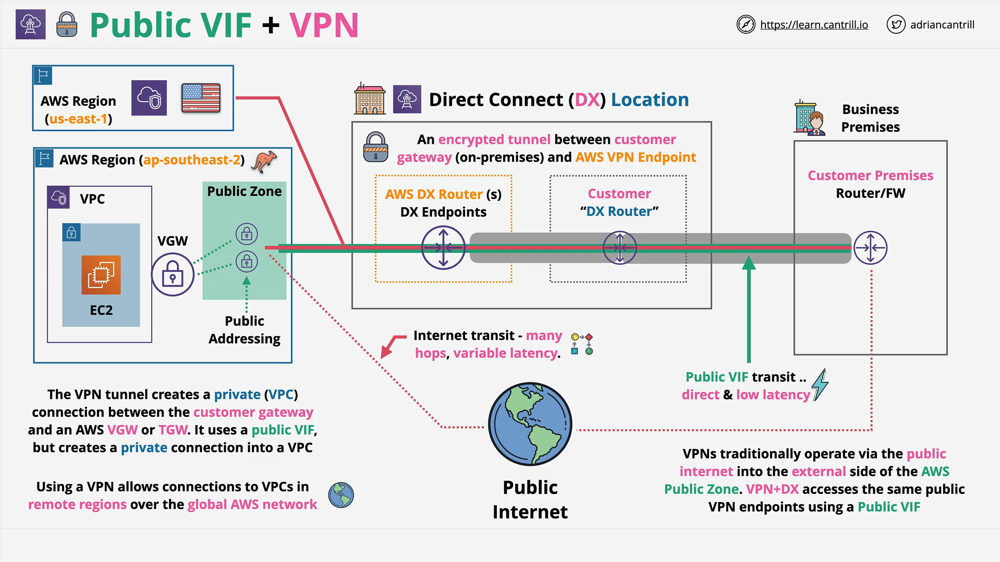

# DirectConnect, Public VIFs, and IPsec VPNs for End-to-End Encryption

## Overview

This lesson covers how to **securely access private VPC networks** using a combination of:

- **AWS DirectConnect**
- **Public VIFs (Virtual Interfaces)**
- **IPsec VPNs (Virtual Private Networks)**

The goal is to **achieve encrypted, authenticated, and low-latency network connectivity** from on-premises locations to AWS VPCs.

## Why Use a VPN over DirectConnect?

- **Encryption and Authentication**:  
  A VPN ensures that the tunnel between your on-premises environment and AWS is encrypted and authenticated, regardless of whether the traffic traverses the public internet or DirectConnect.

- **Performance Benefits**:  
  Running a VPN over DirectConnect provides both **security** and **consistent low latency**, offering better performance compared to the public internet.

## Why Use a Public VIF Instead of a Private VIF?

- **Private VIF**:  
  Grants access only to **private IP addresses** within your AWS environment.

- **Public VIF**:  
  Grants access to **public IP addresses owned by AWS**.

- **Key Reason**:  
  VPN endpoints (such as **Virtual Private Gateways** or **Transit Gateways**) have **public IP addresses**.  
  Therefore, to access them, you must use a **public VIF**, even if the goal is to reach private VPC resources securely.

> **Important Tip**:  
> Always choose your VIF type based on the **destination IP addresses** you are trying to reach.

## Characteristics of VPNs over DirectConnect

- **Transit Agnostic**:  
  VPNs work over both:

  - The **public internet**
  - A **public VIF via DirectConnect**

- **Configuration Consistency**:  
  VPN setup is identical regardless of whether traffic flows over the public internet or DirectConnect.

- **End-to-End Encryption**:  
  VPNs offer encryption from the **Customer Gateway** (your on-premises device) directly to the **AWS VPN endpoints** (Virtual Private Gateway or Transit Gateway).

## VPN vs. MACsec

- **VPN**:

  - **End-to-end encryption** from customer premises to AWS.
  - **Higher cryptographic overhead**, meaning speed can be limited by hardware performance.
  - **Vendor support** is broad; many devices support IPsec VPN.

- **MACsec**:
  - Provides **hop-by-hop encryption** between devices on the same Layer 2 network.
  - **Much faster** and supports **terabit speeds**.
  - Fewer devices support it today, but adoption is growing.

> **Key Distinction**:  
> VPNs and MACsec are **not competitors**; they serve **different use cases**.

## Practical Deployment Patterns

- **Initial VPN Setup**:

  - Since setting up a VPN is software-based and fast, it can be **deployed immediately**.
  - Meanwhile, setting up DirectConnect, which is physical, can **take days or weeks**.

- **Using VPN with DirectConnect**:

  - You can **start with a VPN** over the public internet.
  - Once DirectConnect is ready, **switch the VPN transit** to the **public VIF** for better performance.
  - Keep the VPN as:
    - **Primary encryption method** over DirectConnect
    - **Backup solution** if DirectConnect fails

- **Dual Connectivity for High Resilience**:

  - **Primary**: DirectConnect link with IPsec VPN for low-latency, high-performance encrypted access.
  - **Backup**: Regular internet connection with IPsec VPN to AWS.

  This ensures both performance and resilience.

## Visual Architecture (Described)

- **Components**:

  - AWS Regions (e.g., **us-east-1**, **ap-southeast-2**)
  - **DirectConnect location** near the on-premises business site
  - **Business premises** with a Customer Gateway device

- **VPN Endpoints**:

  - AWS deploys **two VPN endpoints** (one per Availability Zone) with **public IP addresses**.

- **Connectivity Options**:

  - Via **Public Internet** (variable latency, multiple hops)
  - Via **Public VIF over DirectConnect** (consistent low latency)

- **Global VPN Access**:
  - A single Public VIF can be used to access **VPN endpoints in multiple AWS regions** across the AWS global network.
  - This facilitates **global encrypted transit** between AWS VPCs and corporate networks.

## Key Takeaways

- **IPsec VPN over DirectConnect** provides encrypted, reliable, and high-performance connectivity.
- **MACsec and VPNs** are designed for **different purposes**; they are **not replacements** for one another.
- **Public VIF is needed** because **AWS VPN endpoints use public IPs**.
- **Deployment strategy** can start with VPN and layer on DirectConnect later for better flexibility.

# Conclusion

Understanding the architecture and **choosing the correct VIF** type based on **destination IPs** is crucial for designing resilient and secure AWS hybrid networks.
