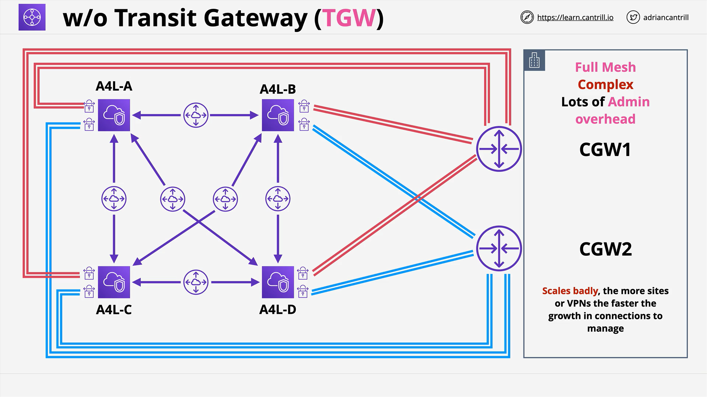
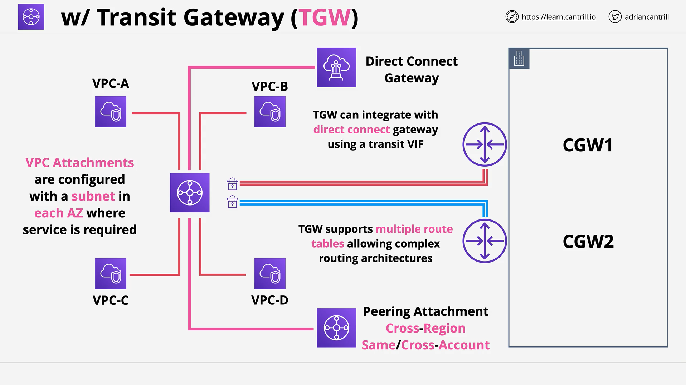

# AWS Transit Gateway (TGW)

## Overview

AWS Transit Gateway (TGW) is a **network transit hub** that connects VPCs (Virtual Private Clouds) and on-premises networks via site-to-site VPNs and Direct Connect. It is designed to simplify and scale complex network architectures by centralizing routing.

## Why AWS Transit Gateway?

- **Before TGW**:

  - Building a **full mesh** network with VPC peering becomes increasingly complex as more VPCs and corporate networks are added.
  - VPC peering is **non-transitive** (i.e., no VPC-to-VPC transit routing).
  - VPN connections add high administrative overhead and potential single points of failure (e.g., single customer gateways).

- **After TGW**:
  - **One central hub** connects VPCs and on-premises networks.
  - Simplifies routing using a single transit gateway.
  - **Transitive routing** support between VPCs and between VPCs and on-premises networks.
  - Highly scalable, highly available, and manageable.

## Key Concepts

### Transit Gateway Attachments

TGW uses **attachments** to connect to various resources:

- **VPC Attachments**: Connect VPCs to the Transit Gateway.
- **Site-to-Site VPN Attachments**: Connect on-premises VPNs to the TGW.
- **Direct Connect Gateway Attachments**: Attach to a Direct Connect gateway for private physical connectivity.

## Traditional Full Mesh vs Transit Gateway

### Traditional Architecture (Without TGW)



- Example: "Animals for Life" company with 4 VPCs (A, B, C, D) + Corporate Office.
- Using VPC Peering:
  - 6 peering connections needed (full mesh: n(n-1)/2).
  - 8 VPN tunnels needed for high availability (2 tunnels per VPC).
  - Single Customer Gateway: **single point of failure**.
  - Adding more VPCs or premises increases complexity exponentially.

### Using Transit Gateway



- Same 4 VPCs and Corporate Office.
- Create a **Transit Gateway** in AWS account.
- Attach:
  - All 4 VPCs to TGW.
  - Corporate Office via Site-to-Site VPN to TGW.
- Benefits:
  - VPCs communicate through TGW (no full mesh required).
  - Corporate Office only connects to TGW, not each VPC separately.
  - **Transitive routing** supported out of the box.
  - Reduces VPN tunnels.
  - Maintains **high availability** with multiple tunnels across AZs.

## Advanced Features of Transit Gateway

- **Transitive Routing**:  
  Enables traffic to pass through the Transit Gateway between attachments.

- **Global Networking**:

  - Peer TGWs across **AWS regions** and **accounts**.
  - Use AWS Global Network, resulting in predictable low-latency performance.

- **Resource Sharing with AWS RAM (Resource Access Manager)**:

  - Share TGWs between different AWS accounts.

- **Direct Connect Integration**:

  - Attach TGWs to Direct Connect Gateways.
  - Support for private, physical, low-latency connections.

- **Routing**:
  - Comes with a **default route table**.
  - Can create **multiple route tables** for more complex routing scenarios.

## Important Considerations

| Feature                | Details                                                            |
| :--------------------- | :----------------------------------------------------------------- |
| **Transitive Routing** | Supported between VPCs and on-premises via TGW.                    |
| **Peering**            | TGWs can peer across different AWS regions and accounts.           |
| **High Availability**  | Built-in across multiple AZs without needing manual configuration. |
| **Scalability**        | Easily handles growing numbers of VPCs and customer gateways.      |
| **Routing**            | Requires correct routing tables and entries per attachment.        |

## Diagram (Conceptual)

```
Corporate Office
    | (VPN)
Transit Gateway (TGW)
    /   |   |   \
 VPC-A VPC-B VPC-C VPC-D
```

All communications (VPC to VPC, VPC to On-Premises, etc.) route through the **Transit Gateway**.

## Summary

AWS Transit Gateway drastically simplifies and optimizes network architectures compared to traditional full-mesh VPC peering and VPN solutions. It reduces administrative overhead, scales efficiently, and enhances resiliency by centralizing and orchestrating routing for both cloud and hybrid environments.

In the upcoming **demo lesson**, you will deploy a Transit Gateway in your AWS account and replace VPC peering connections with TGW attachments to experience these benefits firsthand.
