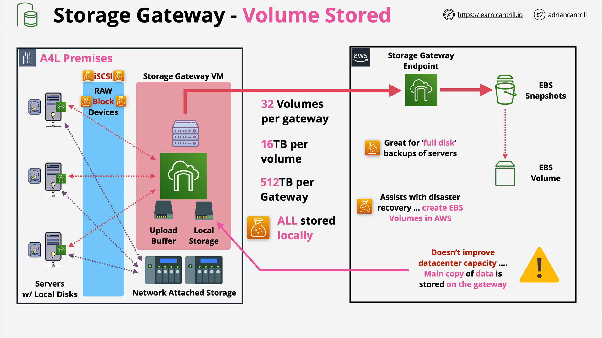
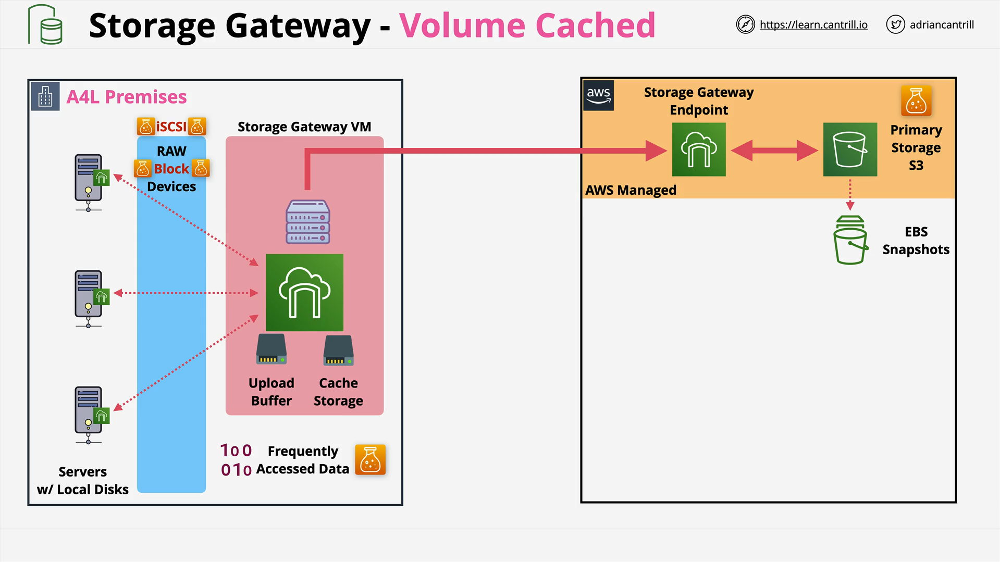
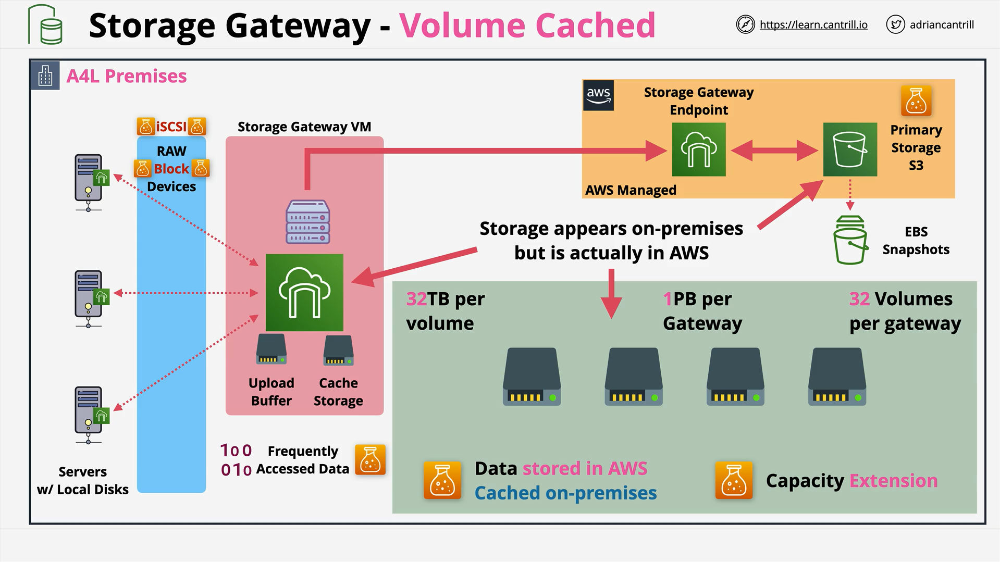

# AWS Storage Gateway - Volume Stored and Volume Cached Modes

## Overview

This section focuses on **AWS Storage Gateway**, particularly the **Volume Stored** and **Volume Cached** modes.  
The key to success in the AWS exam (and real-world architecture) is understanding **when** and **why** you would use each mode.

## Storage Gateway Basics

- **Deployment**: Primarily as a **Virtual Machine** on-premises (or optionally as a hardware appliance).
- **Protocols**:
  - **iSCSI**: For SAN/NAS block storage presentation.
  - **NFS**: Common in Linux environments.
  - **SMB**: Common in Windows environments.
- **AWS Services Integration**:
  - **EBS** (Elastic Block Store)
  - **S3**
  - **Glacier variants**

### Typical Use Cases

- Migration from on-premises to AWS
- Data center extension into AWS
- Storage tiering
- Disaster Recovery (DR)
- Replacement of legacy tape backup solutions

## Storage Gateway Architecture Overview

- Runs on-premises alongside **NAS/SAN systems**.
- Servers access local NAS/SAN storage over the **iSCSI** protocol.
- Storage Gateway bridges on-premises servers and AWS storage services.
- Useful for businesses looking to:
  - Reduce operational costs
  - Avoid building out new data centers
  - Improve disaster recovery options

# Volume Gateway: **Volume Stored Mode**



## How It Works

- **Volumes are presented via iSCSI** to local servers.
- **Primary data** is stored **locally** on-premises.
- Storage Gateway keeps a **local copy** of all data.
- **Upload buffer** temporarily stores changes, which are asynchronously sent to AWS.
- Data is uploaded to **S3** in the form of **EBS Snapshots**.

## Key Characteristics

- **Primary Storage**: On-premises.
- **AWS Usage**: Backup via EBS snapshots.
- **Latency**: Very low, as data is locally accessed.
- **Backup**: Automatic and continuous EBS snapshots in AWS.

## Advantages

- Excellent **Backup** and **Disaster Recovery (DR)** capabilities.
- Great **RPO (Recovery Point Objective)** and **RTO (Recovery Time Objective)**.
- Full disk backup possibilities through EBS Snapshots.

## Limitations

- **Does NOT help** with extending storage capacity.
- Requires enough **local storage** to hold all data.

## Performance and Scaling

- **Volumes per Gateway**: 32
- **Max Volume Size**: 16 TB
- **Max Storage per Gateway**: 512 TB

# Volume Gateway: **Volume Cached Mode**





## How It Works

- **Volumes are presented via iSCSI** to local servers.
- **Primary data** is stored in **AWS S3**.
- Only **frequently accessed** data is **cached locally**.
- Changes made locally are asynchronously pushed to AWS.

## Key Characteristics

- **Primary Storage**: AWS S3 (AWS Managed Bucket).
- **Local Cache**: Stores frequently accessed data only.
- **Latency**: Low for cached data; slower for uncached data.
- **Backup**: Still uses EBS Snapshots for backup and DR.

## Advantages

- Enables **Data Center Extension**.
- Can present **hundreds of terabytes** to local servers while consuming only **a small amount of local disk**.
- Helps organizations overcome **local storage capacity limitations**.

## Limitations

- Slight latency increase for uncached (cold) data.
- Requires consistent network connection to AWS.

## Performance and Scaling

- **Volumes per Gateway**: 32
- **Max Volume Size**: 32 TB
- **Max Storage per Gateway**: 1 Petabyte (PB)

# Quick Comparison: Volume Stored vs. Volume Cached

| Feature                      | Volume Stored Mode    | Volume Cached Mode    |
| ---------------------------- | --------------------- | --------------------- |
| Primary Storage Location     | On-Premises           | AWS (S3)              |
| Main Use Case                | Backup, DR, Migration | Data Center Extension |
| Local Disk Space Requirement | Full Data Size        | Cache Size Only       |
| Latency                      | Very Low              | Low (for cached data) |
| Backup Method                | EBS Snapshots         | EBS Snapshots         |

# Important Exam Tips

- If the question talks about **storage extension** → **Volume Cached Mode**.
- If the question talks about **low latency local access** and **full backups** → **Volume Stored Mode**.
- Remember that **"Volume"** keyword in questions always points toward **Volume Gateway** (Stored or Cached).

# Visual Summary of Data Flow

### Volume Stored Mode

```
Server (On-premises) -> Storage Gateway (VM) -> Local Disk
                                        ↳ Upload Buffer -> AWS S3 (Snapshots)
```

### Volume Cached Mode

```
Server (On-premises) -> Storage Gateway (VM) -> Local Cache -> AWS S3 (Primary Data)
                                        ↳ Upload Buffer -> AWS S3
```

# Explanation of Key Terms

- **iSCSI**: Protocol to access remote storage devices as if they were locally attached.
- **EBS Snapshot**: A backup of an Amazon EBS volume at a specific point in time.
- **Upload Buffer**: Temporary local storage where new data is held before being uploaded to AWS.
- **AWS Managed S3 Storage**: An internal S3 bucket managed by AWS, not directly accessible by users.
