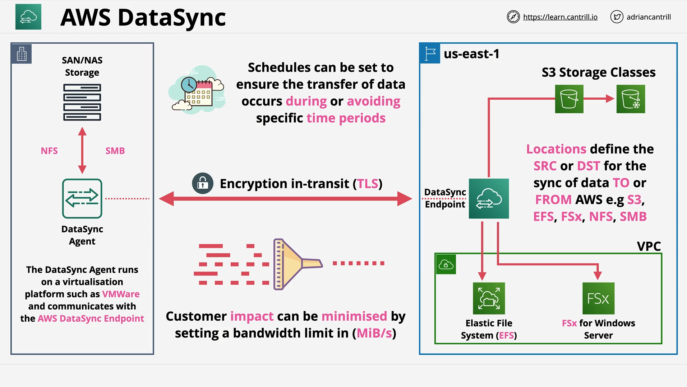

# AWS DataSync

## Introduction

AWS DataSync is an AWS-managed service for transferring data **into** or **out of** AWS environments. It is an increasingly important topic in the AWS Solutions Architect Associate (SAA-C03) exam, featuring in at least two known exam questions.

## What is AWS DataSync?

AWS DataSync is a **data transfer service** that automates moving large amounts of data between:

- On-premises storage and AWS services.
- AWS services themselves (e.g., EFS to EFS across regions).

Previously, such tasks relied on:

- Manual uploads/downloads.
- Physical devices (e.g., **Snowball**, **Snowball Edge**).

Now, DataSync manages this **end-to-end**.

## Common Use Cases

- **Data migrations** into AWS.
- **Temporary transfers** for processing.
- **Archiving** data to AWS for cost-effective storage.
- **Disaster Recovery** and **Business Continuity Planning**.

## Key Capabilities

- **Massive Scale**:
  - Each agent can handle **10 Gbps** transfer speed (~100 TB per day).
  - Each job can manage **50 million files**.
- **Metadata Transfer**:
  - Transfers file metadata like permissions and timestamps.
- **Built-in Data Validation**:
  - Ensures data integrity during transfers, critical for sensitive data like medical records.

## Core Features

| Feature                                 | Description                                                       |
| --------------------------------------- | ----------------------------------------------------------------- |
| **Scalability**                         | High data throughput with multiple agents possible.               |
| **Bandwidth Limiting**                  | Controls network usage during transfers.                          |
| **Incremental and Scheduled Transfers** | Supports moving only changed data and setting transfer schedules. |
| **Compression and Encryption**          | Secures and optimizes data in transit.                            |
| **Automatic Error Recovery**            | Handles interruptions gracefully.                                 |
| **AWS Integrations**                    | Works with **S3**, **EFS**, **FSx for Windows File Server**.      |
| **Cross-Region Transfers**              | Can move data across AWS regions.                                 |
| **Pay-as-You-Use Pricing**              | Costs depend on the amount of data transferred (per GB).          |

## High-Level Architecture

**Example:**

- **On-Premises**:

  - Data resides on a **SAN** or **NAS** device.
  - **DataSync Agent** is installed on VMware (on-premises).
  - Communicates using **NFS** (Linux/Unix) or **SMB** (Windows).

- **AWS Cloud**:
  - The agent connects securely to the **AWS DataSync Endpoint**.
  - Data is transferred to:
    - **Amazon S3**
    - **Amazon EFS**
    - **Amazon FSx for Windows**

**Options Available**:

- **Set transfer schedules** to control timing.
- **Throttle bandwidth** to avoid network congestion.

> **Note**:
> For the exam, you only need to know this high-level architecture, not the implementation details.

## Core Components of AWS DataSync

### 1. Task

- A **Task** is a **Job**.
- It defines:
  - What data is transferred.
  - Transfer speed and bandwidth settings.
  - Scheduling options.
  - Source and destination locations.

### 2. Agent

- The **Agent**:
  - Installed on-premises.
  - Interfaces with storage using **NFS** or **SMB** protocols.
  - Pulls or pushes data between on-premises systems and AWS.

### 3. Location

- Each task has **two locations**:
  - **Source**: Where the data is copied _from_.
  - **Destination**: Where the data is copied _to_.

**Supported Locations**:

- **Network File System (NFS)** – common with Linux/Unix.
- **Server Message Block (SMB)** – popular with Windows.
- **AWS Services**: Amazon S3, Amazon EFS, Amazon FSx.

## How to Choose DataSync in the Exam

Choose **AWS DataSync** when:

- You need an **electronic** transfer method (not physical like Snowball).
- Bi-directional transfers are required (both into and out of AWS).
- You need features like:
  - **Scheduling**,
  - **Bandwidth throttling**,
  - **Automatic retries**,
  - **Compression**,
  - **Handling large-scale transfers**.

When faced with exam options like DataSync vs Snowball or manual transfer methods, DataSync is the answer **if the situation demands scalable, automated, and reliable electronic data transfers**.

# Final Notes

- You will **NOT** be tested on the fine-grained setup.
- Focus on **high-level architecture**, **features**, and **when to use DataSync**.
- Understand the integration points (**S3**, **EFS**, **FSx**) and protocols (**NFS**, **SMB**).
