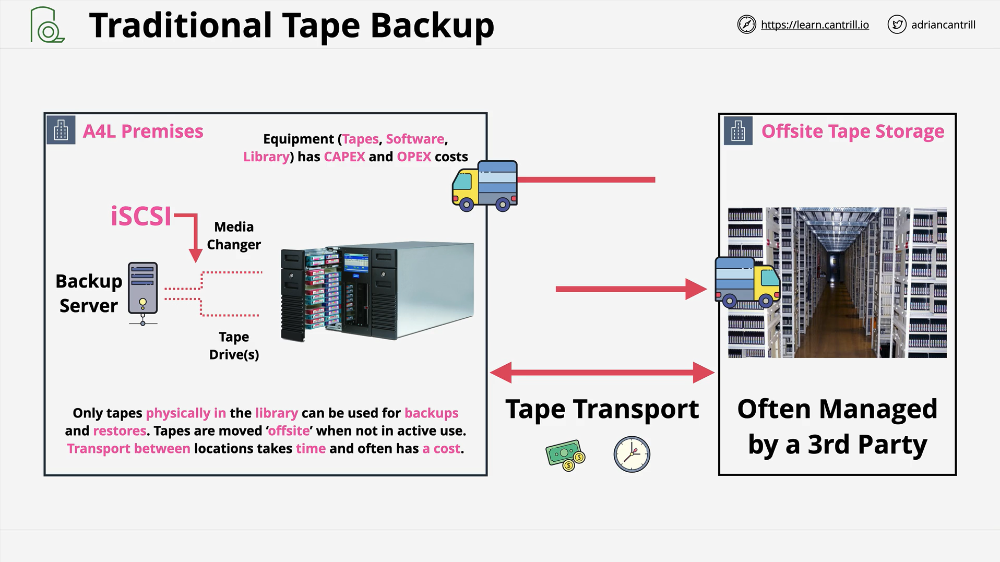
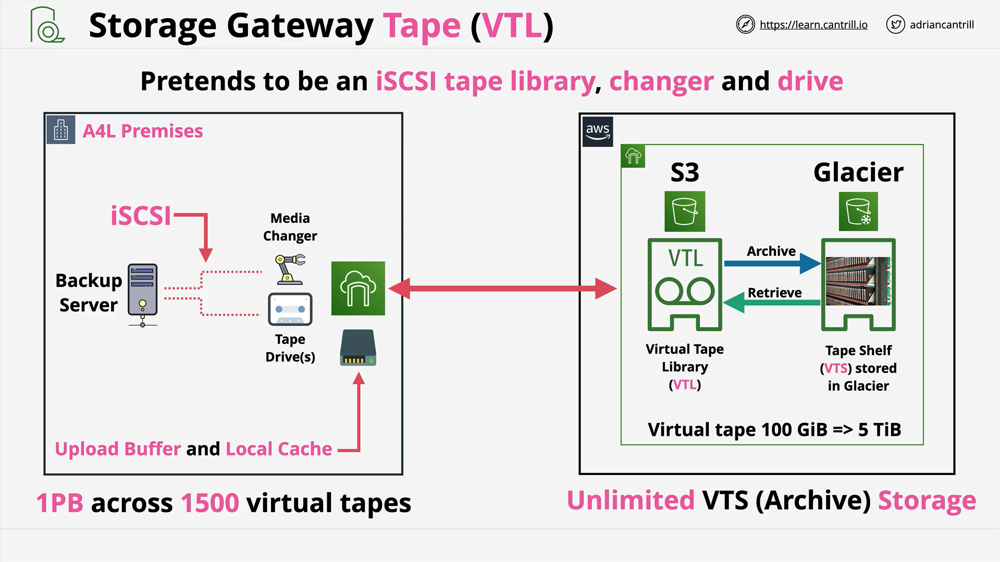

# AWS Storage Gateway - Virtual Tape Library (VTL) Mode

## Introduction to Tape Backup and Storage Gateway in VTL Mode

Storage Gateway's **Tape Gateway (VTL mode)** allows enterprises to virtualize tape backups into AWS, replacing physical tape infrastructure with AWS cloud-backed virtual tapes.

The acronym **VTL** stands for **Virtual Tape Library**.

> **Side note:** Ignore the resemblance of the VTL logo to a toilet roll.

## Understanding Traditional Tape Backup

Before exploring VTL, it’s essential to understand traditional tape-based backup systems:

- **Backup Types:**

  - Tape Backup
  - Disk Backup
  - Off-site Backup via Network Links

- **Popular Tape Technology:**

  - **LTO (Linear Tape-Open)**:
    - Newer generations like **LTO-9** can store **24 TB** uncompressed or **up to 60 TB** compressed.

- **Tape Drive Characteristics:**
  - Sequential access, not random like HDDs/SSDs.
  - To read data: the tape must be physically traversed to locate the data.
  - Updates to existing data are not possible; must overwrite entire sections.

## Components of a Physical Tape Backup System

1. **Tape Drive**:

   - Reads from or writes to tapes.

2. **Tape Loader (Robot Arm)**:

   - Mechanically inserts/removes tapes into/from drives.

3. **Tape Library**:

   - Housing that contains:
     - Tape drives
     - Tape loaders (robots)
     - Slots for idle tapes
   - Can store from a few to thousands of tapes.

4. **Tape Shelf**:
   - Off-library storage, typically at a separate location for disaster recovery.

## Traditional Tape Backup Architecture

- **On-Premises Setup:**

  - Application Servers
  - Backup Server
  - Tape Library
  - Connected via **iSCSI Protocol** (exposes tape drives and media changers).

- **Cost Considerations:**

  - High CAPEX: equipment (drives, tapes, libraries).
  - High OPEX: licensing, maintenance, staffing.
  - Transportation costs for off-site storage.

- **Problems:**
  - Expensive infrastructure.
  - Time-consuming off-site tape transportation.
  - Complexity in scaling and disaster recovery.

## AWS Storage Gateway in VTL Mode

VTL mode simplifies and reduces costs:

### Architecture Overview

- **Business Premises:**  
  Still maintain backup servers.

- **Replacement:**  
  Physical tape libraries replaced by **Storage Gateway (VTL mode)**.

- **Connection:**  
  Backup server connects to the storage gateway over **iSCSI**, believing it’s a normal tape library.

- **Operation:**  
  Backup server sees:
  - Media changer
  - Tape drives

> **No major changes** needed in backup software.

- **Storage Gateway Behavior:**
  - Local **upload buffer** and **cache** used for performance.
  - Virtual tapes stored locally first and then asynchronously uploaded to AWS.

## AWS Side of VTL Mode

1. **Virtual Tape Library (VTL):**

   - Backed by **Amazon S3**.
   - Virtual tapes range from **100 GB to 5 TB** (S3 object size limit).

2. **Virtual Tape Shelf (VTS):**
   - Archived tapes moved to **Amazon Glacier** or **Glacier Deep Archive**.
   - Provides **unlimited capacity** beyond the 1 PB limit in VTL.

## Lifecycle of Virtual Tapes

- **Active Use:**

  - Virtual tapes are stored and used in VTL backed by S3.

- **Archiving:**

  - When no longer in active use, virtual tapes are "exported" (i.e., archived).
  - Exported tapes are automatically transitioned to Glacier or Glacier Deep Archive.

- **Retrieval:**
  - Archived tapes can be retrieved back into the VTL for future access.

## Summary of Key Advantages

- **Cost Savings:**  
  Replaces expensive tape hardware and reduces maintenance and transport costs.

- **Seamless Integration:**  
  Backup servers see no difference between physical tape libraries and Storage Gateway in VTL mode.

- **Scalability:**

  - Up to **1 PB** across **1,500 virtual tapes** in active use.
  - Unlimited archival capacity.

- **Flexible Use Cases:**
  - Extend on-prem backup into AWS.
  - Migrate existing tape archives into the cloud.
  - Maintain historical tape data without legacy infrastructure.
