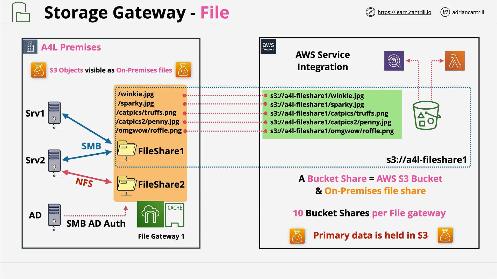
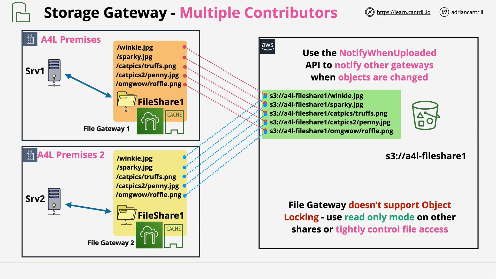
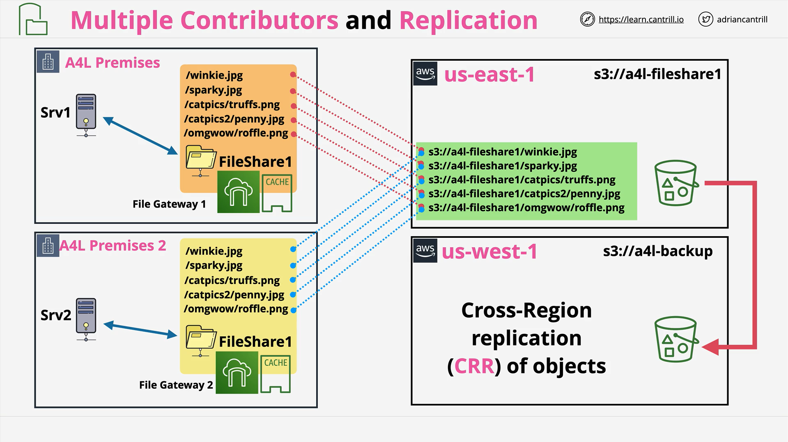
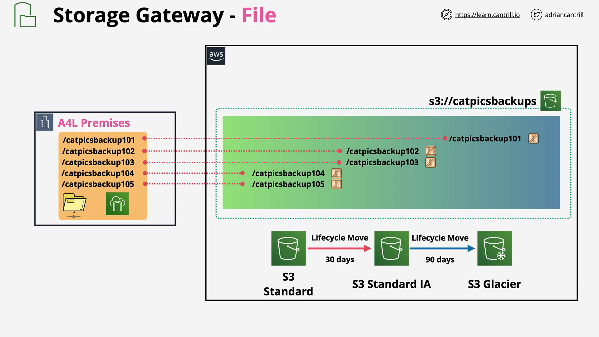

# AWS Storage Gateway - File Mode

## Overview

This section focuses on **AWS Storage Gateway running in File Mode**, expanding from previous discussions on **Volume Mode** (handling block volumes) and **VTL Mode** (virtual tape library for backup systems).  
**File Mode** allows AWS Storage Gateway to **manage files** directly.

## Key Concepts

- **Volume Mentioned → Volume Gateway**
- **Tape Mentioned → VTL Gateway**
- **File Mentioned → File Gateway**

**Keywords to recognize in exams:**

- **NFS (Network File System)** — Linux systems
- **SMB (Server Message Block)** — Windows systems

## What is File Gateway?

- **Bridges on-premises file storage to AWS S3.**
- **Creates mount points (shares)** accessed via **NFS** or **SMB** protocols.
- **Files uploaded to shares** appear as **S3 objects**.
- **S3 objects** appear as **files** on the mount points.

## How It Works

- **Storage Gateway runs on-premises** (often as a virtual appliance).
- **Local caching** is used for **read/write operations** to maintain near-local performance.
- **File structure preservation** by mapping folder paths into object names in S3.

  - Example:
    - `winky.jpg` → `winky.jpg` in S3
    - `OMGWow/ruffle.png` → `OMGWow/ruffle.png` in S3

- **Primary storage** resides in **S3**, **only cached data** is kept locally.

## Typical Architecture

- **One file share maps to one S3 bucket** (bucket share).
- **10 shares per gateway** allowed.

## Integration with AWS Services

- **S3 Events** can trigger **Lambda functions**.
- **Athena**, **Glue**, and other services can access S3 objects stored via the file gateway.
- **Lifecycle policies** manage object storage classes to optimize costs.

## Important Features and Considerations

### 1. **Multi-Site Architecture**

- Multiple on-premises sites can connect to the **same S3 bucket** via different gateways.
- **Challenge:**
  - Local storage gateways **do not automatically sync** new files immediately from S3.
  - **"Notify When Uploaded"** feature can trigger updates using **CloudWatch Events**.

### 2. **No Object Locking**

- **No file locking mechanism**.
- Simultaneous writes to the same file from different locations can cause **data loss**.

**Mitigation options:**

- Make one site **read/write** and others **read-only**.
- Implement strict **access controls**.

## Replication and Disaster Recovery (DR)

- **Cross-region replication (CRR)** can be configured between S3 buckets.
- Enables **multi-region DR** with minimal infrastructure changes.
- **Example:**
  - Site A and Site B use an S3 bucket in `us-east-1`.
  - Bucket is replicated to `us-west-1` for disaster recovery.

## Cost Optimization Using S3 Lifecycle Policies

- **S3 Storage Classes:**

  - `STANDARD`
  - `STANDARD_IA` (Infrequent Access)
  - `GLACIER`

- **Lifecycle Example:**

  - After **30 days**, move objects from `STANDARD` to `STANDARD_IA`.
  - After **90 days**, move to `GLACIER`.

- **Benefit:**
  - Cost-efficient storage management.
  - On-premises users still access files without knowing the underlying storage class.

## Exam Tips

- **Volume mentioned → Volume Gateway**
- **Tape mentioned → VTL Gateway**
- **File mentioned (NFS/SMB) → File Gateway**

**Focus Areas:**

- Recognizing architecture types.
- Identifying when and why to use each gateway mode.
- Understanding multi-site and DR designs with file gateway.
- Knowing integration options with other AWS services.

## Final Notes

- **File Gateway** enables powerful **hybrid cloud architectures**.
- Understand **limitations** (such as no object locking).
- Be ready to apply **real-world examples** to exam scenarios.

If in doubt, reach out via the Cantrill community like **techstudyslack.com** for deeper discussions.
