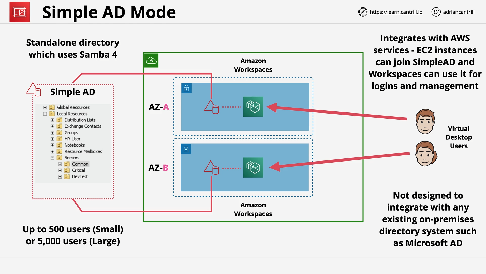
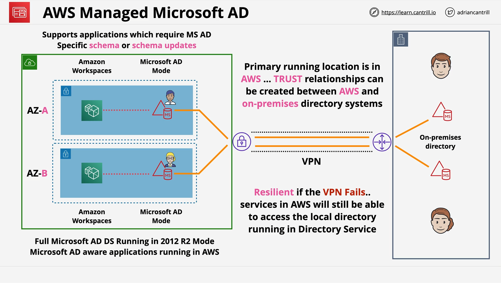
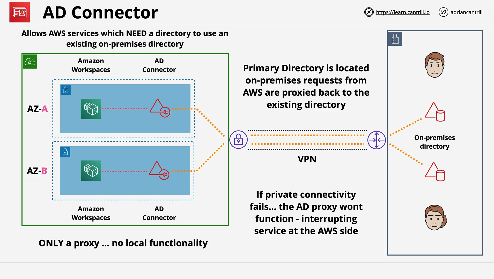

# AWS Directory Service

## Introduction to AWS Directory Service

AWS Directory Service is a **managed directory solution** that provides identity, object, and configuration storage.  
It acts like a **private directory** for AWS services, offering **centralized management and authentication**.

### Key Concepts of Directories

- **Directory**:
  - Hierarchical (inverted tree) structure storing users, groups, computers, servers, file shares.
  - Often referred to as a **domain**.
- **Forest**:
  - A collection of multiple directories.
- **Usage**:
  - Common in large corporate Windows environments.
  - Centralized login (single username/password for multiple devices).
- **Examples**:
  - **Microsoft Active Directory (ADDS)** — most common.
  - **Samba** — open-source, partial AD compatibility.

## AWS Directory Service Overview

AWS Directory Service provides a **managed** Active Directory-like experience without administrative overhead.

### Characteristics:

- **Runs inside a VPC**:
  - Private network setup required.
- **Highly available**:
  - Deployed across multiple subnets and AZs.
- **Integrations**:
  - Services like EC2, Amazon WorkSpaces, WorkMail, RDS, QuickSight, etc.
  - Windows EC2 instances can **join** directories.

## Directory Service Architectures

AWS Directory Service supports multiple modes depending on needs:

### 1. Simple AD

- **What**:
  - Lightweight, open-source based on **Samba 4**.
- **When to Use**:
  - Basic, isolated AWS directory needs.
- **Limits**:
  - Up to **500 users** (small) or **5,000 users** (large).
- **Supports**:
  - WorkSpaces, Chime, Connect, QuickSight, WorkMail, WorkDocs, EC2, AWS Console logins.
- **Important**:
  - **No integration with on-premises**.
  - **Not a full Microsoft AD implementation**.

### 2. AWS Managed Microsoft AD

- **What**:
  - **Full Microsoft Active Directory (2012 R2)** deployment.
- **When to Use**:
  - Need a **full-featured** AD environment.
  - **Trust relationship** needed with on-premises AD.
- **Features**:
  - Supports complex AD-dependent applications (e.g., SharePoint, SQL Server apps).
  - Continues working even if VPN fails (services rely on AWS-based directory).
- **Connectivity**:
  - Requires **Direct Connect** or **VPN** for trust with on-premises AD.

### 3. AD Connector

- **What**:
  - **Proxy** to an **existing on-premises Active Directory**.
- **When to Use**:
  - Want AWS services to authenticate against an **on-premises AD** without deploying a new directory.
- **Important**:
  - **No authentication on its own**.
  - Requires **private network** (VPN or Direct Connect).
  - **If network fails**, authentication fails.

## Choosing the Right Mode

| Requirement                                         | Recommended Mode         |
| :-------------------------------------------------- | :----------------------- |
| Basic AWS-only directory needs                      | Simple AD                |
| Full AD features or on-premises trust needed        | AWS Managed Microsoft AD |
| Proxy existing on-premises AD without new directory | AD Connector             |

## Key Exam Tips

- **Simple AD** = Default for simple, isolated AWS use cases.
- **Managed Microsoft AD** = Use when full AD features or trust with on-premises AD are needed.
- **AD Connector** = Use when existing on-premises AD needs to be used without cloud storage.
- **Critical**:
  - Managed Microsoft AD is a **real Microsoft AD**.
  - AD Connector requires **continuous private connectivity**.

# No Code Samples for this Lesson

> This lesson was theory-focused without specific code or CLI commands. No code explanation is needed.

# Conclusion

The AWS Directory Service allows AWS environments to:

- Integrate with identity systems.
- Support hybrid cloud scenarios.
- Enable centralized authentication and management.
