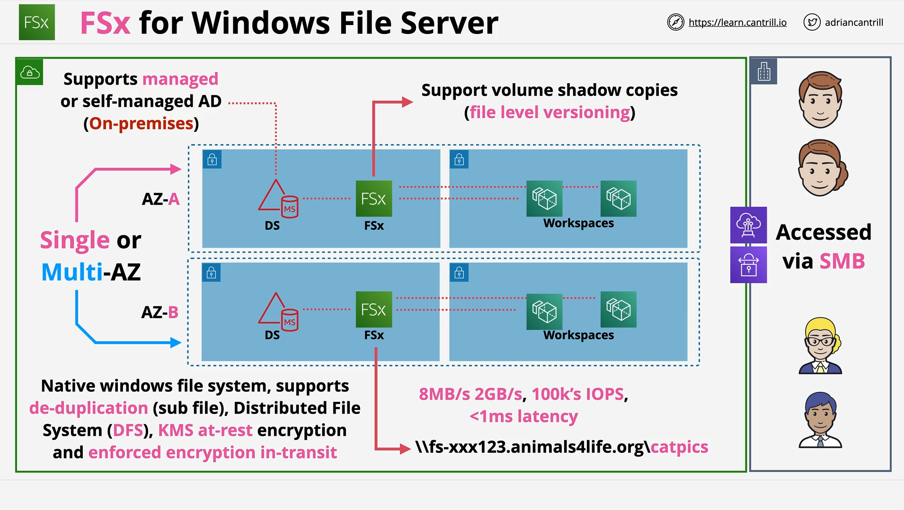

# FSx for Windows File Server

## Introduction

- **Amazon FSx for Windows File Server** is a fully managed, native Windows file system.
- It differs from **EFS** (Elastic File System) by being specifically designed for Windows environments.
- Early AWS support for Windows was limited, but FSx changed this, offering enterprise-level capabilities.

## Key Features of FSx for Windows

### 1. **Managed Native Windows File System**

- Provides **file shares** (similar to RDS offering databases, but for files).
- You consume **file shares**; underlying file servers are abstracted away.
- It’s **not an emulation**—it's a real Windows file server environment.

### 2. **Active Directory Integration**

- Can integrate with:
  - **AWS Managed Active Directory**.
  - **Self-Managed Active Directory** (on AWS or on-premises).
- Critical for enterprises with existing AD infrastructures.

### 3. **Deployment and High Availability**

- Deployments can be:
  - **Single-AZ** (replication within the AZ for hardware failure resilience).
  - **Multi-AZ** (provides full AZ-to-AZ resilience).
- Utilizes **Elastic Network Interfaces (ENIs)** within the VPC.

### 4. **Backup Capabilities**

- Supports:
  - **Automatic Backups** (AWS-side).
  - **On-Demand Backups** (AWS-side).
  - **Client-Side File Restores** (through VSS - discussed later).

### 5. **Access Options**

- Accessible within the **VPC**.
- Extended access via:
  - **VPC Peering**.
  - **VPN Connections**.
  - **AWS Direct Connect** (private, dedicated connection for large enterprises).

## FSx vs EFS: When to Use

| Feature          | FSx                         | EFS                       |
| :--------------- | :-------------------------- | :------------------------ |
| OS Compatibility | Windows                     | Linux                     |
| Protocol         | SMB (Server Message Block)  | NFS (Network File System) |
| Integration      | Active Directory            | No AD integration         |
| Backup Options   | Extensive (VSS, AWS backup) | Basic backup options      |

**Exam Tip:**

- Watch for keywords like **"Windows file system"**, **"SMB"**, **"Active Directory"**, or **"DFS"** to pick FSx in exam scenarios.

## Example Architecture Overview

- **VPC** (Virtual Private Cloud) on AWS side.
- **Corporate network** connected via **VPN** or **Direct Connect**.
- FSx instances deployed across **two Availability Zones** for resilience.
- **Staff access** both on-premises and through the VPC.

## Important Exam Features to Remember

### 1. **VSS (Volume Shadow Copy Service)**

- Allows **user-driven file restores** without admin intervention.
- Users can **right-click** files/folders and restore **previous versions**.

### 2. **SMB Protocol**

- FSx uses **SMB (Server Message Block)** protocol.
- Distinct from **EFS**, which uses **NFS**.

### 3. **Windows Permission Model**

- FSx leverages **native Windows permissions** (ACLs - Access Control Lists).
- Directly compatible with existing **Windows-based access control policies**.

### 4. **DFS (Distributed File System) Support**

- FSx supports **DFS namespaces and replication**.
- Helps **scale** file systems across distributed Windows environments.

### 5. **Native Windows File Server Without Overhead**

- Provides a fully managed **Windows file server**.
- No need to manage your own **Windows Server EC2 instances**.

### 6. **Directory Service Integration**

- FSx can connect with:
  - **AWS Directory Service**.
  - **Self-managed Active Directory**.
- Important for organizations needing **centralized authentication and authorization**.

# Summary

- **FSx for Windows** = Native Windows file shares, highly available, integrated with Active Directory.
- Ideal for **Windows-specific workloads** needing SMB access and advanced file restore features (VSS).
- **Remember** the distinctions vs EFS when preparing for the AWS Certified Solutions Architect exam.
