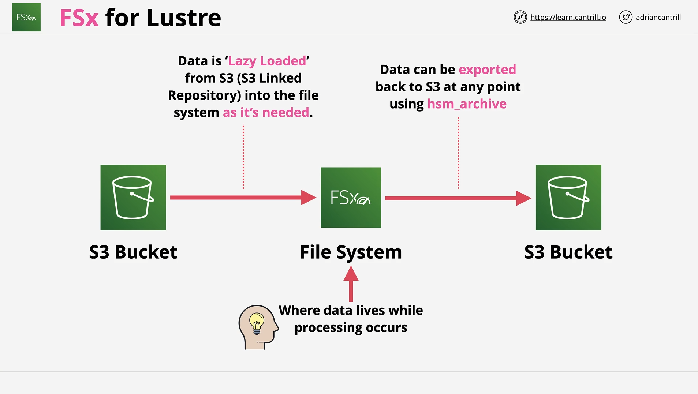
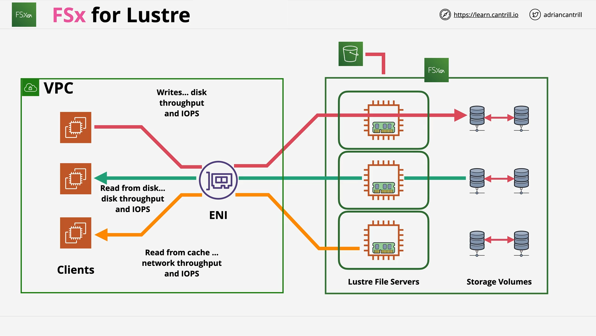

# FSx for Lustre

## Introduction



FSx for Lustre is a **high-performance file system** provided by AWS, designed for **computationally heavy workloads** such as machine learning, big data analytics, and financial modeling. It’s important for the exam to distinguish between **FSx for Windows** and **FSx for Lustre**.

## Key Features of FSx for Lustre

- **Linux-based**: Supports Linux instances.
- **POSIX-compliant**: Supports POSIX-style permissions.
- **High performance**:
  - **Throughput**: Hundreds of GB/s.
  - **Latency**: Sub-millisecond.
- **High-Performance Workloads**:
  - Machine learning.
  - Big data processing.
  - Financial modeling.

## FSx for Lustre Deployment Types

| Deployment Type | Use Case                               | Characteristics                                      | Notes                                                                    |
| :-------------- | :------------------------------------- | :--------------------------------------------------- | :----------------------------------------------------------------------- |
| Scratch         | Short-term, highest performance        | No replication, no HA (High Availability)            | Risk of data loss on hardware failure.                                   |
| Persistent      | Long-term storage with some resilience | High Availability (within one AZ only), Self-healing | Data protected against hardware failure but not against full AZ failure. |

- **Scratch**: Focused purely on performance.
- **Persistent**: Adds resilience at the cost of being restricted to one Availability Zone.

## FSx for Lustre Architecture Overview



- **Managed VPC**: You manage the VPC where FSx for Lustre resides.
- **Clients**: Typically Linux EC2 instances with Lustre client software installed.
- **Storage Components**:
  - **Metadata Target (MGT)**:
    - Stores metadata (file names, timestamps, permissions).
  - **Object Storage Targets (OSTs)**:
    - Stores actual file data.
    - Each OST is 1.17 TiB in size.
- **Elastic Network Interface (ENI)**:
  - Provides connectivity between clients and FSx servers.
- **Caching**:
  - Frequently accessed data is cached in-memory for faster reads.
- **Scaling**:
  - More storage → more servers → higher throughput and IOPS.

## S3 Repository Integration

- When a file system is associated with an S3 bucket:
  - Files are **lazy-loaded**:
    - Appear immediately, but physically pulled into Lustre when first accessed.
  - Changes in Lustre are **not automatically synchronized** back to S3.
  - Use `hsm_archive` command to manually sync changes back to the S3 bucket.

### `hsm_archive` Command Explanation

There was no explicit code given, but an AWS FSx for Lustre command was mentioned:

```bash
hsm_archive <path>
```

**Explanation (line-by-line):**

- `hsm_archive`: Command used within the Lustre environment.
- `<path>`: The path of the file or directory you want to archive (sync) back to the linked S3 bucket.

**Detailed Description**:

- This command manually archives the specified file from the Lustre file system into the associated S3 bucket, ensuring the latest version is stored.

## Performance Details

| Deployment Type | Baseline Performance         | Burst Performance        |
| :-------------- | :--------------------------- | :----------------------- |
| Scratch         | 200 MB/s per TiB             | Up to 1,300 MB/s per TiB |
| Persistent      | 50, 100, or 200 MB/s per TiB | Up to 1,300 MB/s per TiB |

- **Bursting** is based on a **credit system**:
  - Earn credits while under baseline usage.
  - Consume credits when bursting over baseline.

> Similar in concept to EBS burstable volumes, but at a larger, parallelized scale.

## Backup and Data Protection

- **Manual and automatic backups** are available.
- **Retention**: 0 to 35 days.
  - Setting "0" disables automatic backups.
- Backup data is stored in **Amazon S3**.

**Important Notes**:

- Scratch deployments have **no replication** — riskier for large file systems.
- Persistent deployments have **intra-AZ replication** — safe against hardware failure, **but not AZ failure**.

## FSx for Lustre vs FSx for Windows

| FSx Type        | Characteristics                                   |
| :-------------- | :------------------------------------------------ |
| FSx for Windows | Windows-native SMB file system.                   |
| FSx for Lustre  | High-performance, Linux-based, POSIX permissions. |

**Exam Tip**:

- **SMB/Windows environment** → FSx for Windows.
- **High performance / Machine Learning / POSIX** → FSx for Lustre.

# Conclusion

FSx for Lustre is a **high-performance file system** optimized for **computationally intensive workloads** in AWS. Understand the differences between **Scratch** and **Persistent** deployment types, **lazy loading** from S3, and **bursting behavior**. Knowing the **architecture and best practices** will help you confidently answer related questions in the AWS Certified Solutions Architect exam.
