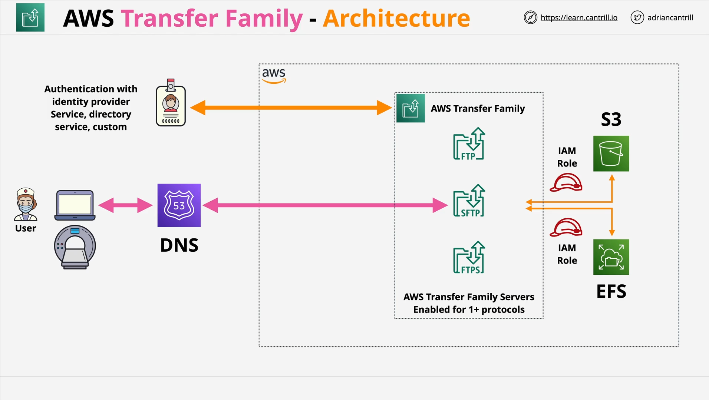
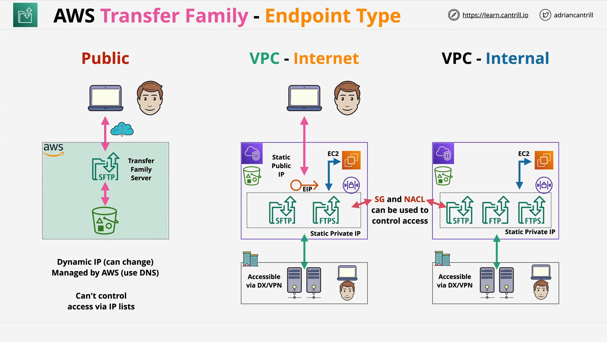

# AWS Transfer Family

## Introduction

This video introduces **AWS Transfer Family**, a managed file transfer service provided by AWS. The instructor mentions that if deeper theory or practical examples are required for the exam, they will be provided separately. Otherwise, this introduction is sufficient for foundational understanding.

## What is AWS Transfer Family?

- **AWS Transfer Family** is a fully managed service that enables file transfers to and from **Amazon S3** and **Amazon EFS**.
- It offers **managed servers** supporting multiple protocols, allowing interaction with S3 and EFS **without using their native APIs**.

## Supported Protocols

AWS Transfer Family enables the use of several common file transfer protocols:

### 1. FTP (File Transfer Protocol)

- **Description**: A traditional file transfer protocol.
- **Key Points**:
  - **Unencrypted** transmission.
  - Considered **legacy technology**.
  - Usage is **niche** due to lack of encryption.

### 2. FTPS (File Transfer Protocol Secure)

- **Description**: FTP with **TLS encryption**.
- **Key Points**:
  - Adds **security** to the basic FTP.
  - Provides **encrypted communication** between client and server.

### 3. SFTP (SSH File Transfer Protocol)

- **Description**: File transfer protocol built on **SSH (Secure Shell)**.
- **Key Points**:
  - Provides **secure file transfer**.
  - Commonly used where **security** is critical.

### 4. AS2 (Applicability Statement 2)

- **Description**: A protocol used for **structured, secure business-to-business data transfers**.
- **Key Points**:
  - Important for **industry sectors** requiring **compliance and security**.
  - Commonly used in:
    - **Supply Chain Logistics**
    - **Payment Workflows**
    - **Enterprise Resource Planning (ERP) systems**
    - **Customer Relationship Management (CRM) systems**
- **Note**:
  - Usage is **niche**.
  - You will **know** when you require AS2 because it is very **specific** to certain business workflows.

## Deployment Scope

- AWS Transfer Family supports file transfers:
  - Over the **public internet**.
  - Within a **VPC (Virtual Private Cloud)**.
  - From **corporate networks**.

This flexibility ensures that organizations can integrate file transfer capabilities within their existing cloud and on-premises environments securely.

## Summary

- **AWS Transfer Family** enables **managed** and **secure** file transfers to **S3** and **EFS**.
- It supports a variety of **industry-standard protocols**.
- **Protocol selection** depends on the **security requirements** and **business needs**.
- Designed for both **internal use** within a VPC and **external access** over the internet.
