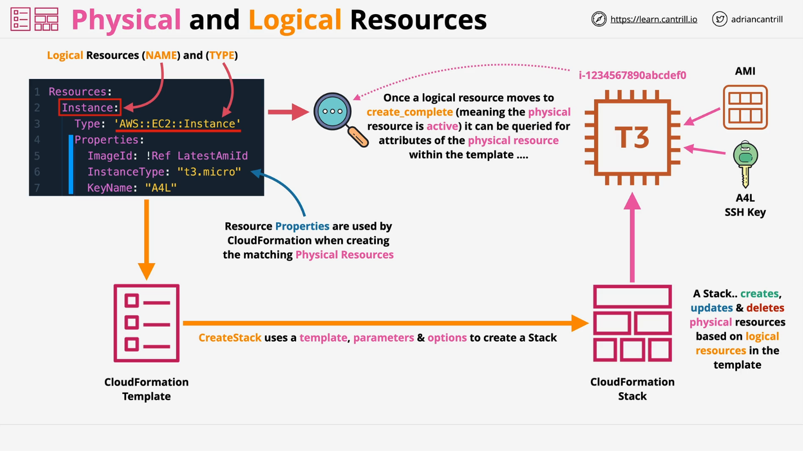
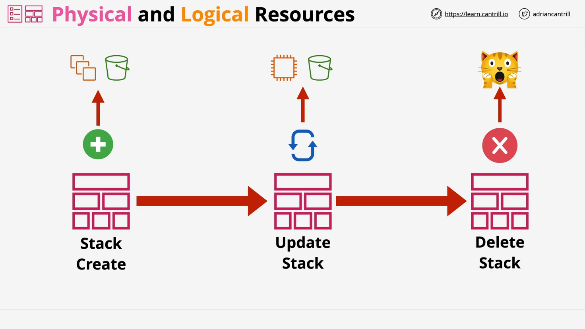

# AWS CloudFormation: Logical Resources vs Physical Resources

## Introduction to CloudFormation



- **CloudFormation** is an AWS service that allows you to define, provision, and manage AWS infrastructure through **code**.
- Infrastructure is declared using a **template** written in either **YAML** or **JSON** formats.
- Focuses on defining **what** resources you want, not **how** to create them.

## CloudFormation Templates

- A **template** is a file that defines **logical resources**.
- Logical resources represent the intended infrastructure but are not yet instantiated as real AWS components.
- Templates are **portable**:
  - One template can create **one** or **many stacks** across different **AWS accounts** and **regions**.

## Logical Resources



- **Logical resources** are entries in a CloudFormation template.
- They define **what resources** to create (e.g., an EC2 instance, an S3 bucket).
- Example components:
  - **Resource Name**: e.g., `Instance`
  - **Resource Type**: e.g., `AWS::EC2::Instance`
  - **Properties**: e.g., AMI ID, instance type, SSH key name.

### Example Template Snippet

```yaml
Resources:
  Instance:
    Type: AWS::EC2::Instance
    Properties:
      ImageId: ami-1234567890abcdef0
      InstanceType: t2.micro
      KeyName: my-ssh-key
```

### Line-by-Line Explanation:

- `Resources:`
  - Begins the definition section for logical resources.
- `Instance:`
  - The logical name (identifier) for the resource within the template.
- `Type: AWS::EC2::Instance`
  - Specifies that the resource is an EC2 instance.
- `Properties:`
  - Provides configuration details for the instance:
    - `ImageId`: The Amazon Machine Image (AMI) to launch the instance.
    - `InstanceType`: The size/type of EC2 instance.
    - `KeyName`: The SSH key pair to use for secure access.

## Stacks and Physical Resources

- A **stack** is the deployment of a CloudFormation template.
- When a stack is created:
  - Each logical resource results in the creation of a **physical resource** (an actual AWS object).
- CloudFormation ensures:
  - **Sync** between logical resources and physical resources.

| Logical Resource (Template) |  →  | Physical Resource (AWS Service) |
| :-------------------------- | :-: | :------------------------------ |
| `AWS::EC2::Instance`        |  →  | An actual EC2 instance          |
| `AWS::S3::Bucket`           |  →  | An actual S3 bucket             |

## Updating and Deleting Stacks

- **Updating a Template**:
  - Changes are reflected in the **stack**.
  - CloudFormation **creates, modifies, or deletes** physical resources based on the new template.
- **Deleting a Stack**:
  - Removes both the **logical** and **physical** resources unless specifically configured not to.

## Practical Usage of CloudFormation

- **Automation**:
  - Deploy complex infrastructures repeatedly with consistency.
- **Change Management**:
  - Templates can be stored in source control (e.g., Git).
  - Changes can be reviewed and approved before deployment.
- **Rapid Deployment**:
  - Quickly spin up environments for testing, demos, or production.

### Real-World Example

- Hosting 100 WordPress sites:
  - Instead of creating 100 instances manually, use a single template to deploy 100 WordPress sites automatically.

## Key Points to Remember

- **Templates** define **logical resources**.
- **Stacks** use templates to create **physical resources**.
- CloudFormation **synchronizes** logical and physical resources.
- Updating templates updates stacks and thus physical resources.
- Deleting stacks deletes the associated physical resources.

# Final Thoughts

- Understanding the relationship between **logical resources** and **physical resources** is fundamental to mastering CloudFormation.
- As you continue through AWS training, you'll encounter CloudFormation extensively, both theoretically and practically.
- CloudFormation is critical for **Solutions Architects**, **Developers**, and **Engineers** alike for automating and managing infrastructure at scale.
