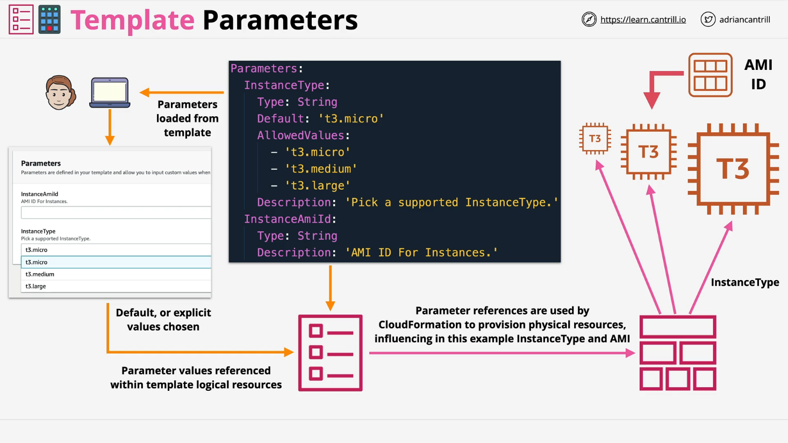
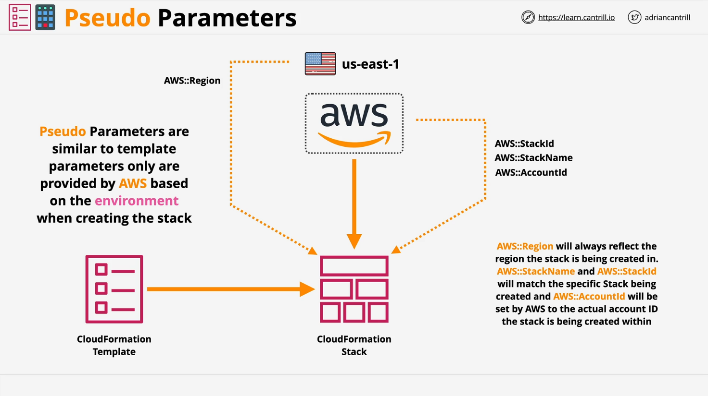

# Pseudo Parameters

## Overview

AWS CloudFormation **pseudo parameters** are predefined parameters available for use in templates. Unlike **template parameters** (which users define), pseudo parameters are **automatically provided by AWS**.  
They are referenced the same way as other parameters using the `Ref` function but **don't need to be explicitly declared** in the template.

## Introduction

- CloudFormation templates support two kinds of parameters:
  - **Template parameters** (defined by users).
  - **Pseudo parameters** (provided by AWS automatically).
- Both allow **input** into CloudFormation templates to influence **logical resources**.

## Template Parameters



- Allow external sources (users, automation) to **input values** during stack creation or update.
- Examples:
  - **Instance size** (e.g., t2.micro, m5.large).
  - **Environment type** (e.g., Dev, Test, Prod).
- Defined **inside** templates.
- Can influence **physical resources** and their **configuration**.

### Template Parameter Features

- **Defaults**: Optional default values.
- **Allowed Values**: Constraints like specific instance types.
- **Restrictions**: Minimum/maximum lengths or patterns.
- **NoEcho**: Hides sensitive input (e.g., passwords).
- **Types**:
  - Basic: `String`, `Number`, `List`
  - AWS-specific: VPC IDs, Subnet IDs, etc.

## Visual Architecture

1. **Define parameters** inside the template.
2. **User Interface** collects input during stack creation.
3. **Combined inputs and resources** build the final **stack**.
4. Physical resources are **affected** based on parameter values.

## Pseudo Parameters



- Provided by **AWS**, no need for user declaration.
- Available automatically in templates.
- Behave similarly to template parameters but populated **internally by AWS**.

### Examples of Pseudo Parameters

- `AWS::Region`: Current AWS Region.
- `AWS::AccountId`: AWS Account ID.
- `AWS::StackId`: Unique ID of the Stack.
- `AWS::StackName`: Name of the Stack.

## Best Practices

- **Minimize** parameters that require user input.
- **Use defaults** wherever possible.
- Prefer **pseudo parameters** for automation and portability.
- Avoid static templates to maintain **flexibility** and **reusability**.

## Example of Pseudo Parameter Usage

### JSON Example

```json
"Outputs" : {
   "MyStacksRegion" : { "Value" : { "Ref" : "AWS::Region" } }
}
```

### YAML Example

```yaml
Outputs:
  MyStacksRegion:
    Value: !Ref "AWS::Region"
```

### Explanation:

- **"Outputs"**: Declares output values for the stack.
- **"MyStacksRegion"**: An output key where the value is set.
- **"Value"**: Refers to `AWS::Region`, which returns the AWS region where the stack is created.

## Key Pseudo Parameters

### `AWS::AccountId`

- Returns the **AWS account ID** where the stack is being created.
- Example output: `123456789012`

### `AWS::NotificationARNs`

- Returns a **list of notification ARNs** (Amazon Resource Names) associated with the stack.
- Use `Fn::Select` to choose a specific ARN.

#### JSON Example

```json
"myASGrpOne" : {
   "Type" : "AWS::AutoScaling::AutoScalingGroup",
   "Version" : "2009-05-15",
   "Properties" : {
      "AvailabilityZones" : [ "us-east-1a" ],
      "LaunchConfigurationName" : { "Ref" : "MyLaunchConfiguration" },
      "MinSize" : "0",
      "MaxSize" : "0",
      "NotificationConfigurations" : [{
         "TopicARN" : { "Fn::Select" : [ "0", { "Ref" : "AWS::NotificationARNs" } ] },
         "NotificationTypes" : [ "autoscaling:EC2_INSTANCE_LAUNCH", "autoscaling:EC2_INSTANCE_LAUNCH_ERROR" ]
      }]
   }
}
```

#### YAML Example

```yaml
myASGrpOne:
  Type: AWS::AutoScaling::AutoScalingGroup
  Version: "2009-05-15"
  Properties:
    AvailabilityZones:
      - "us-east-1a"
    LaunchConfigurationName:
      Ref: MyLaunchConfiguration
    MinSize: "0"
    MaxSize: "0"
    NotificationConfigurations:
      - TopicARN:
          Fn::Select:
            - "0"
            - Ref: AWS::NotificationARNs
        NotificationTypes:
          - autoscaling:EC2_INSTANCE_LAUNCH
          - autoscaling:EC2_INSTANCE_LAUNCH_ERROR
```

### Explanation:

- **AutoScaling Group** creation.
- **Fn::Select** chooses the **first** notification ARN.
- **NotificationTypes** define **events** to notify (like instance launch or launch error).

### `AWS::NoValue`

- Special pseudo parameter used to **conditionally remove** a property.
- Useful inside an `Fn::If` statement to exclude a property when a condition is false.

#### JSON Example

```json
"MyDB" : {
  "Type" : "AWS::RDS::DBInstance",
  "Properties" : {
    "AllocatedStorage" : "5",
    "DBInstanceClass" : "db.t2.small",
    "Engine" : "MySQL",
    "EngineVersion" : "5.5",
    "MasterUsername" : { "Ref" : "DBUser" },
    "MasterUserPassword" : { "Ref" : "DBPassword" },
    "DBParameterGroupName" : { "Ref" : "MyRDSParamGroup" },
    "DBSnapshotIdentifier" : {
      "Fn::If" : [
        "UseDBSnapshot",
        {"Ref" : "DBSnapshotName"},
        {"Ref" : "AWS::NoValue"}
      ]
    }
  }
}
```

#### YAML Example

```yaml
MyDB:
  Type: AWS::RDS::DBInstance
  Properties:
    AllocatedStorage: "5"
    DBInstanceClass: db.t2.small
    Engine: MySQL
    EngineVersion: "5.5"
    MasterUsername:
      Ref: DBUser
    MasterUserPassword:
      Ref: DBPassword
    DBParameterGroupName:
      Ref: MyRDSParamGroup
    DBSnapshotIdentifier:
      Fn::If:
        - UseDBSnapshot
        - Ref: DBSnapshotName
        - Ref: AWS::NoValue
```

### Explanation:

- If `UseDBSnapshot` is `true`, `DBSnapshotIdentifier` is set.
- If `false`, property is **removed** by returning `AWS::NoValue`.

### Other Important Pseudo Parameters

| Pseudo Parameter | Description                                                        |
| ---------------- | ------------------------------------------------------------------ |
| `AWS::Partition` | Returns partition (e.g., `aws`, `aws-cn`, `aws-us-gov`).           |
| `AWS::Region`    | Returns AWS region (e.g., `us-west-2`).                            |
| `AWS::StackId`   | Returns the **unique ID** of the stack.                            |
| `AWS::StackName` | Returns the **name** of the stack.                                 |
| `AWS::URLSuffix` | Returns domain suffix (e.g., `amazonaws.com`, `amazonaws.com.cn`). |

# Conclusion

- Pseudo parameters are essential for making CloudFormation templates **dynamic** and **portable**.
- Combine both template and pseudo parameters for **maximum flexibility**.
- AWS provides pseudo parameters automatically, making templates smarter and less error-prone.
