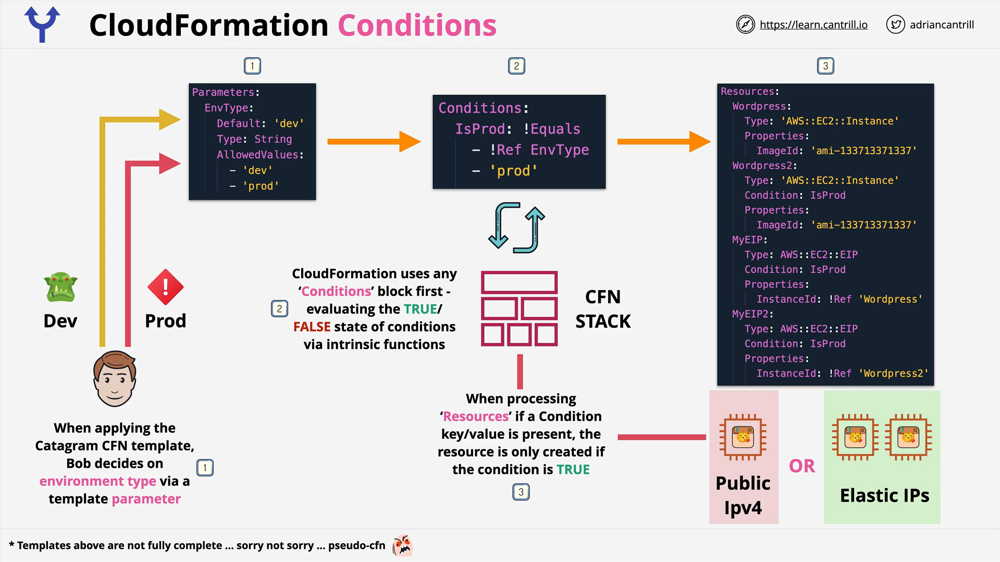

# AWS CloudFormation Conditions

## Introduction

CloudFormation Conditions allow templates to create or configure resources based on certain evaluations.  
This feature offers flexibility for architects, developers, and engineers by enabling stacks to behave dynamically according to specified parameters or environmental factors.

## How CloudFormation Conditions Work

- **Declaration**:  
  Conditions are defined inside the optional `Conditions` section of a CloudFormation template.
- **Evaluation**:  
  Each condition is evaluated to either **true** or **false** _before_ processing logical resources.

- **Impact**:

  - If a resource references a condition that evaluates to **true**, the resource is created.
  - If the condition is **false**, the resource is **not created**.

- **Logical and Physical Resources**:  
  Logical resources defined in templates are mirrored into actual physical AWS resources based on the condition outcomes.

## Use of Intrinsic Functions

Conditions use **Intrinsic Functions** for evaluation:
| Function | Purpose |
| :--- | :--- |
| `Fn::And` | Logical AND |
| `Fn::Equals` | Check if two values are equal |
| `Fn::If` | Perform conditional operations |
| `Fn::Not` | Logical NOT |
| `Fn::Or` | Logical OR |

The outcome of these intrinsic functions determines if the condition itself is **true** or **false**.

## Practical Example

### Scenario

- A template parameter called `EnvType` accepts `dev` or `prod`.
- A condition named `IsProd` is created to evaluate whether `EnvType` equals `prod`.

### Flow:



1. **User Input**:  
   Developer sets `EnvType` to either `dev` or `prod` during stack creation.
2. **Condition Evaluation**:  
   CloudFormation first evaluates the `IsProd` condition.

3. **Resource Creation**:

   - If `IsProd` is **true**, resources such as `WordPress2`, `MyEIP`, and `MyEIP2` are created.
   - If **false**, only the default `WordPress` resource is created.

4. **Important Notes**:
   - Resources without any condition are **always created**.
   - Resources referencing a condition are created **only if** the condition is **true**.

## Visual Example (Pseudocode)

```yaml
Parameters:
  EnvType:
    Type: String
    AllowedValues:
      - dev
      - prod

Conditions:
  IsProd: !Equals [!Ref EnvType, "prod"]

Resources:
  WordPress:
    Type: AWS::EC2::Instance
    Properties:
      # properties here

  WordPress2:
    Condition: IsProd
    Type: AWS::EC2::Instance
    Properties:
      # properties here

  MyEIP:
    Condition: IsProd
    Type: AWS::EC2::EIP
    Properties:
      # properties here

  MyEIP2:
    Condition: IsProd
    Type: AWS::EC2::EIP
    Properties:
      # properties here
```

### Line-by-Line Explanation:

- **Parameters Section**:  
  Defines `EnvType` parameter with allowed values `dev` and `prod`.

- **Conditions Section**:  
  Defines `IsProd` condition using `!Equals` intrinsic function to check if `EnvType` is `prod`.

- **Resources Section**:
  - `WordPress`: Always created.
  - `WordPress2`, `MyEIP`, and `MyEIP2`: Created **only if** `IsProd` is true.

## Nested Conditions

- **Nesting Concept**:  
  Conditions can be combined to create complex logical requirements.

  Example:

  - **Condition 1**: `IsProd`
  - **Condition 2**: `CreateS3Bucket`
  - **Condition 3**: `ApplyBucketPolicy` which depends on both `IsProd` and `CreateS3Bucket` being true.

- **Implementation**:

  Use nested intrinsic functions (`Fn::And`, `Fn::Or`) to handle multiple condition dependencies.

## Best Practices

- Always **review templates** and observe how conditions are used.
- Practice by reading and writing templates with conditions.
- Seeing practical demos will help solidify the concept.

## Final Notes

- Defining and using CloudFormation Conditions may seem complex initially but becomes intuitive with practice.
- **Conditions = Dynamic Control** over infrastructure provisioning.
- Continue reviewing real-world examples to improve CloudFormation mastery.
