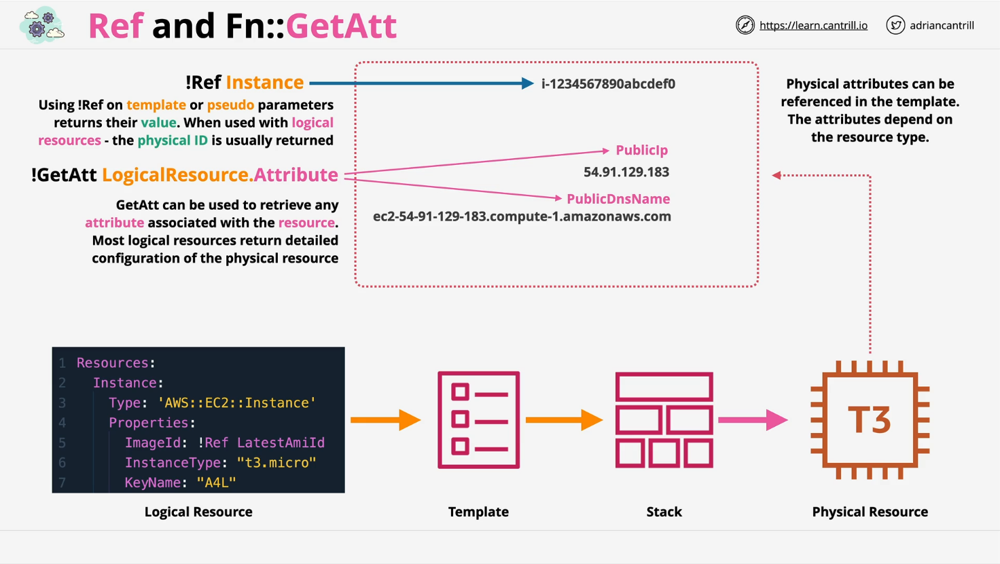
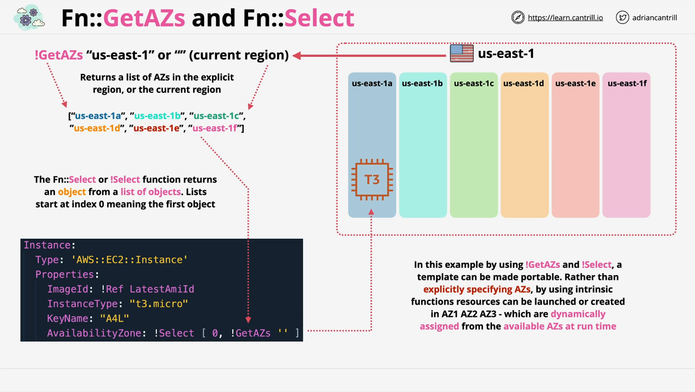
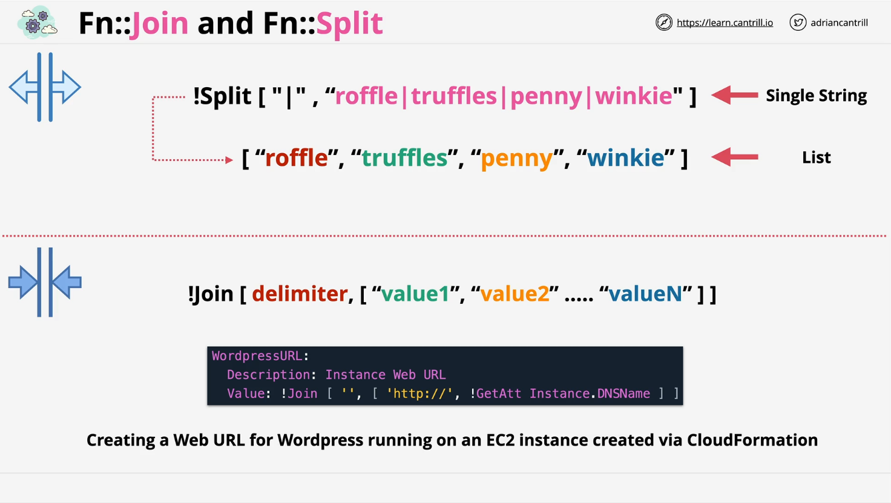
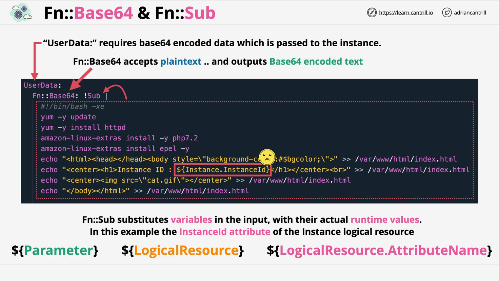
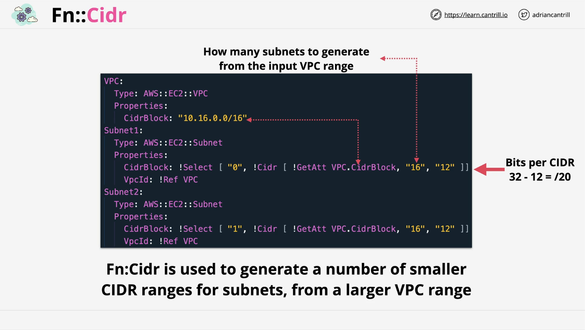

# CloudFormation Intrinsic Functions

## Overview

In this lesson, we are introduced to **CloudFormation Intrinsic Functions** — a set of special operations allowing templates to access dynamic information at stack creation time. Until now, templates were either static or parameter-driven. Intrinsic functions make templates **dynamic and environment-aware**.

## Functions Covered

### 1. `Ref` and `GetAtt` (Get Attribute)



- **`Ref`**:  
  References the main value of a parameter or a logical resource.
  - Example: referencing a parameter or an EC2 instance's **physical ID**.
- **`GetAtt`**:  
  Retrieves **secondary attributes** of a resource, like an EC2 instance's **Public IP** or **DNS Name**.

```yaml
ImageId: !Ref LatestAmiId # References a parameter
InstancePublicDnsName: !GetAtt MyInstance.PublicDnsName # Gets an attribute of an EC2 instance
```

**Explanation:**

- `!Ref LatestAmiId`: Pulls the value of the LatestAmiId parameter.
- `!GetAtt MyInstance.PublicDnsName`: Gets the Public DNS Name attribute from the created EC2 instance `MyInstance`.

### 2. `GetAZs` and `Select`



- **`GetAZs`**:  
  Retrieves a list of available **Availability Zones** (AZs) for a region.
- **`Select`**:  
  Picks an item from a list using an index (starts at 0).

```yaml
AvailabilityZone: !Select
  - 0
  - !GetAZs ""
```

**Explanation:**

- `!GetAZs ''`: Fetches all AZs for the current region.
- `!Select 0`: Picks the first AZ from that list.

> **Important Note:** `GetAZs` behavior depends on **Default VPC subnets** — missing subnets might lead to incomplete AZ lists.

### 3. `Join` and `Split`



- **`Join`**:  
  Combines list elements into a single string with a delimiter.

- **`Split`**:  
  Splits a string into a list based on a delimiter.

**Example:**

```yaml
# Join Example
WebsiteURL: !Join
  - ""
  - - "https://"
    - !GetAtt MyInstance.PublicDnsName

# Split Example
SplitList: !Split
  - "|"
  - "Ruffle|Truffle|Penny|Winky"
```

**Explanation:**

- `!Join`: Combines 'https://' with the EC2 instance DNS name.
- `!Split`: Breaks the string into a list of cat names.

### 4. `Base64`



- Converts a **plain text** into **Base64-encoded** text.
- Required for **User Data scripts** in EC2.

```yaml
UserData:
  Fn::Base64: |
    #!/bin/bash
    echo "Hello World"
```

**Explanation:**

- `Fn::Base64`: Encodes the plain-text script so EC2 instances can accept it.

### 5. `Sub` (Substitute)



- Allows **variable substitution** inside text.
- Replaces placeholders with actual runtime values.

```yaml
UserData:
  Fn::Base64: !Sub |
    #!/bin/bash
    echo "Instance ID is ${MyInstance}"
```

**Explanation:**

- `${MyInstance}` gets replaced at runtime with the value of the `MyInstance` resource.
- Substitutions can reference parameters, logical resources (via Ref), or attributes (via GetAtt).

> **Important:**  
> No **self-referencing** allowed during creation. You cannot refer to an attribute of an instance before the instance physically exists.

### 6. `Cidr`

- **Auto-generates CIDR blocks** based on a given network range.
- Useful for **VPC** and **subnet** design.

```yaml
Subnets: !Cidr
  - 10.0.0.0/16
  - 16
  - 8
```

**Explanation:**

- `10.0.0.0/16`: The base CIDR block.
- `16`: Number of CIDR blocks to create.
- `8`: Size mask for the generated blocks.

**Example Use Case:**

```yaml
Subnet1CIDR: !Select [0, !Cidr [10.0.0.0/16, 16, 8]]
Subnet2CIDR: !Select [1, !Cidr [10.0.0.0/16, 16, 8]]
```

- `Subnet1CIDR` gets the first generated subnet.
- `Subnet2CIDR` gets the second generated subnet.

## Key Takeaways

- **Ref** and **GetAtt** are foundational. They will be used in almost every CloudFormation template.
- **GetAZs** and **Select** help avoid hardcoding AZs, making templates **portable across regions**.
- **Join** and **Split** manipulate strings for dynamic resource naming or processing.
- **Base64** is critical for passing user data scripts securely to instances.
- **Sub** provides powerful runtime value injection into strings.
- **Cidr** automates the VPC and subnet CIDR allocation process, reducing manual effort and errors.
