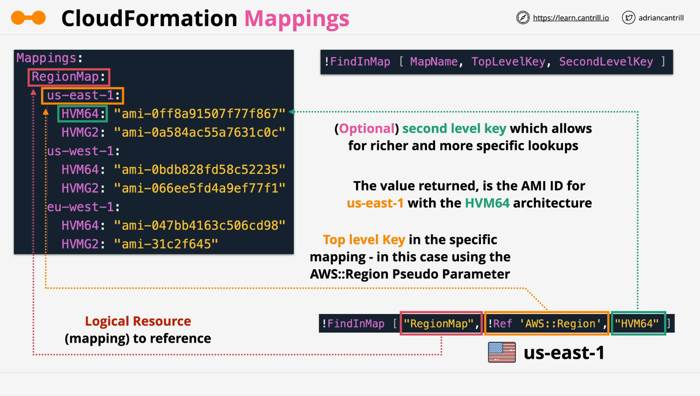

# AWS CloudFormation: Mappings and `FindInMap`

## Introduction



- This video introduces **CloudFormation Mappings**, a feature used to design **portable** and **dynamic** templates.
- Mappings allow **key-value** lookups within a template to adjust behavior based on certain inputs (e.g., region, environment).

## What are Mappings?

- In a CloudFormation template (YAML or JSON), the top-level structure includes sections like `Resources`, `Parameters`, and now `Mappings`.
- **Mappings**:
  - Are **key-value** structures used for lookups.
  - Help store static data influencing template behavior based on input.
  - Improve **template portability** by allowing dynamic values based on conditions like AWS region or environment.

## Single-Level and Two-Level Lookups

- **Single-level lookup**:  
  You provide a **top-level key** and retrieve its value.

- **Two-level lookup**:  
  You provide a **top-level key** and a **second-level key** to retrieve a nested value.

- A common use case:
  - Mapping Amazon Machine Image (AMI) IDs.
  - Top-level key: AWS Region (e.g., `us-east-1`).
  - Second-level key: Architecture (e.g., `HVM64`).

## `FindInMap` Intrinsic Function

- `FindInMap` is an **intrinsic function** used to retrieve values from mappings.
- It requires:
  1. **Mapping name**.
  2. **Top-level key**.
  3. _(Optional)_ **Second-level key**.

If you provide only the mapping name and top-level key, it returns the full nested structure. Supplying the second-level key fetches a specific value.

## Example

Here’s a **simplified visual** of a mapping and usage of `FindInMap`:

```yaml
Mappings:
  RegionMap:
    us-east-1:
      HVM64: ami-0ff8a91507f77f867
      HVMG2: ami-0a584ac55a7631c0c
    us-west-1:
      HVM64: ami-0bdb828fd58c52235
      HVMG2: ami-066ee5fd4a9ef77f1

Resources:
  MyEC2Instance:
    Type: AWS::EC2::Instance
    Properties:
      ImageId: !FindInMap
        - RegionMap # Mapping Name
        - !Ref "AWS::Region" # Top-level key (dynamic region reference)
        - HVM64 # Second-level key (architecture type)
      InstanceType: t2.micro
```

### Line-by-Line Explanation:

- **`Mappings:`**  
  Declares a new section for mappings.

- **`RegionMap:`**  
  Defines a mapping named `RegionMap`.

- **Inside `RegionMap`:**  
  Keys are AWS regions (`us-east-1`, `us-west-1`).  
  Each region maps to specific AMI IDs based on architecture (`HVM64`, `HVMG2`).

- **`Resources:`**  
  Declares AWS resources you want to create (in this case, an EC2 instance).

- **`MyEC2Instance:`**  
  Logical name for the EC2 instance.

- **`Type: AWS::EC2::Instance`**  
  Specifies the resource type (EC2 instance).

- **`Properties:`**  
  Properties for the EC2 instance configuration.

- **`ImageId:`**  
  AMI ID to use for the instance:

  - **`!FindInMap`** calls the intrinsic function to perform a lookup.
    - `RegionMap`: Look in the `RegionMap` mapping.
    - `!Ref "AWS::Region"`: Get the current deployment region dynamically.
    - `HVM64`: Retrieve the AMI ID for `HVM64` architecture.

- **`InstanceType: t2.micro`**  
  Defines the EC2 instance type.

## Key Takeaways

- **Mappings** allow storing static key-value lookup data within the template.
- **`FindInMap`** retrieves values based on provided keys.
- Helps in **regional portability** by mapping resources dynamically based on the deployed region.
- **Single-level** and **two-level** lookups are possible.
- Commonly used for:
  - AMI lookups.
  - Environment-specific configurations (e.g., Dev, Test, Prod).

## What's Next?

- In upcoming demos (not covered in this video), you will use Mappings practically to build dynamic, reusable CloudFormation templates.
