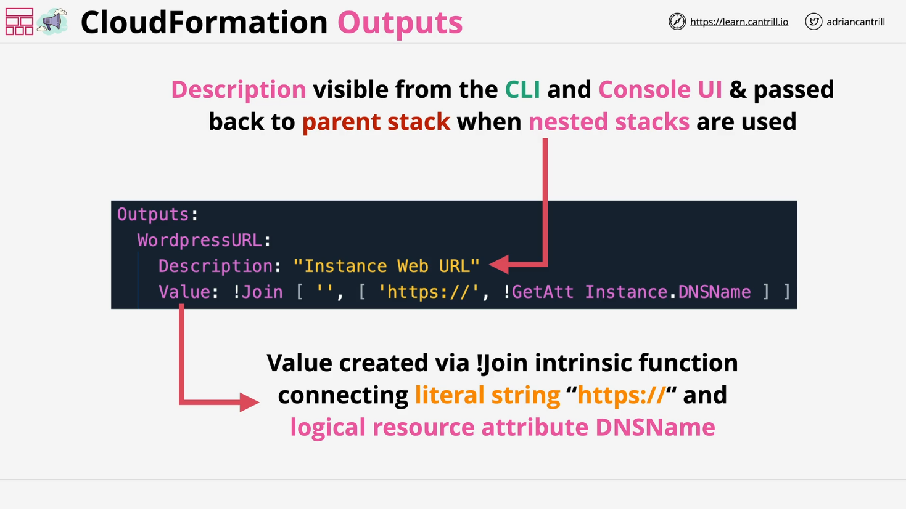

# AWS CloudFormation: Outputs

## Introduction

- This section covers **CloudFormation Outputs**, an optional part of a template.
- Outputs are useful for:
  - Providing **status information** about the stack.
  - Showing **how to access services** created by the stack.
  - Enabling **communication between nested stacks**.
  - Allowing **cross-stack references** by exporting values.

## Key Points About Outputs

- **Outputs are optional**:  
  A CloudFormation template can work perfectly without any outputs.

- **Visibility**:  
  When outputs are included:

  - They are visible via the **AWS CLI**.
  - They are visible via the **AWS Console UI**.
  - They can be **accessed by parent stacks** in nested stack setups.

- **Cross-Stack Export**:  
  Outputs can be **exported** to allow other stacks to **reference them**, enabling complex infrastructure designs.

## Basic Structure of Outputs



- An output consists of:
  1. **Name**: Logical identifier for the output.
  2. **Description**: Human-readable information about the output (best practice to always include).
  3. **Value**: The actual data to be exposed once the stack is created.

## Example

Here’s a basic example of a CloudFormation Output:

```yaml
Outputs:
  WordPressURL:
    Description: "URL of the WordPress instance"
    Value: !Join
      - ""
      - - "https://"
        - !GetAtt MyEC2Instance.PublicDnsName
```

### Line-by-Line Explanation:

- **`Outputs:`**  
  Starts the Outputs section of the CloudFormation template.

- **`WordPressURL:`**  
  Logical name of the output (can be referenced elsewhere if needed).

- **`Description: "URL of the WordPress instance"`**  
  A human-readable description explaining the purpose of the output.

- **`Value:`**  
  Defines the value that should be exposed once the stack is successfully created.

- **`!Join - '' - [ ... ]`**  
  Uses the `Join` intrinsic function to concatenate two elements without any separator (`''` means no space between elements):
  - `'https://'`: A literal string.
  - `!GetAtt MyEC2Instance.PublicDnsName`: Retrieves the public DNS name attribute of the EC2 instance resource called `MyEC2Instance`.

Thus, the final output is something like:

```plaintext
https://<PublicDnsName>
```

where `<PublicDnsName>` is dynamically fetched based on the created instance.

## How Outputs Help

- **Usability**:  
  Outputs provide users with important information after stack creation, like service endpoints, instance IP addresses, or resource IDs.

- **Automation**:  
  Other templates or manual processes can consume outputs, automating multi-stack deployments.

- **Best Practices**:
  - Always provide meaningful descriptions.
  - Carefully decide which values to expose, especially when exporting outputs.

## What's Next?

- In future videos:
  - You will gain **practical experience** using Outputs.
  - Learn about **cross-stack references** by **exporting** outputs.
  - Understand how outputs can simplify and modularize infrastructure designs.
