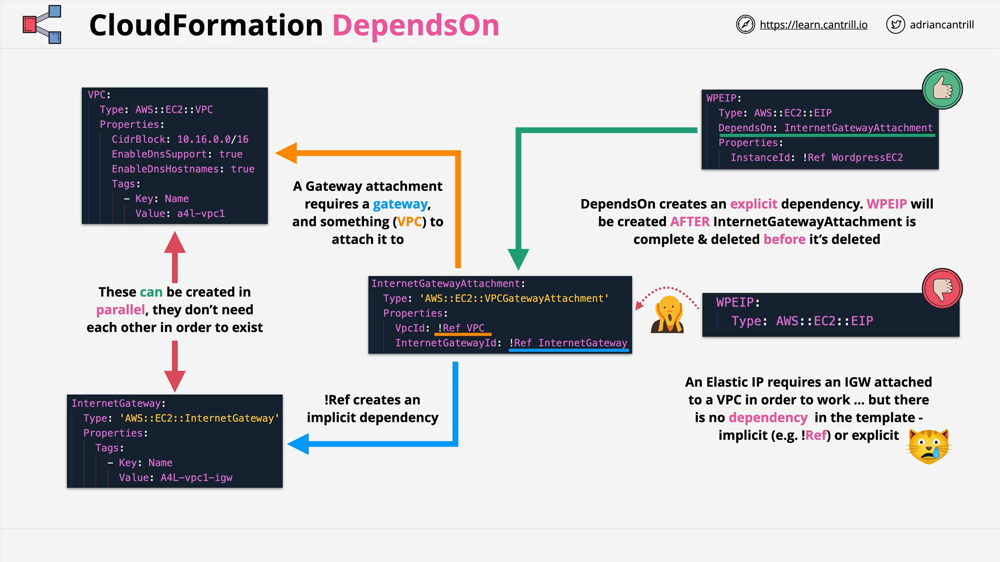

# AWS CloudFormation: Understanding `DependsOn`

## Overview

In this lesson, we learn about the **`DependsOn`** attribute in AWS CloudFormation templates.  
It is used to explicitly set the creation order between resources, ensuring CloudFormation provisions, updates, and deletes resources in the correct sequence.

## Why `DependsOn` is Necessary

- **CloudFormation Parallelism**:  
  CloudFormation tries to create, update, and delete resources **in parallel** to be more efficient.

- **Automatic Dependency Inference**:

  - CloudFormation can automatically determine order based on **references** between resources.
  - Example:
    - VPC is created first.
    - Then Subnets inside the VPC.
    - Then EC2 Instances inside the Subnets.

- **Manual Dependency Control**:
  - Sometimes CloudFormation's automatic inference is not enough.
  - Certain resources (like Elastic IPs and Internet Gateway Attachments) can fail if not explicitly ordered.
  - **`DependsOn`** lets you manually specify resource dependencies to avoid these issues.

## How Dependencies Are Normally Determined

- **Implicit Dependencies**:

  - Created when a resource **references** another.
  - Example:
    - An Internet Gateway Attachment referencing both a VPC and an Internet Gateway.

- **Reference Rule**:
  - You **cannot reference** a resource that is not yet in the **`CREATE_COMPLETE`** state.
  - Thus, CloudFormation **waits** for the referenced resources to finish before proceeding.

## When You MUST Use `DependsOn`

- **Elastic IPs and VPCs Example**:
  - If creating an **Elastic IP** and associating it with a resource in a **newly created VPC**:
    - The VPC **must** have an **Internet Gateway attached**.
    - Without `DependsOn`, Elastic IP creation may randomly fail or succeed.
    - Similarly, during deletion, CloudFormation might try to delete resources in the wrong order.

## Syntax of `DependsOn`

```yaml
Resources:
  MyElasticIP:
    Type: AWS::EC2::EIP
    DependsOn: MyInternetGatewayAttachment
    Properties:
      InstanceId: !Ref MyInstance
```

### Line-by-Line Explanation:

- `Resources:`  
  Begins the CloudFormation `Resources` block.

- `MyElasticIP:`  
  Defines a logical resource name for the Elastic IP.

- `Type: AWS::EC2::EIP`  
  Specifies that the resource type is an Elastic IP.

- `DependsOn: MyInternetGatewayAttachment`  
  **Explicitly declares** that `MyElasticIP` **depends** on `MyInternetGatewayAttachment`.  
  CloudFormation **will not** create `MyElasticIP` until `MyInternetGatewayAttachment` is fully created.

- `Properties:`  
  Section where resource-specific properties are defined.

- `InstanceId: !Ref MyInstance`  
  Associates the Elastic IP with the specified EC2 instance.

## Key Points to Remember

- `DependsOn` ensures **correct resource ordering**.
- It can prevent **errors during creation** and **deletion**.
- You can specify:

  - A **single resource**.
  - **Multiple resources** using a list:
    ```yaml
    DependsOn:
      - ResourceA
      - ResourceB
    ```

- Always check for `DependsOn` usage in large templates or production environments.
- Expect exam questions on this topic in AWS certification exams.

## Visual Example



- The **Elastic IP** must wait until the **Internet Gateway Attachment** is complete.
- `DependsOn` enforces this order.

# Conclusion

The `DependsOn` attribute is a crucial CloudFormation feature for controlling the creation and deletion order of resources.  
By mastering it, you can prevent errors in complex templates and perform better on AWS certification exams.
