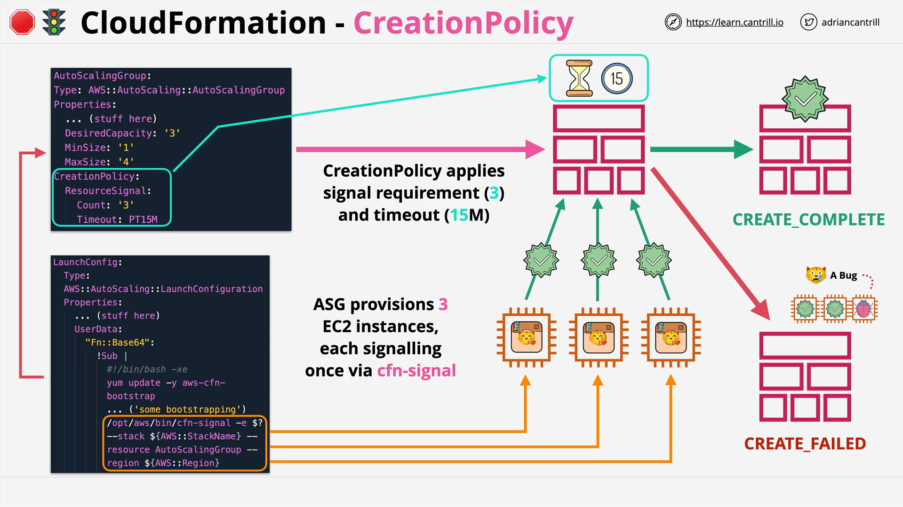
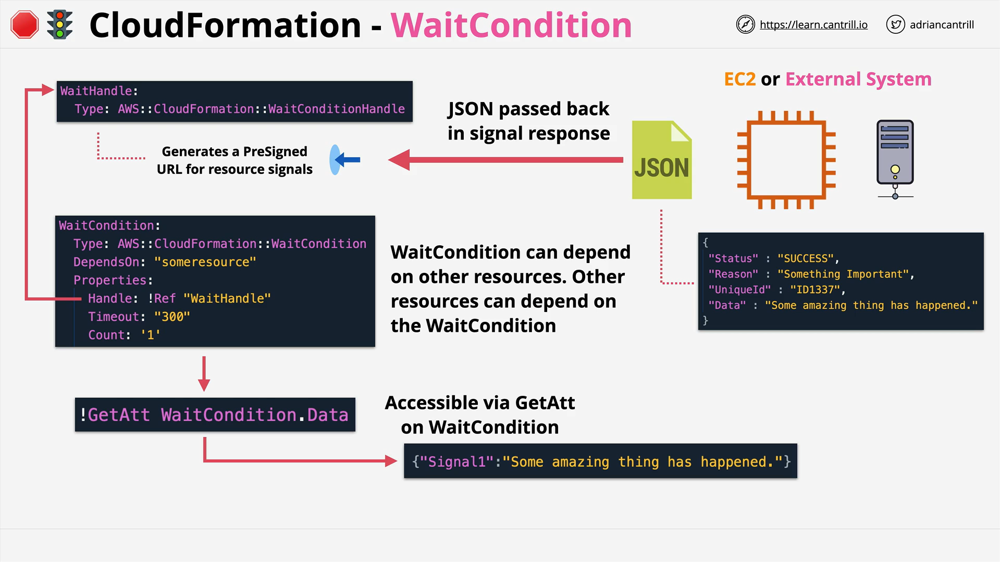

# AWS CloudFormation: Creation Policies, Wait Conditions, and CFN-Signal

## Traditional CloudFormation Provisioning Process

- **Logical resources** are defined in a CloudFormation template.
- CloudFormation **creates a stack** using the template, translating logical resources into **physical AWS resources** (e.g., EC2 instances).
- **EC2 instance** creation is initiated, and once AWS reports "creation complete," CloudFormation proceeds.
- **Problem**:
  - **Bootstrapping scripts** (via `UserData`) like WordPress installation can continue _after_ the instance signals "ready."
  - CloudFormation **does not know** if the bootstrapping **succeeds or fails**.

## Introducing Creation Policies, Wait Conditions, and CFN-Signal

To address the above problem:

- **Creation policies**, **wait conditions**, and **CFN-signal** are used to ensure **full readiness** before considering a resource as "created."
- They allow a **detailed signaling mechanism** from resources back to CloudFormation.

## CFN-Signal

- A **CLI utility** (`cfn-signal`) part of the `AWS::CloudFormation::Init` toolset.
- Purpose: **Send success or failure signals** from an instance **back to CloudFormation**.
- **Configuration**:
  - **Number of success signals required** (e.g., 3 successful instances).
  - **Timeout** (up to **12 hours**).

### Behavior:

- If the **required signals are received** in time → **Resource becomes Create Complete**.
- If **failure signals** or **timeout** occur → **Resource creation fails**, and **stack creation fails**.

## Creation Policies



- **Attach directly** to specific resources like `AWS::EC2::Instance` or `AWS::AutoScaling::AutoScalingGroup`.
- Define:
  - **Signal count required**.
  - **Timeout period**.
- **Process**:
  - Resource **waits** until it receives the configured number of success signals.
  - Only then does CloudFormation mark the resource as `CREATE_COMPLETE`.

### Example: Auto Scaling Group with Creation Policy

**Scenario**:

- Launch an AutoScaling group that spins up **three EC2 instances**.

**Process**:

1. Stack creation initiated.
2. Instances launched but **AutoScaling Group waits** because of the attached **Creation Policy**.
3. Each instance:
   - Bootstraps via `UserData`.
   - After successful bootstrapping, executes **`cfn-signal`**.
4. Once **three success signals** are received within the timeout (e.g., 15 minutes):
   - **Stack moves to CREATE_COMPLETE**.
5. If timeout or failure signal:
   - **Stack moves to CREATE_FAILED**.

## Wait Conditions



- **Separate logical resource** (`AWS::CloudFormation::WaitCondition`) used for **general signaling needs**.
- **Not tied** to specific resources.
- Useful for **external systems** integration or **general synchronization points** in the stack.

### Key Concepts:

- **WaitHandle** (`AWS::CloudFormation::WaitConditionHandle`):
  - **Generates a pre-signed URL**.
  - No AWS credentials needed to send a signal (credentials embedded).
- **External servers** or resources **send signals** (success/failure) using this URL.
- **Signals** contain:
  - `Status` (SUCCESS or FAILURE)
  - `Reason`
  - `UniqueId`
  - `Data` (optional additional metadata)

## Data Access and Flow

- Signals **carry data** back to the CloudFormation stack.
- Use **`Fn::GetAtt`** function to retrieve data attributes from a `WaitCondition`.
- This enables **dynamic flow** of information (e.g., licensing info, config states) into the CloudFormation template.

## Comparison: Creation Policies vs Wait Conditions

| Feature              | Creation Policies                     | Wait Conditions                       |
| -------------------- | ------------------------------------- | ------------------------------------- |
| Tied to a resource?  | Yes (e.g., EC2, AutoScalingGroup)     | No (separate logical resource)        |
| Use case             | Confirm instance is fully provisioned | General event synchronization         |
| Signal Source        | Resource itself (instance)            | Any entity (e.g., external server)    |
| Additional data flow | No                                    | Yes (data can be passed and accessed) |
| Simplicity           | Simple                                | Slightly more complex                 |

- **AWS Recommendation**: Use **creation policies** where possible for simplicity.
- **Wait conditions** are better suited for **complex or external integration**.

## Code Example: Using `cfn-signal`

```bash
/opt/aws/bin/cfn-signal --exit-code $? \
  --stack myStackName \
  --resource myAutoScalingGroupLogicalName \
  --region us-east-1
```

### Line-by-line Explanation:

- `/opt/aws/bin/cfn-signal` → Path to the `cfn-signal` binary.
- `--exit-code $?` → Passes the exit status of the last command (e.g., bootstrap success/failure).
- `--stack myStackName` → Name of the CloudFormation stack.
- `--resource myAutoScalingGroupLogicalName` → Logical name of the resource defined in the template.
- `--region us-east-1` → AWS region where the stack is deployed.

### How it works:

- After bootstrapping scripts (e.g., installing software) finish, the instance sends a **success or failure signal** based on the exit code.
- CloudFormation receives the signal and proceeds accordingly.

## Final Thoughts

- **Creation Policies** and **Wait Conditions** are essential for **robust, production-ready stacks**.
- Understanding them is **critical for AWS certification exams** (especially the **Solutions Architect Associate**).
- These tools **enhance resource provisioning validation**, **prevent incomplete deployments**, and **allow controlled stack progression**.
