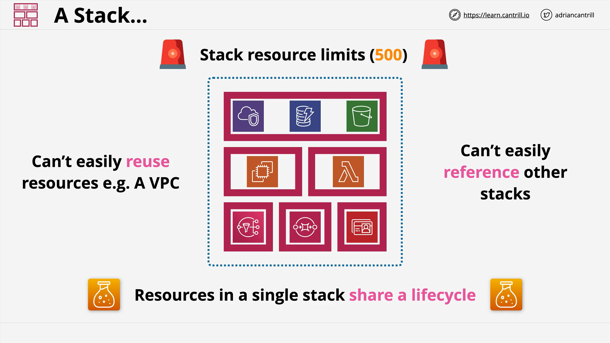
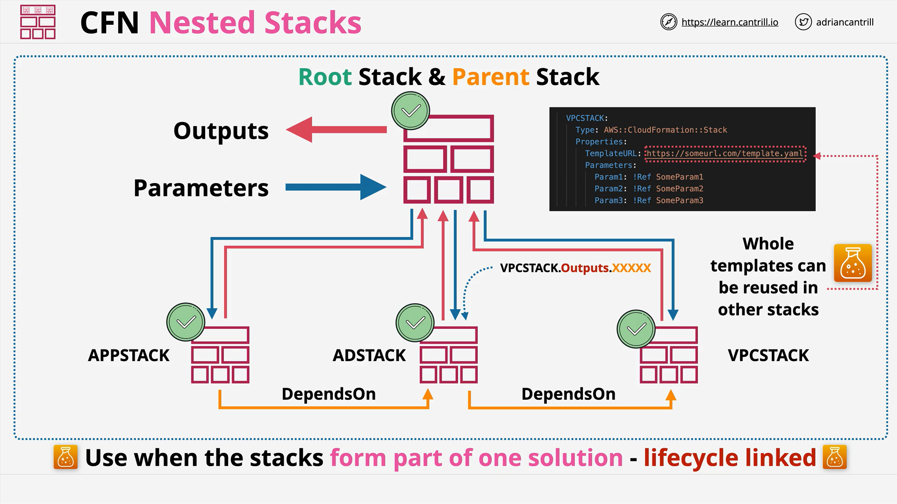

# AWS CloudFormation: Nested Stacks

## Introduction

In this section, we discuss two advanced CloudFormation features:

- **Nested Stacks** (this lesson)
- **Cross-Stack References** (next lesson)

Understanding when and how to use each is important for both the AWS certification exam and real-world projects.

## Single CloudFormation Stack Architecture



- A **CloudFormation Stack** is **isolated** and manages a set of AWS resources that are created, updated, and deleted together.
- Example resources: **VPC**, **DynamoDB**, **S3**, **EC2**, **Lambda**, **SNS**, **SQS**, **Directory Service**.
- All resources within the stack **share the same lifecycle**.

**Limits and Drawbacks**:

- **500 resources per stack** limit: can be problematic for large deployments.
- **Isolation**: resources like a VPC inside a stack cannot be easily reused by other stacks.

## Multi-Stack Architecture



When dealing with complex architectures, you use **multiple stacks**. Two approaches are:

- **Nested Stacks** (discussed in this lesson)
- **Cross-Stack References** (covered in the next lesson)

# Nested Stacks

## What Are Nested Stacks?

- **Nested Stacks** are regular CloudFormation stacks created inside another stack.
- The **root stack** (also the parent stack) is manually created.
- The **root stack** manages one or more **nested stacks**.
- Each nested stack is a **logical resource** of type:

```yaml
Type: AWS::CloudFormation::Stack
```

> **Explanation**:
>
> - `Type:` defines the type of AWS resource. Here, it specifies another CloudFormation Stack as a resource inside the main stack.

## How Nested Stacks Work

- The nested stack references a separate CloudFormation **template file** (usually through a URL).
- Nested stacks can accept **parameters** and can return **outputs** to the root stack.

Example Concept:

```
Root Stack
├── VPC Nested Stack
├── Active Directory Nested Stack (depends on VPC)
└── Application Nested Stack (depends on AD)
```

**Important Details**:

- Parameters must be provided when creating a nested stack unless the parameters have **default values**.
- Nested stack **outputs** can be referenced by the root stack, but **individual resources inside a nested stack cannot** be directly referenced.

## Example of Nested Stack Resource

```yaml
Resources:
  VPCStack:
    Type: AWS::CloudFormation::Stack
    Properties:
      TemplateURL: https://someurl.com/template.yaml
      Parameters:
        Parameter1: Value1
        Parameter2: Value2
        Parameter3: Value3
```

**Line-by-Line Explanation**:

- `Resources:` section defines AWS resources.
- `VPCStack:` logical name of the nested stack resource.
- `Type: AWS::CloudFormation::Stack` specifies it's a nested stack.
- `Properties:` block provides properties for the stack.
- `TemplateURL:` URL where the nested stack's template file is located.
- `Parameters:` block passes input parameters to the nested stack.

> **Summary**:
>
> - You need to provide values for each required parameter.
> - If defaults exist in the template, parameters are optional.

## Dependency Management

- Nested stacks may depend on other nested stacks.
- Use **DependsOn** attribute to explicitly define creation order.
- Example: Active Directory Stack (**ADStack**) depends on VPC Stack (**VPCStack**).

Nested stacks can:

- Pass outputs (like VPC ID, Subnet IDs) from one nested stack into the parameters of another.

## Benefits of Nested Stacks

| Benefit                       | Description                                                                   |
| :---------------------------- | :---------------------------------------------------------------------------- |
| **Resource Limit Workaround** | Each nested stack has its own 500-resource limit.                             |
| **Modular Templates**         | Templates like VPC creation can be reused across projects.                    |
| **Ease of Stack Management**  | Root stack manages the lifecycle (create/update/delete) of all nested stacks. |

## Important Notes About Nested Stacks

- **Template Reuse**: You are **reusing templates**, **not resources**.
  - Every reuse results in **new resources** being created.
- **Lifecycle Linking**: Use nested stacks when **all resources** are lifecycle-linked (created, updated, deleted together).
- **When Not to Use Nested Stacks**:
  - If some parts need to persist independently.
  - If resources like VPCs are intended to be **shared across projects** (then use **Cross-Stack References** instead).

## Summary

Use **Nested Stacks** when:

- You need to manage more than 500 resources.
- You want to **modularize** infrastructure templates.
- All infrastructure components **must share the same lifecycle**.
- Stack creation, update, and deletion need to be orchestrated easily through one root stack.

Do **not use Nested Stacks** when:

- Different parts of your infrastructure have **different lifecycles**.
- You need to **reuse the same actual resources** across different projects (then prefer **Cross-Stack References**).

## Next Step

In the next lesson, **Cross-Stack References** will be discussed to understand when you should prefer sharing actual resources between stacks.
