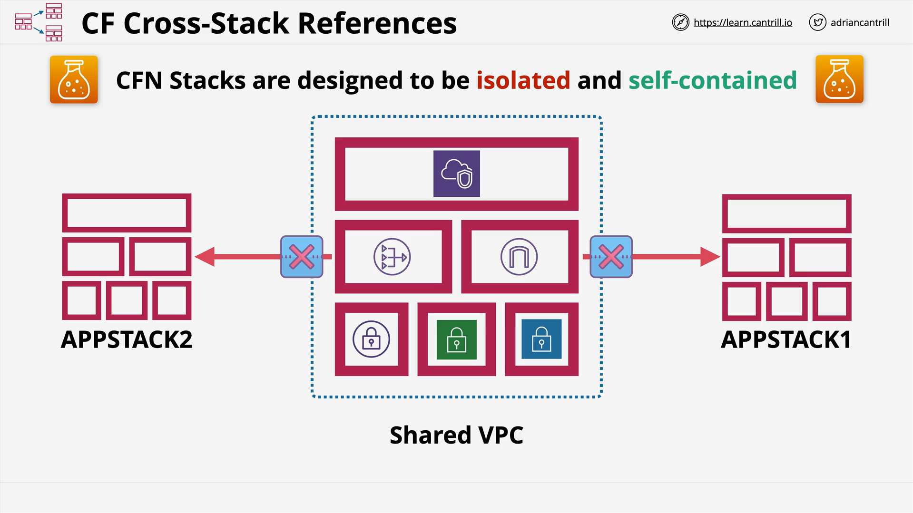
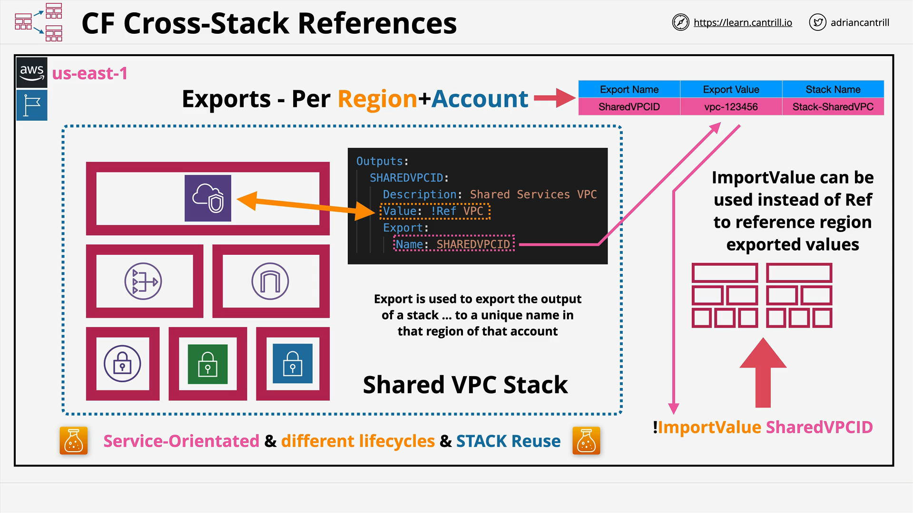

# Cross-Stack References in CloudFormation

## Overview

This lesson builds on the previous discussion of **nested stacks** and introduces **cross-stack references**. Although both techniques involve using parts of infrastructure templates, they are intended for very different scenarios.

## Review of Nested Stacks

- **Nested Stacks** help overcome the AWS CloudFormation resource limit per stack.
- **Reuse templates** modularly (e.g., a standard VPC template).
- **Simplify large infrastructure deployments** through a single root stack invoking multiple nested stacks.
- **Key Limitation**: Reusing templates **recreates** the resources (e.g., using the VPC template 10 times creates 10 VPCs).

## The Problem: Isolation of Stacks



- **Stacks are isolated by design**: Resources in one stack aren't natively accessible by another stack.
- Example: Application stacks (AppStack1 and AppStack2) **cannot reference** the subnets of a Shared VPC Stack directly.
- **Manual input** of VPC or Subnet IDs is possible but results in **static parameters**, not dynamic references.

## Introducing Cross-Stack References



**Purpose**: Enable one stack to **dynamically reference** outputs from another stack without duplicating resources.

### Key Concepts

- Normally, **outputs** of a stack are **only viewable** via the AWS Console or CLI.
- **Root stacks** can reference outputs of **nested stacks**, but their lifecycle is tied together.
- **Cross-stack references** allow **independent lifecycles** (e.g., a long-lived shared VPC and short-lived app stacks).

### Example Scenario

- A company wants to **re-use** a **Shared VPC** for every new application deployment triggered from a Git repository.
- Rather than creating a **new VPC** every time, **reuse the existing VPC, subnets, and NAT gateways**.

## How Cross-Stack References Work

1. **Export** the outputs from the first stack (e.g., VPC ID, subnet IDs).
2. **Import** the exported values into other stacks using the `ImportValue` function.

### Important Notes

- **Export Names Must Be Unique** per **region/account**.
- Cross-stack references **only work within the same region and account** (no cross-region/cross-account support).

## Example: Output and Export

**CloudFormation Output Section Example:**

```yaml
Outputs:
  SharedVPCID:
    Description: "The ID of the shared VPC"
    Value: !Ref SharedVPC
    Export:
      Name: SharedVPCID
```

### Line-by-Line Breakdown:

- `Outputs:`  
  Begins the Outputs section of the CloudFormation template.

- `SharedVPCID:`  
  Defines a logical name for the output.

- `Description:`  
  A human-readable description of what this output represents.

- `Value: !Ref SharedVPC`  
  Uses the `Ref` function to return the ID of the VPC resource named `SharedVPC` within this stack.

- `Export:`  
  Indicates that this output value will be made available for other stacks to use.

- `Name: SharedVPCID`  
  Specifies the unique name under which this value will be exported.

### Explanation

This code exports the VPC ID so that it can be used by other stacks within the same region and account.

## Example: Importing an Export

**CloudFormation Resource Example Using ImportValue:**

```yaml
Resources:
  MyAppSubnet:
    Type: AWS::EC2::Subnet
    Properties:
      VpcId: !ImportValue SharedVPCID
      CidrBlock: 10.0.1.0/24
```

### Line-by-Line Breakdown:

- `Resources:`  
  Begins the Resources section.

- `MyAppSubnet:`  
  Defines a new subnet resource.

- `Type: AWS::EC2::Subnet`  
  Specifies the AWS resource type to create.

- `Properties:`  
  Begins the properties block for the subnet.

- `VpcId: !ImportValue SharedVPCID`  
  Instead of creating a new VPC, imports the VPC ID exported earlier.

- `CidrBlock: 10.0.1.0/24`  
  Specifies the IP range for the new subnet.

### Explanation

Instead of creating a new VPC, this subnet is associated with an **existing shared VPC** by importing its VPC ID.

## Architectural Flow

1. **Shared Services Stack** creates a VPC and **exports** necessary values (e.g., VPC ID).
2. **Application Stacks** **import** these values and deploy resources into the shared infrastructure.
3. Both stacks operate independently — **different lifecycles**.

## Use Cases for Cross-Stack References

- **Service-Oriented Architectures (SOA)**: Services provided by one stack to another.
- **Short-lived Applications**: Apps that use long-lived infrastructure (like a shared VPC).
- **Different Lifecycles**: Infrastructure and applications can be updated or destroyed separately.
- **Reusing Actual Resources**: Unlike nested stacks that reuse **templates**, cross-stack references **reuse infrastructure**.

## Important Exam Tips

- **Template ≠ Stack**:

  - A **template** is a blueprint.
  - A **stack** is an actual deployed set of resources.

- **Nested Stacks**: Reuse templates.
- **Cross-Stack References**: Reuse existing deployed resources.

Choosing incorrectly (e.g., using nested stacks when cross-stack references are needed) can result in **inefficient designs** or **unexpected behaviors**.

# Conclusion

Cross-stack references are essential for building **efficient, scalable, and modular** architectures using AWS CloudFormation when you need to **reuse resources** across stacks while maintaining **independent lifecycles**.
