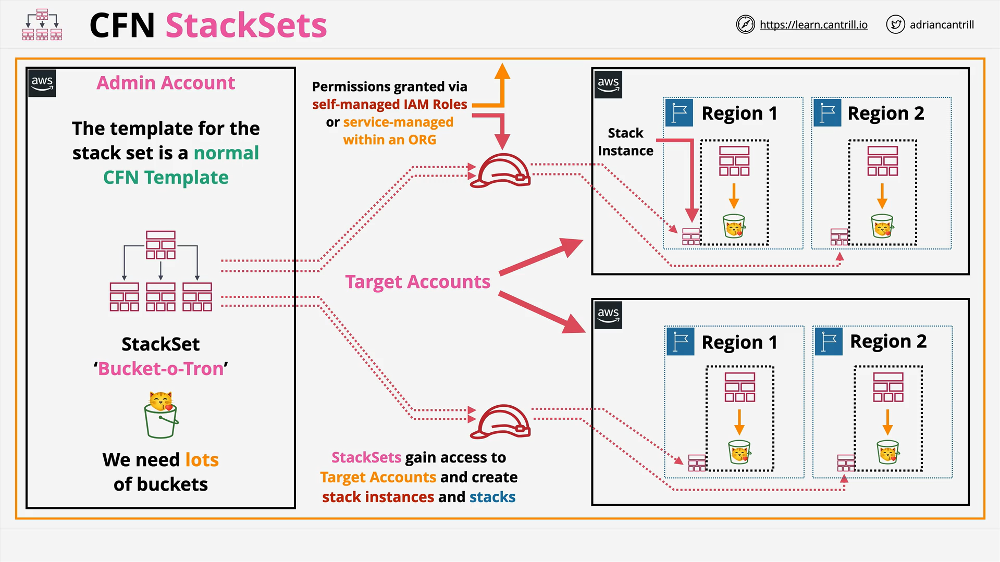

# AWS CloudFormation StackSets

## What are StackSets?

**StackSets** are a feature of AWS CloudFormation that allows you to **create, update, and delete** CloudFormation stacks **across multiple AWS accounts and regions** automatically.  
Rather than manually authenticating into different accounts and regions, StackSets delegate these tasks to CloudFormation itself.

## Key Concepts

### StackSets

- **Container** for managing CloudFormation stacks across multiple accounts/regions.
- Applied in an **Admin Account** (a normal AWS account designated for management).
- StackSets manage **Stack Instances** but are **different from individual stacks**.

### Stack Instances

- **References** to individual stacks.
- Represent the connection between a StackSet and an actual stack deployed in a specific **AWS account** and **region**.
- **Important:** Even if stack creation fails, the Stack Instance remains to record the event.

### Admin Account vs Target Account

- **Admin Account:** The AWS account where the StackSet is created and managed.
- **Target Account:** AWS accounts where the actual infrastructure (stacks) will be deployed.

## StackSets and Permissions

There are **two ways** to configure permissions for StackSets:

1. **Service-Managed Permissions**

   - Uses **AWS Organizations**.
   - Permissions and roles are created automatically.
   - Easier and more automated.

2. **Self-Managed Permissions**
   - You manually create the **IAM roles** required for StackSet operations.
   - Offers more customization and control.

## Visual Overview of StackSets Architecture



- **Admin Account**:
  - Create a StackSet using a normal CloudFormation template (e.g., create an S3 bucket).
- **Target Accounts**:
  - Multiple AWS accounts across multiple regions.
  - Stack Instances created for each combination of account + region.
- **Resource Creation**:
  - Actual stacks are created inside target accounts, based on the StackSet template.
  - Resources (like S3 buckets) are provisioned.

**Example:**

- 2 AWS Accounts, 2 Regions each → **4 Stacks**.
- Without StackSets, manual setup needed.
- With StackSets, CloudFormation automates the setup.

## Important Terms

| Term                    | Definition                                                                                      |
| ----------------------- | ----------------------------------------------------------------------------------------------- |
| **Concurrent Accounts** | Number of AWS accounts deployed into simultaneously. Higher values = faster deployments.        |
| **Failure Tolerance**   | Number of allowable failures before the StackSet is considered failed.                          |
| **Retain Stacks**       | If enabled, when removing Stack Instances, the deployed Stacks are **kept** instead of deleted. |

## Common Use Cases for StackSets

- Enable AWS Config across multiple accounts.
- Deploy AWS Config Rules (e.g., MFA enforcement, EBS encryption checks).
- Create IAM roles for cross-account access.
- Mass creation of resources like S3 buckets, SNS topics, or IAM policies across an enterprise.

## Code Example: Creating an Output for StackSets (Conceptual Example)

Here’s what a simple template (e.g., creating an S3 bucket) might look like:

```yaml
Resources:
  MyS3Bucket:
    Type: AWS::S3::Bucket
    Properties:
      BucketName: my-stackset-bucket

Outputs:
  BucketName:
    Description: "The name of the S3 bucket"
    Value: !Ref MyS3Bucket
```

### Line-by-Line Explanation:

- `Resources:`  
  The section where resources to be created are defined.

- `MyS3Bucket:`  
  Logical ID for the S3 bucket resource.

- `Type: AWS::S3::Bucket`  
  Specifies that the resource is an S3 Bucket.

- `Properties:`  
  Defines specific properties of the S3 bucket, such as the bucket name.

- `Outputs:`  
  Section used to declare output values from the stack. Useful for cross-stack references or external usage.

- `BucketName:`  
  Logical ID for the output.

- `Description:`  
  Description of what the output represents.

- `Value: !Ref MyS3Bucket`  
  Uses the `Ref` function to output the actual name of the S3 bucket created.

## Key Takeaways

- **StackSets** simplify multi-account, multi-region infrastructure management.
- **Admin Account** manages StackSet; **Target Accounts** host the deployed resources.
- **Self-Managed Roles** vs **Service-Managed Roles** offer flexibility in permission management.
- **Concurrency** and **failure tolerance** settings are critical for efficient deployments.
- **StackSets** are ideal for deploying consistent infrastructure across an entire AWS Organization.
