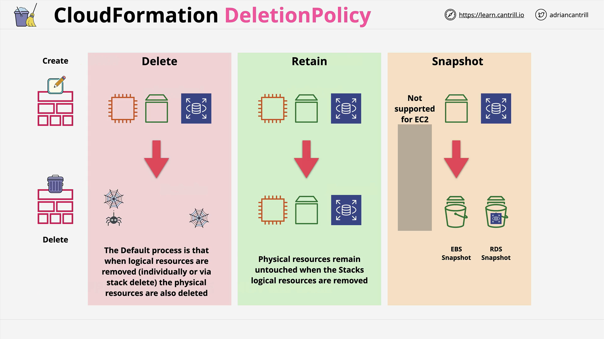

# AWS CloudFormation Deletion Policies

## Introduction

In this lesson, the concept of **Deletion Policies** in AWS CloudFormation is introduced. Although simple, it is critical when deploying larger production systems to avoid accidental data loss.

## What Are Deletion Policies?

- By **default**, when a resource is deleted from a template or when an entire stack is deleted, **CloudFormation deletes the associated physical resource**.
- This can cause **data loss** for services like:
  - **RDS Databases**
  - **EC2 Instances with EBS Volumes**

To control the behavior when deleting resources, **Deletion Policies** can be specified on a per-resource basis.

## Types of Deletion Policies

| Type               | Description                                                                                                                               |
| ------------------ | ----------------------------------------------------------------------------------------------------------------------------------------- |
| `Delete` (Default) | Deletes the physical resource when its logical resource is removed.                                                                       |
| `Retain`           | Keeps the physical resource even if the logical resource is deleted.                                                                      |
| `Snapshot`         | Takes a snapshot of the resource before deletion. Only supported for certain resources like EBS, RDS, Redshift, Neptune, and ElastiCache. |

## Example Behavior

| Scenario | Behavior                                                                                                                                       |
| -------- | ---------------------------------------------------------------------------------------------------------------------------------------------- |
| Default  | Stack deletion removes EC2, EBS, and RDS resources.                                                                                            |
| Retain   | Stack deletion leaves EC2, EBS, and RDS resources intact.                                                                                      |
| Snapshot | Snapshot is taken for EBS and RDS before deletion (not supported for EC2). Snapshots remain after stack deletion and must be managed manually. |

## Important Notes

- **Deletion Policies apply only to explicit delete operations**, such as:
  - Deleting a stack
  - Deleting a logical resource from the template and applying it
- **They do NOT apply** to resource replacements caused by updates (which replace the resource).
  - **Resource replacement** will **lose data** despite Deletion Policies.
- **Snapshots incur costs** in AWS storage; manual cleanup is required to avoid unexpected charges.
- **Snapshot Deletion Policy** is **not supported** on all AWS resources (e.g., EC2 instances).

## Visual Understanding



- **Default**  
  → Deleting the stack removes all physical resources.
- **Retain**  
  → Deleting the stack retains all physical resources.
- **Snapshot**  
  → Deleting the stack retains snapshots for supported resources (manual management needed).

## Example CloudFormation Snippet with Deletion Policy

```yaml
Resources:
  MyEBSVolume:
    Type: AWS::EC2::Volume
    Properties:
      AvailabilityZone: us-east-1a
      Size: 100
    DeletionPolicy: Snapshot
```

### Line-by-Line Explanation:

- `Resources:`: Start of the resources block.
- `MyEBSVolume:`: Logical name for the EBS volume.
- `Type: AWS::EC2::Volume`: Defines the resource type as an EC2 Volume.
- `Properties:`: Attributes for the EBS volume.
- `AvailabilityZone: us-east-1a`: Defines which availability zone the EBS volume will reside in.
- `Size: 100`: Defines the volume size in GB.
- `DeletionPolicy: Snapshot`: Ensures a snapshot is taken before the volume is deleted.

**Additional Explanation:**  
This CloudFormation resource defines a 100GB EBS volume in the `us-east-1a` availability zone. If this stack or resource is deleted, **CloudFormation will take a snapshot of the volume** before deletion, thus preventing immediate data loss.

## Conclusion

Deletion Policies are crucial for production-grade systems to avoid unintended data loss during stack or resource deletions. While simple, understanding when and how they apply is critical — especially differentiating between **deletion** and **replacement** operations.
