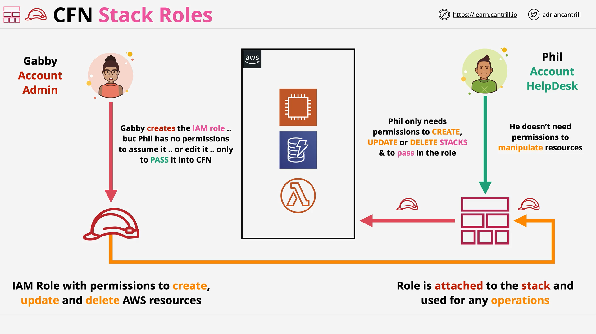

# AWS CloudFormation Stack Roles

## Introduction

In this lesson, we explore **CloudFormation Stack Roles**, a key feature for securing and managing CloudFormation operations, especially for AWS certification and real-world production environments.

## Background: How CloudFormation Normally Works

- When creating a **CloudFormation Stack**, logical resources from the template are mapped to **physical AWS resources**.
- **Default behavior:**
  - CloudFormation uses the **permissions of the identity** (IAM user or role) that initiates the stack creation.
  - Example identities:
    - IAM User (through Console UI or CLI)
- To operate with CloudFormation **by default**, the identity must have:
  - Permissions to **create, update, and delete stacks**
  - Permissions to **create, update, and delete** all AWS resources within the stack

## The Problem with Default Behavior

- Many organizations separate duties between teams:
  - **One team** may create infrastructure.
  - **Another team** may support or update infrastructure.
- Granting full permissions to all users **poses security risks**.

## What Are CloudFormation Stack Roles?

- **CloudFormation Stack Roles** allow CloudFormation to **assume an IAM role** with specific permissions to create, modify, or delete AWS resources.
- **Key Benefits:**
  - **Separation of duties:**  
    Stack creators don't need full permissions on resources.
  - **Controlled delegation:**  
    Users can manage stacks **without managing resources directly**.

## How Stack Roles Work

1. **An Admin (Gabby)**:
   - Creates an IAM **role** with permissions needed to interact with AWS resources.
   - **Important:**
     - The role is **protected**:  
       Users like Phil **cannot edit or directly assume** the role.
2. **A Help Desk Engineer (Phil)**:
   - Only has permissions to:
     - Create, update, delete CloudFormation stacks.
     - **Pass the specific role** to CloudFormation.
3. **During Stack Creation**:
   - Phil **selects the predefined role**.
   - CloudFormation **assumes the role** to interact with AWS services.
4. **Result**:
   - Phil **cannot** directly create, modify, or delete AWS resources.
   - Phil **can** manage stacks safely via CloudFormation.

## Visual Example Scenario



| Identity                      | Permissions                                | Actions                                            |
| ----------------------------- | ------------------------------------------ | -------------------------------------------------- |
| **Gabby** (Admin)             | Create IAM roles with resource permissions | Defines Stack Role                                 |
| **Phil** (Help Desk Engineer) | Manage CloudFormation Stacks, Pass Role    | Creates/updates/deletes stacks by passing the role |

## Example CloudFormation Setup with Stack Roles

Suppose Gabby creates an IAM role `CFNStackRole` with permissions to manage S3, EC2, and RDS.

**Phil** can now deploy a stack like this:

```bash
aws cloudformation create-stack \
    --stack-name my-stack \
    --template-body file://template.yaml \
    --role-arn arn:aws:iam::123456789012:role/CFNStackRole
```

### Line-by-Line Explanation:

- `aws cloudformation create-stack`: Command to create a new CloudFormation stack.
- `--stack-name my-stack`: Names the stack "my-stack."
- `--template-body file://template.yaml`: Provides the CloudFormation template from a local file.
- `--role-arn arn:aws:iam::123456789012:role/CFNStackRole`:  
  Specifies the **Stack Role** that CloudFormation should assume during the creation process.

### Additional Explanation:

Using `--role-arn`, Phil passes the required role to CloudFormation.  
The AWS CLI command ensures CloudFormation uses **CFNStackRole**'s permissions to create resources, **not Phil’s personal IAM permissions**.

## Important Points for the Exam

- **Use Stack Roles** if:
  - A user needs to perform operations they would not otherwise have permissions to do **outside of CloudFormation**.
- **Administrator sets up the IAM Role**, and the less-privileged user simply:
  - Manages stacks.
  - Passes the role when creating or updating stacks.
- **Security Control:**  
  Users **cannot edit roles or resources directly** — they operate safely through CloudFormation.

## Conclusion

Stack Roles in CloudFormation are a **simple but powerful feature** that enforces strict security controls while allowing users to manage infrastructure flexibly.  
You must be fully comfortable with this concept for the AWS exam and real-world cloud deployments.
