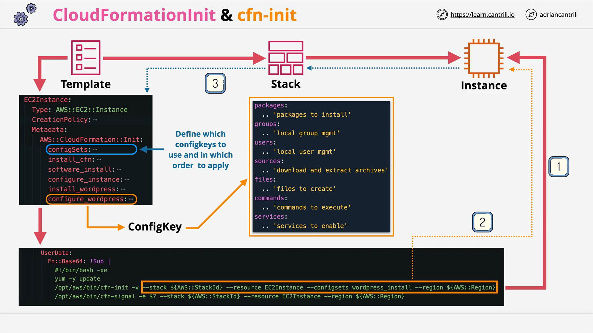

# CloudFormation Init

## Introduction

In this lesson, we explore **CloudFormation Init**, a native feature of AWS CloudFormation used to manage the configuration of EC2 instances. It is an alternative to traditional bootstrapping using **user data scripts**.

## Differences Between User Data and CloudFormation Init

|                 User Data                  |               CloudFormation Init                |
| :----------------------------------------: | :----------------------------------------------: |
| Procedural (executes step-by-step scripts) |           Desired state configuration            |
|  Tells the instance **how** to bootstrap   |     Defines **what** the end state should be     |
|      Instance-specific (OS-dependent)      |   Cross-platform (Linux, some Windows support)   |
|  Not idempotent (requires manual checks)   | Idempotent (automatically ensures desired state) |

- **User Data**: Scripts are passed directly to EC2 during launch and executed on the instance.
- **CloudFormation Init**: Configuration is declared in the **template** under the EC2 resource's `Metadata` section and managed via the **CFN-Init helper tool**.

## CloudFormation Init - Key Concepts



### 1. Native to CloudFormation

- Configurations are part of the **CloudFormation template**.
- Stored under the `Metadata` block within an EC2 logical resource.
- Uses the **AWS::CloudFormation::Init** namespace.

### 2. Idempotency

- CFN-Init does not repeat actions if the desired state is already achieved.
  - Example: If Apache is already installed, no reinstallation occurs.
- This reduces the complexity of scripts and error handling.

### 3. Access and Execution

- **CFN-Init Helper Script (`cfn-init`)** is used to read and apply the configuration.
- **CFN-Signal (`cfn-signal`)** is used to notify CloudFormation about the completion of instance setup.

### 4. Invocation Flow

1. CloudFormation template defines an EC2 instance.
2. Under `Metadata`, configuration is specified using `AWS::CloudFormation::Init`.
3. `cfn-init` is triggered via **minimal user data script** during instance launch.
4. The helper script reads the stack metadata and applies configurations.
5. `cfn-signal` optionally signals back to CloudFormation to indicate the completion.

## Key Sections Within CloudFormation Init

Each config block can include:

|  Section   |             Purpose             |
| :--------: | :-----------------------------: |
| `packages` |    Install software packages    |
|  `groups`  |       Manage local groups       |
|  `users`   |       Manage local users        |
| `sources`  |  Download and extract archives  |
|  `files`   |     Create or modify files      |
| `commands` | Execute specific shell commands |
| `services` |  Enable/start system services   |

## Config Sets

- **Config keys** represent individual configurations.
- **Config sets** are collections of config keys that can be executed in a specific order.
- This allows building modular and reusable configuration patterns.

**Example Scenario:**

- Config Keys:
  - `install_cfn_software`
  - `configure_instance`
  - `install_wordpress`
  - `configure_wordpress`
- Config Set:
  - `WordPress_install` config set that bundles all the above.

## Example: Minimal `cfn-init` Command Breakdown

```bash
/opt/aws/bin/cfn-init \
    --stack STACK_ID \
    --resource RESOURCE_LOGICAL_ID \
    --region AWS_REGION \
    --configsets WordPress_install
```

### Line-by-Line Explanation:

- `/opt/aws/bin/cfn-init`: Path to the helper tool installed in the EC2 AMI.
- `--stack STACK_ID`: Refers to the CloudFormation stack that created the EC2 instance.
- `--resource RESOURCE_LOGICAL_ID`: Logical ID of the EC2 resource in the CloudFormation template.
- `--region AWS_REGION`: AWS region where the stack is deployed.
- `--configsets WordPress_install`: Specifies the config set to use (a collection of configuration directives).

### Additional Notes:

- `STACK_ID`, `RESOURCE_LOGICAL_ID`, and `AWS_REGION` are dynamically replaced at launch.
- `cfn-init` reads the metadata from the template and applies it.

## Summary

- **CloudFormation Init** enables declarative instance configuration.
- It's **more powerful, cross-platform, and idempotent** compared to raw **user data scripts**.
- Configuration is organized into **config keys** and **config sets**.
- Helper tools like **cfn-init** and **cfn-signal** facilitate seamless bootstrapping.
- Essential for creating repeatable, maintainable CloudFormation templates for complex applications.
