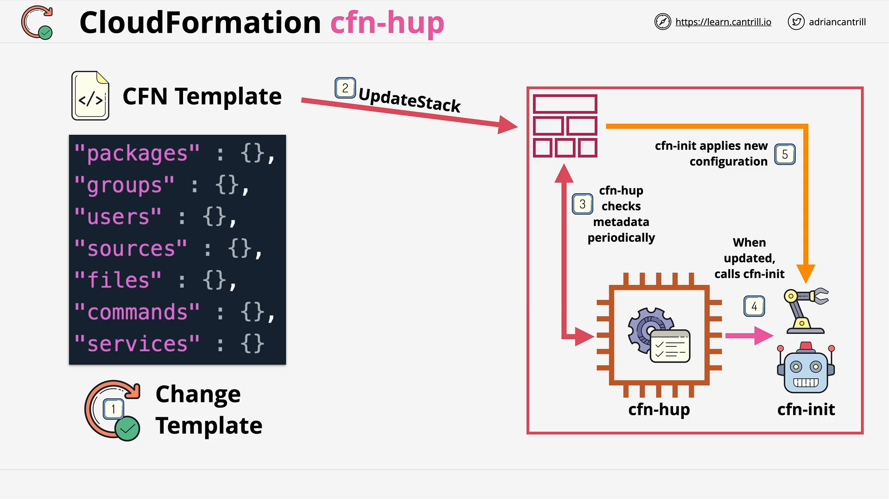

# CloudFormation CFN-Hup Detailed

## Introduction

This lesson introduces **CFN-Hup**, a critical tool that extends the capability of **cfn-init** in AWS CloudFormation. It enables EC2 instances to **detect metadata changes** and **reapply configurations automatically**, ensuring that updated stack templates can dynamically adjust running instances.

## Quick Refresher: `cfn-init`

- **`cfn-init`** is a helper script used during the **initial bootstrapping** of an EC2 instance.
- It **reads metadata** attached to the logical resource of the EC2 instance inside the CloudFormation stack.
- It **applies configurations** like:
  - Installing software packages
  - Configuring files
  - Starting services
- **Important**:
  - `cfn-init` is **only executed once** when the instance is first launched.
  - Any future changes to the stack **do not trigger `cfn-init` again** by default.

## The Problem with Static Bootstrapping

- If the **CloudFormation template is updated** (such as updating metadata to install a new application),
- The changes **will not automatically be applied** to already running EC2 instances.
- **User Data Scripts**:
  - These also only run once at launch.
  - Updates made after instance creation are **ignored** unless specifically handled.

## What is CFN-Hup?

- **`cfn-hup`** is a lightweight **daemon** (background service) that can be installed on an EC2 instance.
- It **monitors** the logical resource metadata for that instance within the CloudFormation stack.
- When a **change** is detected (through a **stack update** that modifies metadata), `cfn-hup` can:
  - **Trigger configurable actions**, typically rerunning `cfn-init`.
- This allows instances to **dynamically reconfigure** based on updated metadata without manual intervention.

## How CFN-Hup Works (Step-by-Step)

1. A **CloudFormation template** defines an EC2 instance and its metadata (e.g., install WordPress).
2. On instance launch:
   - **`cfn-init`** applies the initial configuration.
   - **`cfn-hup`** is installed and configured to monitor changes.
3. Later, a **template update** modifies the metadata (e.g., update application version).
4. After performing a **stack update**:
   - `cfn-hup` **detects the change** in the metadata.
   - It **executes a configured action** — commonly rerunning `cfn-init`.
5. `cfn-init` **downloads and applies** the new metadata, updating the instance's configuration.

## Visual Flow



```plaintext
CloudFormation Template
    ↓ (create stack)
CloudFormation Stack
    ↓ (create resource)
EC2 Instance
    ↓ (initial config with cfn-init + cfn-hup installed)

Later:
Template Updated
    ↓ (stack update)
CFN-Hup detects change
    ↓
Triggers cfn-init
    ↓
Applies updated configuration to instance
```

## Important Takeaways

- **Stack Updates Alone**:
  - Updating a stack **does not** trigger bootstrapping processes like `cfn-init` or User Data again by default.
- **CFN-Hup Requirement**:
  - To apply updates to a running instance after a stack update:
    - You must **install and configure CFN-Hup** during the initial bootstrapping.
- **Normal User Data Limitation**:

  - Only executed once at initial launch.
  - Changes to User Data later are **not re-executed automatically**.

- **CFN-Hup Advantage**:
  - Allows **live updates** to running instances based on updated stack metadata without needing to replace or relaunch instances.

## (Example) Basic CFN-Hup Configuration (Assumed Setup)

Although no specific code was shown in the lecture, here’s an example of a typical CFN-Hup configuration setup:

### `/etc/cfn/cfn-hup.conf`

```ini
[main]
stack=MyStackName
region=us-east-1
interval=5
verbose=true
```

### Line-by-Line Explanation:

- `[main]`: Start of the main configuration block.
- `stack=MyStackName`: The CloudFormation stack name the instance belongs to.
- `region=us-east-1`: AWS region where the stack is deployed.
- `interval=5`: Poll for changes every 5 minutes.
- `verbose=true`: Enables detailed logging for troubleshooting.

### `/etc/cfn/hooks.d/cfn-auto-reloader.conf`

```ini
[cfn-auto-reloader-hook]
triggers=post.update
path=Resources.MyEC2Instance.Metadata.AWS::CloudFormation::Init
action=/opt/aws/bin/cfn-init -v --stack MyStackName --resource MyEC2Instance --region us-east-1
runas=root
```

### Line-by-Line Explanation:

- `[cfn-auto-reloader-hook]`: Name of the hook block.
- `triggers=post.update`: Trigger action after the metadata is updated.
- `path=Resources.MyEC2Instance.Metadata.AWS::CloudFormation::Init`: Monitors the specific resource's metadata.
- `action=/opt/aws/bin/cfn-init -v --stack MyStackName --resource MyEC2Instance --region us-east-1`:  
  Command to rerun `cfn-init` with verbose output.
- `runas=root`: Runs the action as the root user for full system access.

# Final Summary

- **`cfn-init`** applies instance configurations based on CloudFormation metadata during launch.
- **`cfn-hup`** monitors resource metadata for changes and can **trigger actions** like rerunning `cfn-init`.
- This ensures that **updates to templates and metadata can dynamically reconfigure existing instances**.
- **Installing and configuring `cfn-hup` during bootstrapping** is critical to enable this functionality.
- Without `cfn-hup`, updates to stack metadata will **not affect** running instances.

# Next Steps

In the next lesson, there will be a **practical demo** showing how to install, configure, and test `cfn-init` and `cfn-hup` together for dynamic, automated instance updates.
