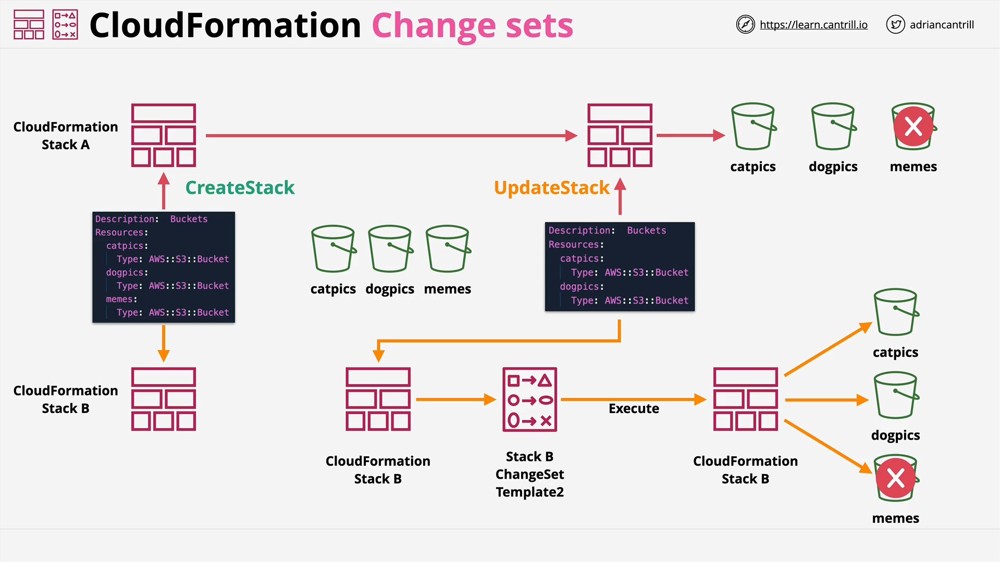

# CloudFormation Change Sets

## Introduction to Change Sets

CloudFormation Change Sets are a feature designed to make AWS CloudFormation safer and more manageable, especially in:

- **Full Infrastructure as Code (IaC) environments**
- **Continuous Integration and Continuous Deployment (CI/CD) processes**

Change Sets allow you to **preview changes** before applying them to your stack, providing better control and avoiding accidental disruptions.

## Typical CloudFormation Workflow



1. **Create Stack**:

   - Use a CloudFormation template to create a stack.
   - Stack creates **physical resources** from **logical resources** defined in the template.

2. **Delete Stack**:

   - Deletes all physical resources created by the stack.

3. **Update Stack**:
   - Apply a new template to an existing stack.
   - Updates logical resources which may change physical resources.

## Stack Update Effects

When a stack update modifies logical resources, it results in one of three physical resource effects:

| Effect            | Description                                                 |
| ----------------- | ----------------------------------------------------------- |
| No Interruption   | Resource is updated with no operational disruption.         |
| Some Interruption | Minor disruption like an EC2 reboot (non-damaging).         |
| Replacement       | Resource is replaced, old one deleted (possible data loss). |

## Introduction to Change Sets

**Problem Without Change Sets**:  
If you apply a new template immediately, unwanted resources may be deleted or modified without notice.

**Solution With Change Sets**:

- You create a **Change Set** based on the new template.
- Change Set **summarizes all changes** before actually applying them.
- **Multiple Change Sets** can be created and reviewed.
- You can **discard** or **execute** any Change Set as needed.

## Visual Example - Buckets Scenario

1. **Initial Stack (Template V1)**:

   - Creates three S3 Buckets:
     - `capics`
     - `dogpics`
     - `memes`

2. **Desired Update (Template V2)**:

   - You decide to **remove** the `memes` bucket.
   - A new template omitting `memes` is created.

3. **Without Change Set**:

   - If updated immediately, the `memes` bucket is deleted without any prior review.

4. **With Change Set**:
   - A Change Set is created showing:
     - Action: **Remove**
     - Resource: **memes bucket**
   - Decision: You can **review**, **accept**, or **discard** the Change Set.

## Demo Walkthrough - Using the AWS Console

### Step-by-Step:

1. **Log in**:

   - Use IAM admin user in AWS Management Account.
   - Region: Northern Virginia (us-east-1).

2. **Access CloudFormation Console**:

   - Search and open the CloudFormation service.

3. **Upload and Create Initial Stack**:

   - Use `template1.yaml` (3 buckets: capics, dogpics, memes).
   - Create the stack (stack name suggested: `change-sets`).

4. **Verify Resources**:

   - Check that three S3 buckets were created.

5. **Create Change Set**:

   - Action: **Create Change Set for Current Stack**.
   - Upload `template2.yaml` (removes memes bucket).
   - Name Change Set: `change-sets-v2`.
   - (Optional) Add description, e.g., "Removing memes".

6. **Review Change Set**:

   - Check visual list:
     - Action: **Remove** the `memes` logical and physical resource.
   - Check **Template tab** for the updated template.
   - Check **JSON Changes tab** for detailed change list.

7. **Execute Change Set**:

   - Apply the changes by **executing** the Change Set.
   - Stack updates, memes bucket is deleted.

8. **Post-update**:

   - Stack now shows only two buckets: capics and dogpics.

9. **Cleanup**:
   - **Delete the Stack** to revert environment to the original state.

## JSON Changes Overview

When reviewing a Change Set, you can view detailed changes in **JSON** format.

**Example JSON Change Description:**

```json
[
  {
    "ResourceChange": {
      "Action": "Remove",
      "LogicalResourceId": "memes",
      "PhysicalResourceId": "example-memes-bucket-id",
      "ResourceType": "AWS::S3::Bucket"
    }
  }
]
```

### Explanation:

- **Action**: `"Remove"` — the resource will be deleted.
- **LogicalResourceId**: `"memes"` — the logical name in the template.
- **PhysicalResourceId**: ID of the actual S3 bucket.
- **ResourceType**: `"AWS::S3::Bucket"` — confirms it's an S3 bucket.

## Why Use Change Sets?

| Benefit                    | Description                                       |
| -------------------------- | ------------------------------------------------- |
| Risk Mitigation            | Avoids accidental deletion or disruption.         |
| Review Before Execution    | Shows all planned changes before applying.        |
| Multiple Change Options    | Create and compare different Change Sets.         |
| Rigorous Change Management | Enables better governance in larger environments. |

## Conclusion

CloudFormation Change Sets are a **powerful safety mechanism** for managing AWS resources via Infrastructure as Code.  
They provide visibility into planned changes, enable pre-approval, and greatly reduce the risk of unintentional outages or data loss.

At the end of the demo:

- Always **delete test stacks** to clean up your AWS environment.
- Understand how to **review**, **apply**, or **discard** Change Sets effectively.

# Final Notes

- **Practice** creating and executing Change Sets.
- **Always review** the Change Set thoroughly before execution in production environments.
- **Use JSON view** for precise details in complex environments.
