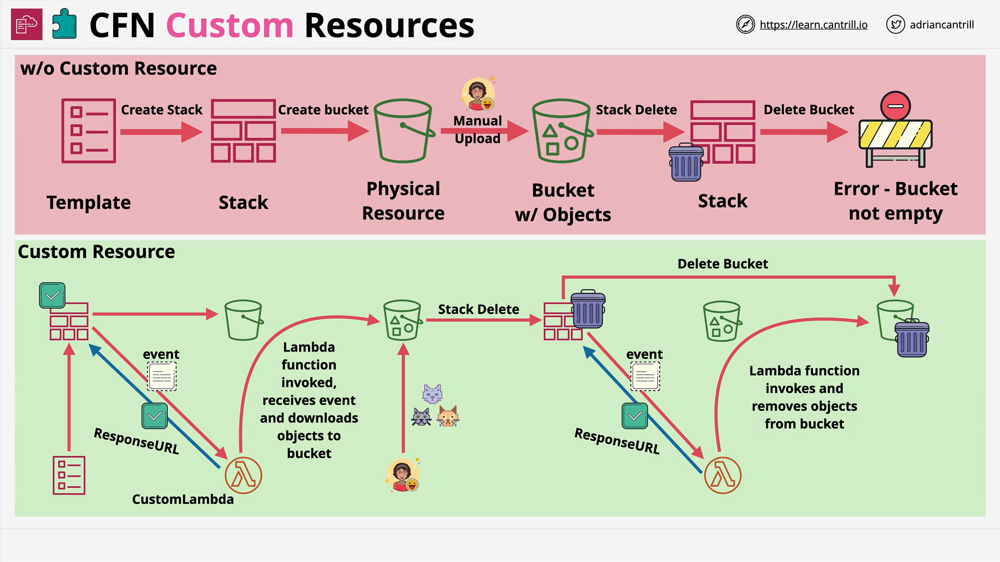

# AWS CloudFormation Custom Resources

## Introduction

CloudFormation is designed to manage AWS infrastructure using **logical resources** defined in a template. These logical resources are transformed into **physical resources** upon stack creation. When a template is updated, the physical resources update accordingly; if a resource is removed, the physical resource is deleted.

However, CloudFormation does **not** support every AWS service or feature natively. To overcome this limitation, **Custom Resources** can be used.

## What are Custom Resources?

Custom Resources allow CloudFormation to:

- Perform actions not natively supported.
- Integrate with **external systems**.
- Extend functionality beyond AWS resources.

### Common Use Cases:

- Populate an S3 bucket with objects upon creation.
- Clean up S3 bucket objects before deletion (to avoid stack deletion failure).
- Retrieve external configuration data during stack setup.
- Provision **non-AWS resources**.

## How Custom Resources Work

The architecture for custom resources is straightforward:

1. CloudFormation **initiates** a create/update/delete operation for the custom resource.
2. It **sends an event** (with operation details and properties) to an **endpoint**.
   - This endpoint is usually an **AWS Lambda function** or an **SNS Topic**.
3. The endpoint processes the event and **sends a response** back to CloudFormation indicating success or failure.
4. If successful, any data generated is passed back into the CloudFormation template for use by other resources.

> **Important:**  
> Custom resources **must** respond to a pre-signed **response URL** provided by CloudFormation to signal the outcome.

## Visual Example: Custom Resource Architecture



### Without Custom Resource:

- A CloudFormation template creates a **simple S3 bucket**.
- If an external user manually uploads objects into the bucket:
  - Deleting the stack **fails**, because S3 buckets with objects cannot be deleted by CloudFormation natively.

### With Custom Resource:

- The template defines:
  - An **S3 bucket**.
  - A **Custom Resource backed by a Lambda Function**.
- The Lambda:
  - Uploads objects during creation.
  - Responds back to CloudFormation via the provided **response URL**.
- If manual uploads happen afterward:
  - During stack deletion, the custom resource is **deleted first**.
  - The Lambda function is triggered to **delete all bucket objects**.
  - After bucket is empty, the bucket and then the entire stack is deleted successfully.

## Detailed Deletion Process With Custom Resource

1. **Delete Stack Initiated**:
   - CloudFormation starts deleting resources based on their **dependency order**.
2. **Custom Resource Deletion**:
   - CloudFormation sends a delete event to the Lambda.
   - Lambda function **empties the S3 bucket**.
   - Lambda function responds with **success** to the response URL.
3. **Bucket Deletion**:
   - With no objects left, the S3 bucket is deleted successfully.
4. **Stack Deletion Complete**:
   - Stack removal succeeds without manual intervention.

## Example: Lambda Function Code for Custom Resource

Here's a simple **Node.js (JavaScript)** Lambda function used to support a custom resource:

```javascript
const https = require("https");
const url = require("url");
const AWS = require("aws-sdk");
const s3 = new AWS.S3();

exports.handler = async (event, context) => {
  console.log("Event: ", JSON.stringify(event, null, 2));

  const bucketName = event.ResourceProperties.BucketName;
  const responseData = {};

  try {
    if (event.RequestType === "Delete") {
      const listedObjects = await s3.listObjectsV2({ Bucket: bucketName }).promise();

      if (listedObjects.Contents.length > 0) {
        const deleteParams = {
          Bucket: bucketName,
          Delete: { Objects: [] },
        };
        listedObjects.Contents.forEach(({ Key }) => {
          deleteParams.Delete.Objects.push({ Key });
        });
        await s3.deleteObjects(deleteParams).promise();
      }
    }
    await sendResponse(event, context, "SUCCESS", responseData);
  } catch (err) {
    console.error(err);
    await sendResponse(event, context, "FAILED", responseData);
  }
};

function sendResponse(event, context, responseStatus, responseData) {
  const responseBody = JSON.stringify({
    Status: responseStatus,
    Reason: "See the details in CloudWatch Log Stream: " + context.logStreamName,
    PhysicalResourceId: context.logStreamName,
    StackId: event.StackId,
    RequestId: event.RequestId,
    LogicalResourceId: event.LogicalResourceId,
    Data: responseData,
  });

  console.log("Response Body: ", responseBody);

  const parsedUrl = url.parse(event.ResponseURL);
  const options = {
    hostname: parsedUrl.hostname,
    port: 443,
    path: parsedUrl.path,
    method: "PUT",
    headers: {
      "Content-Type": "",
      "Content-Length": responseBody.length,
    },
  };

  return new Promise((resolve, reject) => {
    const request = https.request(options, (response) => {
      console.log("Status Code: ", response.statusCode);
      resolve();
    });

    request.on("error", (error) => {
      console.error("sendResponse Error: ", error);
      reject();
    });

    request.write(responseBody);
    request.end();
  });
}
```

### Line-by-Line Explanation:

- **Import modules**:
  - `https`, `url` for HTTP communication.
  - `aws-sdk` to interact with AWS services like S3.
- **`exports.handler`**:
  - Main function triggered by CloudFormation.
- **Event Parsing**:
  - Retrieve `BucketName` from event properties.
- **If Delete Operation**:
  - List all objects in the bucket.
  - If objects exist, create a delete request.
  - Delete all listed objects.
- **Send Response**:
  - After operations, send a success or failure signal back to CloudFormation using `sendResponse`.
- **`sendResponse` function**:
  - Builds the HTTP response body.
  - Parses the signed URL.
  - Sends the HTTP PUT request to the pre-signed S3 URL.

# Conclusion

Custom Resources dramatically **extend CloudFormation's capabilities** by allowing complex and non-native AWS operations during stack lifecycle events. Using Lambda functions to back custom resources provides **dynamic, programmable responses** that integrate seamlessly with the infrastructure as code model.
