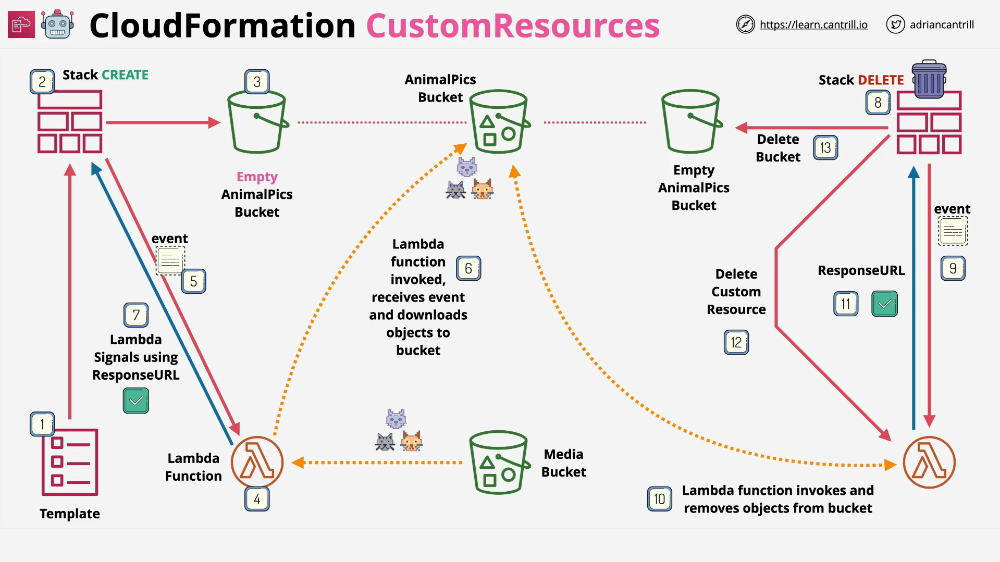

# CloudFormation Custom Resources - Part 1

## Overview

In this lesson, we implemented an AWS architecture using **CloudFormation** to create and manage an S3 bucket and demonstrated the need for **custom resources** when dealing with cleanup scenarios involving populated S3 buckets.

We deployed two types of S3 buckets:

- A **normal (standard)** S3 bucket (simple stack).
- An S3 bucket using a **custom Lambda-backed CloudFormation resource**.

The purpose was to highlight the differences between standard resource deployment and using custom resources for additional customization, particularly around cleanup and lifecycle management.

## Resources Used

- **Standard S3 Bucket Deployment:**  
  [Deploy Here](https://console.aws.amazon.com/cloudformation/home?region=us-east-1#/stacks/create/review?templateURL=https://learn-cantrill-labs.s3.amazonaws.com/awscoursedemos/0021-aws-associate-cloudformation-custom-resources/basicS3bucket.yaml&stackName=S3BUCKETNORMAL)

- **Custom Resource Deployment:**  
  [Deploy Here](https://console.aws.amazon.com/cloudformation/home?region=us-east-1#/stacks/create/review?templateURL=https://learn-cantrill-labs.s3.amazonaws.com/awscoursedemos/0021-aws-associate-cloudformation-custom-resources/customresource.yaml&stackName=S3BUCKETCUSTOM)

- **Demo Files (Images):**  
  [Download Here](https://learn-cantrill-labs.s3.amazonaws.com/awscoursedemos/0050-aws-mixed-cloudformation-customresources/customresources.zip)

## Architecture Implemented



- **Step 1:** Create a normal, empty S3 bucket using CloudFormation.
- **Step 2:** Create a Lambda function.
- **Step 3:** Use Lambda as a **custom resource** to:
  - Download media from a source bucket.
  - Populate the new S3 bucket with images.
- **Step 4:** When deleting the stack:
  - Lambda deletes objects inside the bucket first.
  - The empty bucket can then be deleted successfully.

## Code Explanation

### Basic S3 Bucket Template (Normal)

```yaml
Description: Basic S3 Bucket
Resources:
  animalpics:
    Type: AWS::S3::Bucket
```

**Line-by-line explanation:**

- `Description: Basic S3 Bucket`  
  Provides a description of what this template is doing — creating a basic S3 bucket.

- `Resources:`  
  The section where all AWS resources to be provisioned are listed.

- `animalpics:`  
  Logical ID for the S3 bucket in the CloudFormation stack.

- `Type: AWS::S3::Bucket`  
  Defines the resource type. In this case, an S3 bucket (`AWS::S3::Bucket`).

**Summary Explanation:**  
This simple template creates an empty S3 bucket named using the stack's naming conventions.

## Deployment and Behavior

### Normal S3 Bucket Creation

1. **Deploy the template** using the provided **1-click deployment link**.
2. The S3 bucket (`animalpics`) is created successfully.
3. **Upload files** manually:
   - Anna.jpeg
   - Yuri.jpeg
4. Files are successfully stored in the S3 bucket.

### Attempted Deletion of Normal Stack

- **Problem encountered:**  
  CloudFormation fails to delete the stack when the S3 bucket contains objects.
- **AWS Behavior:**  
  AWS does not allow S3 buckets with contents to be deleted through CloudFormation without intervention.

- **Resolution:**
  - Manually empty the S3 bucket.
  - Retry the stack deletion.
  - Stack deletion then completes successfully.

### Key Takeaway

> **Without a custom resource**, you cannot automate the emptying of S3 buckets during stack deletion, leading to manual cleanup tasks.

## What Custom Resources Will Solve

- Automate the cleanup of S3 buckets during stack deletion.
- Enable Lambda to empty the bucket automatically upon receiving a delete event.
- Make the whole process **self-contained** within CloudFormation (no manual steps).

## Conclusion

- This part of the demo illustrated the limitations of standard CloudFormation deployments when managing resources like S3 buckets.
- It set up the transition to the second part, where **custom resources** will solve the cleanup problem elegantly.

# Coming Up:

**Part 2** will cover:

- Deploying a custom resource-enabled S3 bucket.
- Using Lambda for automatic object management inside the bucket.
