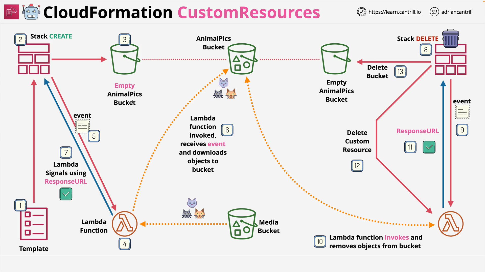

# CloudFormation Custom Resources - Part 2

## Resources Used

- **Normal/Standard S3 Bucket Deployment:**  
  [Click to deploy Standard S3 Bucket](https://console.aws.amazon.com/cloudformation/home?region=us-east-1#/stacks/create/review?templateURL=https://learn-cantrill-labs.s3.amazonaws.com/awscoursedemos/0021-aws-associate-cloudformation-custom-resources/basicS3bucket.yaml&stackName=S3BUCKETNORMAL)

- **Custom Resource S3 Bucket Deployment:**  
  [Click to deploy S3 Bucket with Custom Resource](https://console.aws.amazon.com/cloudformation/home?region=us-east-1#/stacks/create/review?templateURL=https://learn-cantrill-labs.s3.amazonaws.com/awscoursedemos/0021-aws-associate-cloudformation-custom-resources/customresource.yaml&stackName=S3BUCKETCUSTOM)

- **Demo Files Download:**  
  [Download Custom Resources Demo Files](https://learn-cantrill-labs.s3.amazonaws.com/awscoursedemos/0050-aws-mixed-cloudformation-customresources/customresources.zip)

# Normal Bucket Deployment

### Template Overview

A simple S3 bucket created with the following resource:

```yaml
Resources:
  animalpics:
    Type: AWS::S3::Bucket
```

- **Resource:** `animalpics`
- **Type:** `AWS::S3::Bucket`
- **Function:** Creates a basic S3 bucket without any additional customization.

# Custom Resource Bucket Deployment

### Template Overview

A more advanced template that involves:

- Creating an S3 bucket.
- Deploying a Lambda function.
- Copying objects from another bucket using the Lambda function.
- Setting up an IAM role to provide permissions.

## CloudFormation Template (Custom Deployment)

```yaml
Resources:
  animalpics:
    Type: AWS::S3::Bucket

  copyanimalpics:
    Type: "Custom::S3Objects"
    Properties:
      ServiceToken: !GetAtt CopyS3ObjectsFunction.Arn
      SourceBucket: "cl-randomstuffforlessons"
      SourcePrefix: "customresource"
      Bucket: !Ref animalpics

  S3CopyRole:
    Type: AWS::IAM::Role
    Properties:
      Path: /
      AssumeRolePolicyDocument:
        Version: 2012-10-17
        Statement:
          - Effect: Allow
            Principal:
              Service: lambda.amazonaws.com
            Action: sts:AssumeRole
      Policies:
        - PolicyName: S3Access
          PolicyDocument:
            Version: 2012-10-17
            Statement:
              - Sid: AllowLogging
                Effect: Allow
                Action:
                  - logs:CreateLogGroup
                  - logs:CreateLogStream
                  - logs:PutLogEvents
                Resource: "*"
              - Sid: ReadFromLCBucket
                Effect: Allow
                Action:
                  - s3:ListBucket
                  - s3:GetObject
                Resource:
                  - !Sub "arn:aws:s3:::cl-randomstuffforlessons"
                  - !Sub "arn:aws:s3:::cl-randomstuffforlessons/*"
              - Sid: WriteToStudentBuckets
                Effect: Allow
                Action:
                  - s3:ListBucket
                  - s3:GetObject
                  - s3:PutObject
                  - s3:PutObjectAcl
                  - s3:PutObjectVersionAcl
                  - s3:DeleteObject
                  - s3:DeleteObjectVersion
                  - s3:CopyObject
                Resource:
                  - !Sub "arn:aws:s3:::${animalpics}"
                  - !Sub "arn:aws:s3:::${animalpics}/*"

  CopyS3ObjectsFunction:
    Type: AWS::Lambda::Function
    Properties:
      Description: Copies objects into buckets
      Handler: index.handler
      Runtime: python3.9
      Role: !GetAtt S3CopyRole.Arn
      Timeout: 120
      Code:
        ZipFile: |
          import os 
          import json
          import cfnresponse
          import boto3
          import logging

          from botocore.exceptions import ClientError
          client = boto3.client('s3')
          logger = logging.getLogger()
          logger.setLevel(logging.INFO)

          def handler(event, context):
              logger.info("Received event: %s" % json.dumps(event))
              source_bucket = event['ResourceProperties']['SourceBucket']
              source_prefix = event['ResourceProperties'].get('SourcePrefix') or ''
              bucket = event['ResourceProperties']['Bucket']
              prefix = event['ResourceProperties'].get('Prefix') or ''
              result = cfnresponse.SUCCESS
              try:
                  if event['RequestType'] == 'Create' or event['RequestType'] == 'Update':
                      result = copy_objects(source_bucket, source_prefix, bucket, prefix)
                  elif event['RequestType'] == 'Delete':
                      result = delete_objects(bucket, prefix)
              except ClientError as e:
                  logger.error('Error: %s', e)
                  result = cfnresponse.FAILED
              cfnresponse.send(event, context, result, {})

          def copy_objects(source_bucket, source_prefix, bucket, prefix):
              paginator = client.get_paginator('list_objects_v2')
              page_iterator = paginator.paginate(Bucket=source_bucket, Prefix=source_prefix)
              for key in {x['Key'] for page in page_iterator for x in page['Contents']}:
                  dest_key = os.path.join(prefix, os.path.relpath(key, source_prefix))
                  if not key.endswith('/'):
                      print('copy {} to {}'.format(key, dest_key))
                      client.copy_object(CopySource={'Bucket': source_bucket, 'Key': key}, Bucket=bucket, Key=dest_key)
              return cfnresponse.SUCCESS

          def delete_objects(bucket, prefix):
              paginator = client.get_paginator('list_objects_v2')
              page_iterator = paginator.paginate(Bucket=bucket, Prefix=prefix)
              objects = [{'Key': x['Key']} for page in page_iterator for x in page['Contents']]
              client.delete_objects(Bucket=bucket, Delete={'Objects': objects})
              return cfnresponse.SUCCESS
```

# Lambda Function: Line-by-Line Explanation

### Importing Libraries

```python
import os
import json
import cfnresponse
import boto3
import logging
from botocore.exceptions import ClientError
```

- **os, json**: Standard Python libraries for file and JSON operations.
- **cfnresponse**: AWS library to send responses back to CloudFormation.
- **boto3**: AWS SDK for Python to interact with S3.
- **logging**: Standard Python logging module.
- **ClientError**: Exception handling for AWS service errors.

### Client and Logger Setup

```python
client = boto3.client('s3')
logger = logging.getLogger()
logger.setLevel(logging.INFO)
```

- **client**: Connects to AWS S3.
- **logger**: Sets up a logger to track events at INFO level.

### Main Handler

```python
def handler(event, context):
```

- **handler**: Main entry for Lambda to process incoming CloudFormation custom resource events.

### Copy and Delete Functionality

```python
def copy_objects(source_bucket, source_prefix, bucket, prefix):
```

- **copy_objects**: Copies objects from the source S3 bucket into the destination S3 bucket.

```python
def delete_objects(bucket, prefix):
```

- **delete_objects**: Deletes all objects inside the destination bucket when the stack is deleted.

# How the Custom Resource Works

- **Create Stack**:

  - Creates the S3 bucket.
  - Deploys IAM Role.
  - Deploys Lambda function.
  - Lambda function is triggered via custom resource to **copy** files.

- **Delete Stack**:
  - Lambda is triggered to **delete** objects inside the bucket before the bucket is removed.

# CloudFormation Stack Creation Flow



1. **S3 Bucket (`animalpics`)** created first.
2. **IAM Role (`S3CopyRole`)** created after the bucket.
3. **Lambda Function (`CopyS3ObjectsFunction`)** deployed after the IAM role.
4. **Custom Resource (`copyanimalpics`)** created last, invoking the Lambda function.
5. **Files (`nemo1`, `nemo2`, `nemo3`)** copied from source bucket into new S3 bucket.

# CloudWatch Logs Review

- Logs confirm the receipt of event data by Lambda.
- The Lambda logs show either copying or deleting of objects based on the event (`Create`, `Update`, or `Delete`).

Example Event Logged:

```json
{
  "RequestType": "Create",
  "ServiceToken": "arn:aws:lambda:us-east-1:xxx:function:S3BUCKETCUSTOM-CopyS3ObjectsFunction",
  "ResourceProperties": {
    "SourceBucket": "cl-randomstuffforlessons",
    "SourcePrefix": "customresource",
    "Bucket": "s3bucketcustom-animalpics-xxxx"
  }
}
```

# Key Learnings

- How to use **Custom Resources** in CloudFormation.
- How **Lambda functions** can automate S3 object management during stack lifecycle events.
- Importance of IAM roles and **dependency management** in CloudFormation templates.
