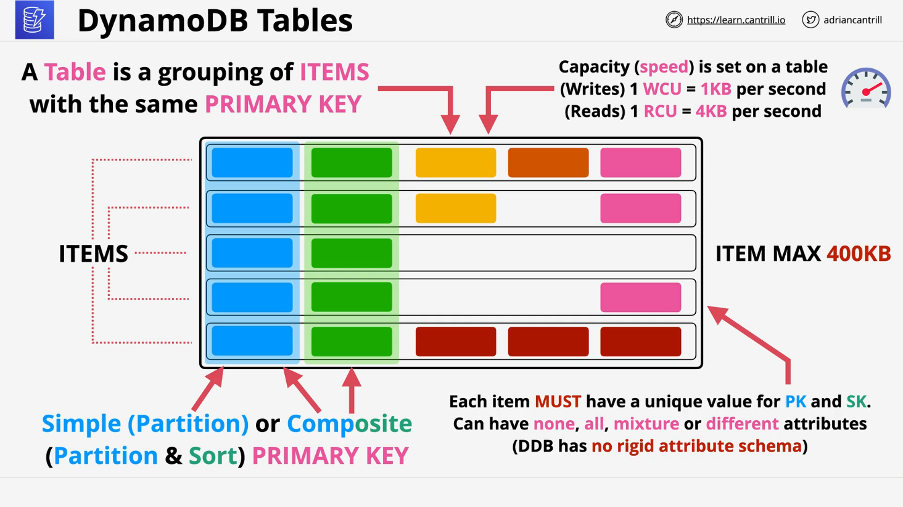
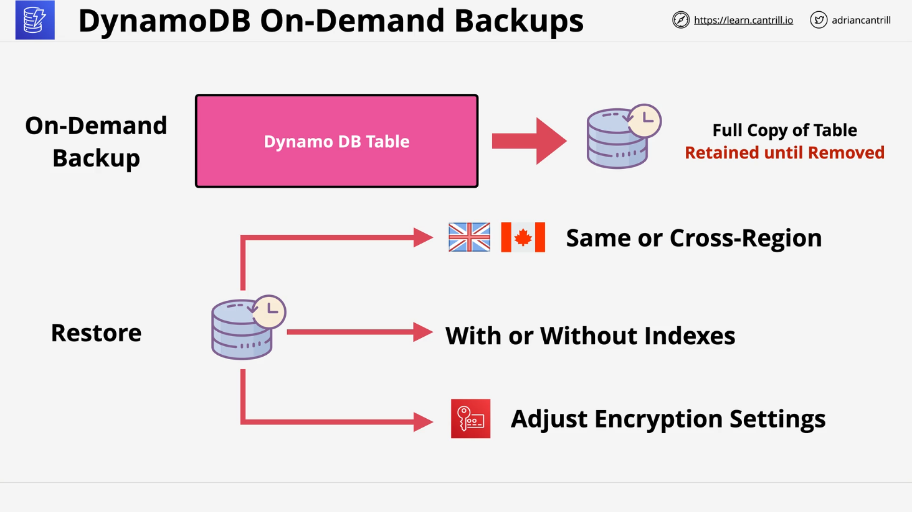
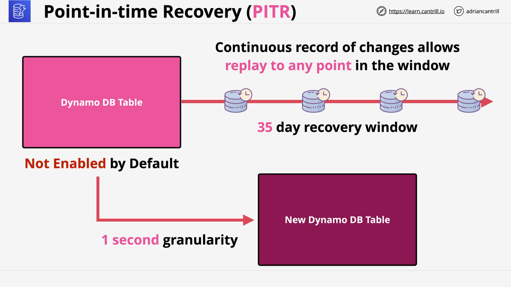

## DynamoDB

## Overview of DynamoDB

**DynamoDB** is a **fully managed NoSQL, wide-column key-value database** provided as a service by AWS. It's designed for **serverless**, **web-scale applications** and is a highly available, fast, and scalable solution with **minimal administrative overhead**.

- **Type**: NoSQL, wide-column, key-value database
- **Accessibility**: Public service – accessible via the internet or VPC endpoints
- **Use cases**: Serverless apps, scalable backends, high-throughput low-latency applications

## Core DynamoDB Features

### 1. **Serverless & Managed**

- No need to manage servers or infrastructure
- Simplifies operations compared to RDS/Aurora

### 2. **Scalability**

- **Provisioned Capacity Mode**: You set Read/Write capacity units (RCU/WCU)
- **On-Demand Mode**: Auto-scales based on load; "set and forget"

### 3. **High Availability**

- Data is **replicated across multiple AZs**
- Optional **Global Tables** for multi-region replication

### 4. **Performance**

- **SSD-backed** storage: Single-digit millisecond latency

### 5. **Security & Recovery**

- **Encryption at rest** (enabled by default)
- **Backups**:
  - **On-Demand Backups**: Manual snapshots
  - **Point-in-Time Recovery (PITR)**: Automatic stream of backups for last 35 days

## DynamoDB Data Model



### 1. **Table**

- Fundamental entity in DynamoDB
- Think of a **table** like a **collection of rows (items)**

### 2. **Item**

- Analogous to a row in SQL
- Must contain a **primary key**
- Can contain any number of **attributes**

### 3. **Primary Key**

There are two types of primary keys:

- **Simple Primary Key**: Only a **Partition Key (PK)**
- **Composite Primary Key**: **Partition Key (PK)** + **Sort Key (SK)**

#### Key Uniqueness

- Simple PK must be unique per item
- Composite PK+SK combination must be unique

### 4. **Attributes**

- Additional data per item
- No schema enforcement – items can have different attributes
- Max item size: **400 KB**, includes PK, SK, attribute names/values

## Capacity Modes

### 1. **On-Demand Capacity**

- **No provisioning required**
- Billed per read/write operation

### 2. **Provisioned Capacity**

- You must set:
  - **WCU (Write Capacity Unit)**:
    - 1 WCU = write of 1 KB/s
  - **RCU (Read Capacity Unit)**:
    - 1 RCU = strongly consistent read of 4 KB/s
    - Minimum 1 RCU is charged per read, even for small reads

## Backup & Restore Options

### 1. **On-Demand Backups**



- Manual snapshots of a table
- Used for:
  - Point-in-time restoration
  - Region-to-region migration
  - Backup encryption customization

### 2. **Point-In-Time Recovery (PITR)**



- Must be enabled per table
- Maintains a rolling 35-day history of changes
- Can restore to any second within that window
- Ideal for operational recovery

## Important Exam Considerations

| Exam Hint                                       | Use DynamoDB If...                | Avoid If...                                |
| ----------------------------------------------- | --------------------------------- | ------------------------------------------ |
| **NoSQL** is mentioned                          | ✅ DynamoDB is a NoSQL database   | ❌ Avoid if relational data is mentioned   |
| **Key-Value** use case                          | ✅ Best fit for key-value storage | ❌ Not suitable for relational joins       |
| **SQL/Structured Query Language** is mentioned  | ❌ DynamoDB doesn't use SQL       | ✅ Use RDS/Aurora instead                  |
| **High scalability / Low-latency / Serverless** | ✅ DynamoDB is optimized for this | ❌ Not meant for complex relational models |

## Access Methods

- **AWS Console**
- **AWS CLI**
- **AWS SDK / API**
- No SQL support (i.e., no SELECT, JOIN)

## Billing & Pricing

Pricing is based on:

- **Read and write throughput (RCU/WCU)** or on-demand operations
- **Storage consumed**
- **Additional features enabled** (e.g., PITR, Global Tables)
- Option to purchase **Reserved Capacity** for long-term, predictable workloads

## Code Explanation: Capacity Units

Here’s how **RCU and WCU** work with a code-like example.

```plaintext
Example:
Provisioned Capacity:
  - WCU = 5
  - RCU = 10

What it means:
  - 5 writes/sec of 1KB data
  - 10 reads/sec of 4KB data (strongly consistent)
```

### Explanation

- If you try to write 10 items of 1KB each per second, you’ll exceed the **WCU = 5**, and throttling occurs unless autoscaling is enabled.
- If reading 4KB items at a rate of 20 reads/sec, you need at least **RCU = 20** (or enable on-demand mode).

## Summary

- **DynamoDB** is a **highly scalable NoSQL service** ideal for **key-value** or **document-based workloads**.
- Use **on-demand mode** for unpredictable workloads and **provisioned mode** when you can estimate usage.
- It offers **multiple backup options**, **global availability**, and **fine-grained access control**.
- Know when **not** to use DynamoDB: avoid it for relational data needs or where SQL is required.
