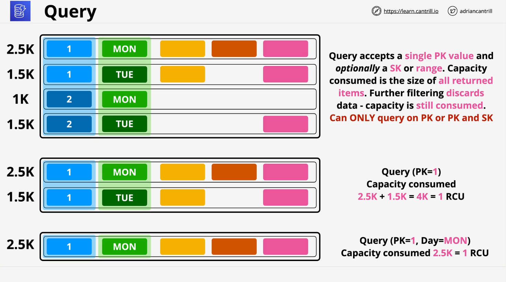
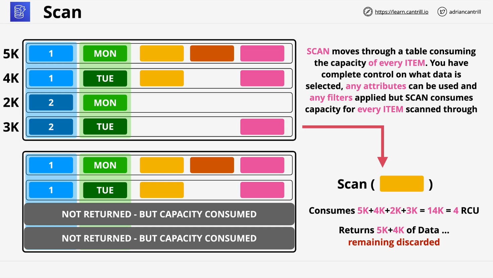

# DynamoDB Operations, Consistency, and Performance (Part 1)

This lesson covers the operational and performance considerations of **Amazon DynamoDB**, including capacity modes, read/write units, and how different operations like `Query` and `Scan` behave.

## 1. DynamoDB Capacity Modes

DynamoDB supports **two capacity modes**:

### a. On-Demand Capacity

- Suitable for **unpredictable workloads**.
- Minimal admin overhead.
- **No need to manually set read/write capacity.**
- **Pricing**: Pay per **million read/write units**.
  - Can be **up to 5x more expensive** than provisioned mode.

### b. Provisioned Capacity

- Manually define:
  - **RCU** (Read Capacity Units)
  - **WCU** (Write Capacity Units)
- Each table has a **burst pool** = 300 seconds worth of capacity.
- If you exceed provisioned capacity + burst pool → you'll get a **`ProvisionedThroughputExceededException`**.

## 2. Read and Write Capacity Units

| Operation | Capacity Unit                                | Notes                                 |
| --------- | -------------------------------------------- | ------------------------------------- |
| **Read**  | 1 RCU = 1 read of up to **4 KB per second**  | Rounds up; reading 1 KB = still 1 RCU |
| **Write** | 1 WCU = 1 write of up to **1 KB per second** | Also rounds up                        |

> Items in DynamoDB can be up to **400 KB** in size.

- Reading such an item = `400 / 4 = 100 RCUs`.
- Writing it = `400 / 1 = 400 WCUs`.

## 3. Query Operation



### Basics

- Used to **retrieve items based on a `partition key`**.
- Must specify **a single value** for the partition key.
- Can **filter by `sort key`** optionally.

### Example Table

| Partition Key (`sensor_id`) | Sort Key (`day`) | Size   |
| --------------------------- | ---------------- | ------ |
| 1                           | Monday           | 2.5 KB |
| 1                           | Tuesday          | 1.5 KB |
| 2                           | Monday           | 1.0 KB |
| 2                           | Tuesday          | 1.5 KB |

### Example: Query with Partition Key Only

```sql
Query: sensor_id = 1
Returns: Items for Monday and Tuesday
Total Size = 4 KB → Costs 1 RCU
```

### Example: Query with Partition and Sort Key

```sql
Query: sensor_id = 1 AND day = 'Monday'
Returns: Single 2.5 KB item
Cost: 1 RCU
```

### Optimization Tip

Always try to:

- **Retrieve multiple items in one query**, instead of many separate ones.
- **Reduce item size** to minimize capacity usage.

### Notes

- **Cannot query across multiple partition key values**.
- You can project specific attributes (e.g., only return `temperature`), **but you are still billed for the entire item**.

## 4. Scan Operation



### Purpose

- Use when you **need to search across all items in a table**, not just by partition key.
- Much **less efficient** than `Query`.

### Characteristics

- Reads **every item in the table**.
- Can **filter attributes**, but billing is based on **data scanned**, not returned.
- More **flexible**, but **expensive** in capacity.

### Scan Example

#### Goal: Find all items with a "sunny day" attribute

| sensor_id | day     | sunny | Size |
| --------- | ------- | ----- | ---- |
| 1         | Monday  | Yes   | 5 KB |
| 1         | Tuesday | Yes   | 4 KB |
| 2         | Monday  | No    | 2 KB |
| 2         | Tuesday | No    | 3 KB |

```sql
Scan: where sunny = 'Yes'
```

- Scans **entire table** (14 KB total).
- Even though only 9 KB of data is returned, capacity cost = **14 KB / 4 KB = 4 RCUs**.
- **Non-matching data is discarded but still billed**.

## 5. Best Practices Summary

| Operation | Use Case                                          | Efficient? | Notes                         |
| --------- | ------------------------------------------------- | ---------- | ----------------------------- |
| **Query** | Known partition key (and optional sort key range) | ✅ Yes     | Efficient, scales well        |
| **Scan**  | Unknown partition key, broad search               | ❌ No      | Use sparingly, very expensive |

## 6. Architectural Tip

- Since **DynamoDB operates on full items**, minimizing item size is **crucial** to save on read/write costs.
- Always try to **retrieve as much relevant data in a single operation** to avoid repeated capacity consumption.

## End of Part 1

This concludes part one of the DynamoDB operations lesson. Part two will continue directly with **additional concepts like consistency models and performance tuning**.
