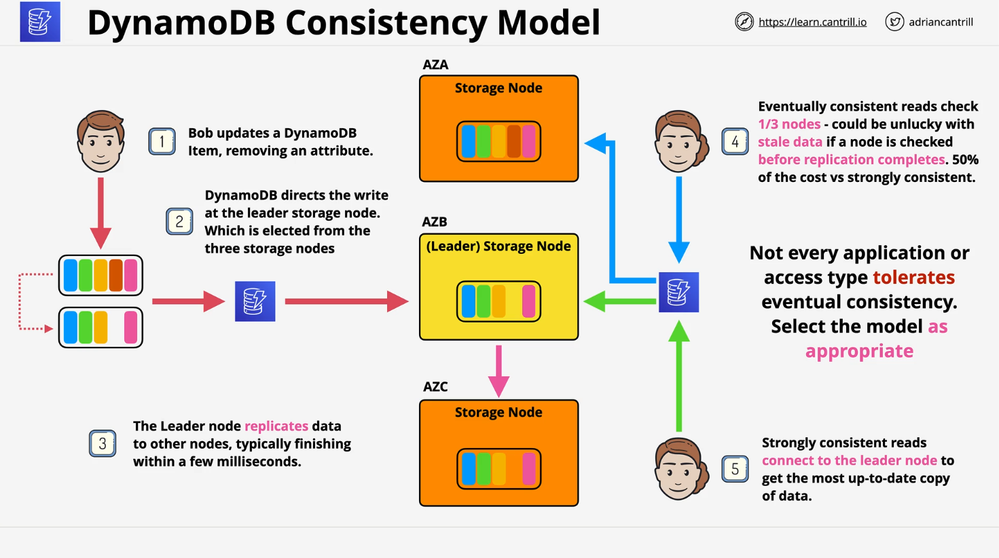

# DynamoDB Operations, Consistency, and Performance (Part 2)

## DynamoDB Read Consistency Models



### 1. Eventually Consistent Reads

- Default mode.
- May return stale data immediately after a write.
- Scales better and is cheaper (1 RCU = 2 eventually consistent reads).
- Suitable for non-critical, latency-tolerant applications.

### 2. Strongly Consistent Reads

- Guarantees up-to-date data.
- Always reads from the **leader node**.
- Consumes **twice as many resources** as eventually consistent reads.
- Costs more (1 RCU = 1 strongly consistent read for up to 4 KB).
- Suitable for stock levels, medical records, or real-time systems.

## How DynamoDB Handles Writes

1. Writes are always sent to the **leader node**.
2. The leader node updates the item (e.g., deletes the 4th attribute).
3. Data is replicated to **follower nodes** across availability zones.
4. During replication (which takes milliseconds), the system is **temporarily inconsistent**.
5. Writes are more expensive because:
   - They use **write capacity units (WCU)**.
   - They always target the **leader node**, reducing scalability.

## Eventually vs. Strongly Consistent Reads

| Feature                  | Eventually Consistent | Strongly Consistent    |
| ------------------------ | --------------------- | ---------------------- |
| Cost                     | 0.5 RCU per 4 KB      | 1 RCU per 4 KB         |
| Scalability              | High                  | Limited (leader only)  |
| Data freshness guarantee | No                    | Yes                    |
| Use case suitability     | Cache, feeds          | Stock, medical records |

## Calculating Write Capacity Units (WCU)

To calculate required WCU:

```text
WCU per item = ceil(item_size_in_KB / 1 KB)
Total WCU = WCU per item × number_of_writes_per_second
```

### Example:

- **Item size**: 2.5 KB
- **Writes/sec**: 10

```text
WCU per item = ceil(2.5 / 1) = 3
Total WCU = 3 × 10 = 30 WCU
```

## Calculating Read Capacity Units (RCU)

### For **strongly consistent reads**:

```text
RCU per item = ceil(item_size_in_KB / 4 KB)
Total RCU = RCU per item × reads_per_second
```

### Example:

- **Item size**: 2.5 KB
- **Reads/sec**: 10

```text
RCU per item = ceil(2.5 / 4) = 1
Total RCU = 1 × 10 = 10 RCU
```

### For **eventually consistent reads**:

```text
Total RCU = Strongly consistent RCU / 2
```

```text
Total Eventually Consistent RCU = 10 / 2 = 5 RCU
```

## DynamoDB Provisioned Capacity Mode

### Key Concepts:

- You specify **read and write throughput**.
- Billed **hourly**, based on provisioned values—not usage.
- Suitable for predictable workloads.
- You can manually adjust provisioned throughput or use **auto scaling**.

### Mode Switching Rules:

- Switch to **provisioned mode** anytime.
- Must wait **24 hours** to switch **back to on-demand mode**.

## Auto Scaling with DynamoDB

### Purpose:

Automatically adjusts provisioned throughput to handle traffic spikes and reduce costs.

### How It Works:

1. Set min/max read and write capacity limits.
2. Define a **target utilization percentage** (recommended: 70%).
3. Auto scaling uses **CloudWatch alarms** to trigger scaling.
4. Scaling occurs when utilization breaches the threshold for **2 consecutive minutes**.

### Benefits:

- No throttling during bursts.
- Cost-effective during idle times.
- Enabled **by default** in the AWS Console.

## Capacity Unit Definitions

| Operation Type                   | Capacity Unit             |
| -------------------------------- | ------------------------- |
| Write (1 KB item)                | 1 WCU                     |
| Read (strongly consistent, 4 KB) | 1 RCU                     |
| Read (eventually consistent)     | 0.5 RCU (2 reads per RCU) |

## Summary

- Choose between **strong** and **eventual consistency** based on app needs.
- Use **WCU and RCU calculations** to determine provisioned settings.
- Take advantage of **auto scaling** to maintain performance and optimize cost.
- Monitor usage via **CloudWatch** and set appropriate scaling policies.
