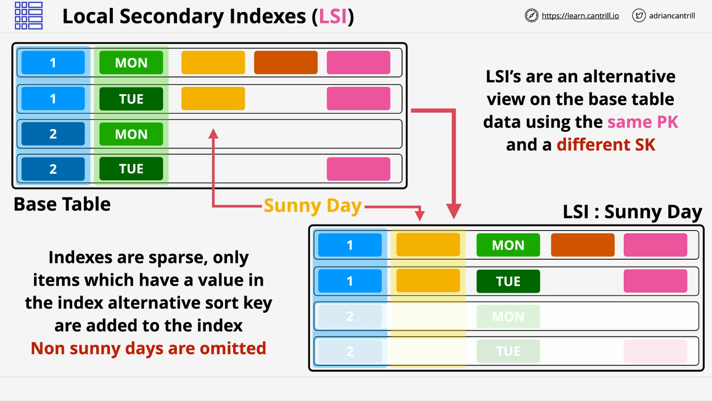
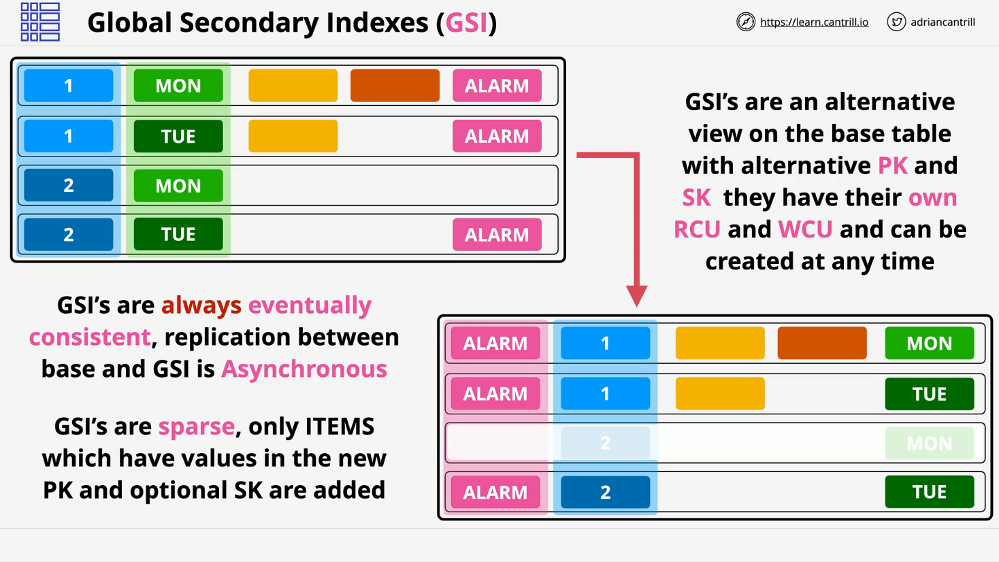

# DynamoDB Indexes

DynamoDB supports two types of indexes to enable efficient querying:

- **Local Secondary Indexes (LSI)**
- **Global Secondary Indexes (GSI)**

Indexes allow you to create **alternative views** of your table’s data, improving query flexibility and efficiency.

## Overview of Indexes

- **Purpose**: Improve query efficiency by enabling alternative partition or sort keys.
- **Query Limitations Without Indexes**:
  - Query operation only works on a single **partition key**.
  - Optional use of a **sort key** range.
  - For other attributes, you'd be forced to use **Scan**, which is inefficient.

## Local Secondary Indexes (LSI)

### Key Characteristics

- **Created at table creation time** only (cannot be added later).
- Shares the **same partition key** as the base table.
- Uses an **alternative sort key**.
- Shares **read and write capacity units (RCU/WCU)** with the base table.
- Maximum of **5 LSIs** per table.

### Projection Options

You can choose which attributes are included in the LSI:

- `ALL` – All attributes from the base table.
- `KEYS_ONLY` – Only partition and sort key attributes.
- `INCLUDE` – Select specific attributes.

### Example Use Case: Weather Station with `SunnyDay` Sort Key

- **Base Table**:

  - Partition Key: `StationID`
  - Sort Key: `Date`

- **Access Pattern Problem**:

  - You want to retrieve only days marked as `SunnyDay`.
  - Since `SunnyDay` is **not a key**, a query is not possible — you'd need a **scan**.

- **Solution**:
  - Create an LSI using `SunnyDay` as the sort key at **table creation**.
  - Now you can query `StationID` (partition key) and filter by `SunnyDay`.

### Sparse Indexes

LSIs (and GSIs) are **sparse**:

- Only items that **contain** the indexed attribute appear in the index.
- This reduces index size and improves scan efficiency when scanning the index.

### Exam Tips

- LSIs **must be created with the base table**.
- Used to query same partition key with **alternative sort keys**.
- Share throughput with the base table.
- Use **only when strong consistency** is needed.

## Global Secondary Indexes (GSI)

### Key Characteristics

- **Can be created at any time** after the table exists.
- Uses a **different partition key and sort key** than the base table.
- Has **separate RCU/WCU** if provisioned.
- Limit: **20 GSIs** per table.
- Like LSIs, GSIs allow `ALL`, `KEYS_ONLY`, or `INCLUDE` projection options.

### Example Use Case: Weather Station with `Alarm` Partition Key

- **Base Table**:

  - Partition Key: `StationID`
  - Sort Key: `Date`

- **New Access Pattern**:

  - Retrieve all records where `Alarm` is triggered.

- **Solution**:

  - Create a GSI with:
    - Partition Key: `Alarm`
    - Sort Key: `StationID`

- This enables efficient queries for alarms across all or specific weather stations.

### Eventual Consistency

- GSI data is replicated **asynchronously** from the base table.
- GSIs only support **eventual consistency**.

## Design Considerations

### Capacity Implications

- Projecting **all attributes** into an index means consuming capacity for **all attributes**.
- Avoid projecting unnecessary data — use `INCLUDE` for select attributes.

### Queries on Non-Projected Attributes

- If you query an index for attributes **not projected**, DynamoDB fetches the item from the base table (a **fetch operation**).
- This is **expensive** and should be avoided.

### AWS Recommendations

- **Use GSIs by default**.
- **Only use LSIs** when:
  - You need **strong consistency**.
  - You can plan indexes at table creation.

## Architecture & Exam Relevance

- Base table design must align with **primary access pattern**.
- Use **indexes for alternate access patterns** (e.g., different teams needing different data views).
- **Indexing keeps data centralized** but accessible from multiple "perspectives."

## Key Takeaways for AWS SAA-C03 Exam

| Feature            | LSI                                | GSI                                |
| ------------------ | ---------------------------------- | ---------------------------------- |
| Creation Time      | At table creation                  | Any time                           |
| Partition Key      | Same as base table                 | Can differ from base table         |
| Sort Key           | Different from base table          | Can differ from base table         |
| Capacity Model     | Shares with base table             | Has its own RCU/WCU                |
| Consistency        | Supports strong consistency        | Eventually consistent only         |
| Projection Options | `ALL`, `KEYS_ONLY`, `INCLUDE`      | Same options                       |
| Use Case           | Same partition, different sort key | Different access patterns entirely |
