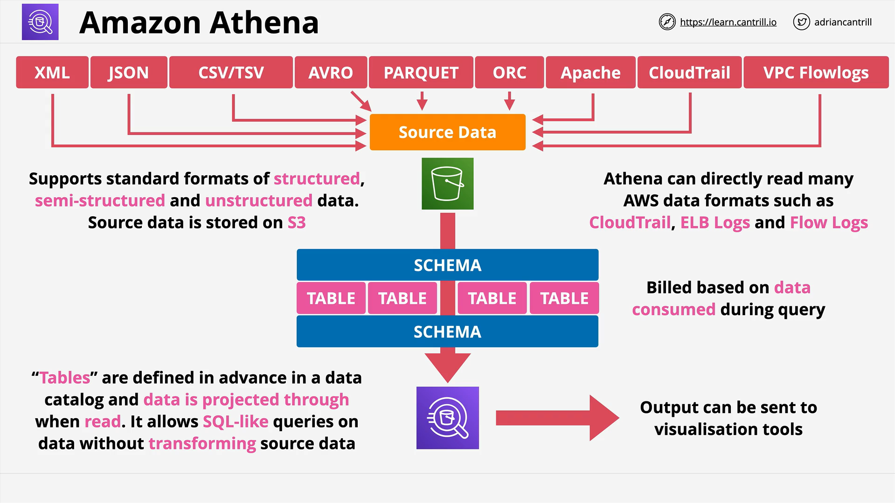
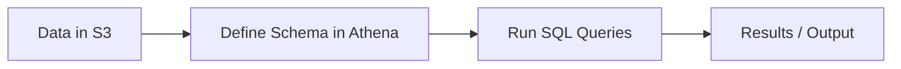

# Amazon Athena

## Overview

**Amazon Athena** is a **serverless**, **interactive querying service** that allows users to query data directly from **Amazon S3** using **SQL**. It is optimized for **ad hoc querying** without the need for provisioning infrastructure or preloading data.

## Key Features

### 1. **Serverless Architecture**

- No servers to manage.
- No infrastructure to provision.
- You only pay per query based on the amount of data scanned.

### 2. **Querying S3 Data Directly**

- Supports querying structured, semi-structured, and unstructured data stored in **Amazon S3**.
- Native formats supported:
  - JSON, XML
  - CSV, TSV
  - Parquet, ORC, Avro
  - AWS service logs (e.g., VPC Flow Logs, CloudTrail)

## Schema on Read: A Fundamental Concept

### What It Means:

Athena uses a **Schema on Read** approach:

- The **original data** in S3 is **left untouched**.
- When you define a **schema**, it acts like a **lens** that interprets the structure of raw data at **query time**.

> Unlike traditional databases that require data to be **loaded** and **structured** before querying, Athena reads and interprets data on the fly using predefined schema.

## How It Works





1. **Data is stored** in raw format in S3.
2. **Schema is created** in Athena to define how to interpret that data.
3. Athena queries the data in real-time using the schema.
4. Results can be:
   - Displayed in the console
   - Exported to other AWS services
   - Saved for later use

## Benefits of Athena

### 1. **No Loading or ETL Required**

- Skip traditional ETL (Extract, Transform, Load) processes.
- Run queries on data as-is.

### 2. **Cost-Effective**

- No base or hourly charges.
- Pay only for the **data scanned** by each query.
- Optimize by using columnar formats (e.g., **Parquet**, **ORC**) and compressing files.

### 3. **Ideal for Ad Hoc Queries**

- Great for quick, one-time analysis or reporting.
- Suitable for irregular or infrequent usage patterns.

### 4. **Native AWS Log Support**

- Athena can **natively query** logs from services like:
  - **VPC Flow Logs**
  - **CloudTrail**
  - **ELB Access Logs**
  - **S3 Access Logs**
  - **Cost and usage reports**

## Federated Querying

### What It Is:

- Allows Athena to query **data outside of S3**, including:
  - RDS
  - DynamoDB
  - CloudWatch Logs
  - On-premise JDBC-compliant databases

### How It Works:

Athena uses **data source connectors** (Lambda functions) to connect to external systems.

```text
Athena -> Lambda (Connector) -> External Data Source
```

### Use Case Examples:

- Querying **MySQL**, **PostgreSQL**, or **MongoDB** without moving the data to S3.
- Joining data from S3 with data in RDS.

## Exam Tips

- **Athena is serverless** – no infrastructure to manage.
- **Schema on read** – no data loading required.
- **Great for ad hoc queries** – especially on large datasets in S3.
- **Useful for log analysis** – VPC, CloudTrail, and ELB logs.
- **Not ideal** when you need complex joins, transactions, or if data isn't in S3 and no connector exists.
- If you see **SQL** and **S3** together in a question, **Athena is likely the correct answer**.

## When to Use Athena

| Use Case                         | Why Athena Works                           |
| -------------------------------- | ------------------------------------------ |
| Quick queries on large data sets | No infrastructure; query directly from S3  |
| Analyzing AWS logs               | Native support for log formats             |
| Cost-sensitive environments      | Pay-per-query, no idle cost                |
| No ETL or preprocessing desired  | Schema-on-read enables real-time structure |

## Summary

Amazon Athena is a **powerful, flexible, and cost-effective tool** for querying data stored in S3. It works on a **serverless model**, employs **schema-on-read**, and supports **federated querying** of other AWS and non-AWS data sources. Understanding its **strengths and limitations** is key for success in both the **AWS SA-C03 exam** and real-world implementations.
