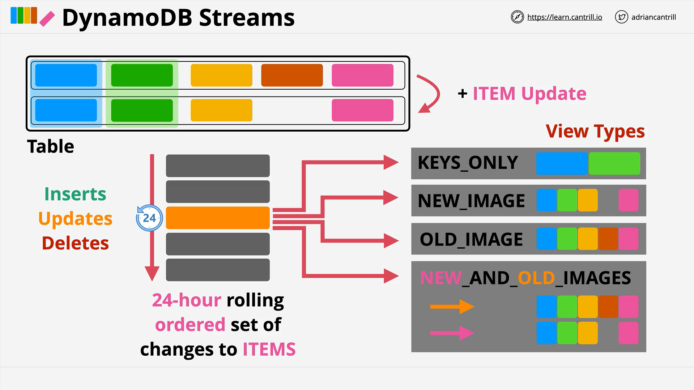
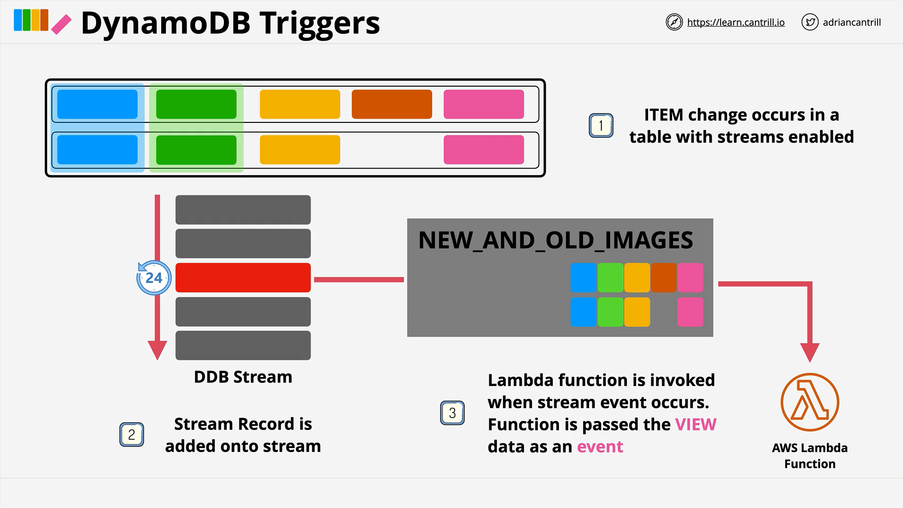

# DynamoDB Streams and Triggers

This lesson from Cantrill.io explains the powerful features of **DynamoDB Streams** and **Triggers**, enabling event-driven and cost-effective architectures in AWS. These features allow DynamoDB to integrate tightly with other AWS services, especially **AWS Lambda**, for real-time processing of data changes.

## What is a DynamoDB Stream?

A **DynamoDB Stream** is a **time-ordered list** of item-level changes (inserts, updates, and deletes) that occur in a DynamoDB table.

- The stream maintains a **24-hour rolling window** of changes.
- Implemented under the hood using **Amazon Kinesis Streams**.
- **Enabled per-table** and **configured with a specific view type** to control the data recorded.

## Stream View Types



DynamoDB Streams can be configured with one of the following **view types**, which determine what data is written to the stream when a change occurs:

### 1. **Keys Only**

- Only includes the **partition key** and **sort key** (if applicable) of the changed item.
- Does **not include the actual attribute values**.
- Requires additional reads to determine what changed.

### 2. **New Image**

- Contains the **entire item after the change**.
- Useful if the downstream process only cares about the **resulting state** of the item.
- Cannot determine what specifically changed from the previous state.

### 3. **Old Image**

- Includes the **entire item before the change**.
- Can compare this with the current item in the table to infer what changed.
- May still require additional reads.

### 4. **New and Old Images**

- Includes both **before** and **after** versions of the item.
- Provides **full visibility** of what exactly changed, without needing to query the table.
- Ideal for **auditing, logging, or analytics** use cases.

### Example Use Case: Attribute Removal

If an item has an attribute removed:

- `Keys Only`: only gets key identifiers.
- `New Image`: shows the item after removal.
- `Old Image`: shows the item before removal.
- `New and Old Images`: allows full comparison without accessing the table.

## Insert & Delete Events

The stream behaves as follows:
| Operation | Old Image | New Image |
|-----------|-----------|-----------|
| **Insert** | null | populated |
| **Delete** | populated | null |

This helps in scenarios where items are added or removed entirely.

## DynamoDB Triggers (Event-Driven Architecture)



A **trigger** is a serverless mechanism that automatically **invokes a Lambda function** in response to changes in a DynamoDB table.

### Architecture Overview

1. Table with **DynamoDB Streams enabled**.
2. Change (Insert/Update/Delete) occurs.
3. Stream captures the change as an event.
4. Event is sent to a **Lambda function**.
5. Lambda performs a **compute operation** based on the change.

```plaintext
[ DynamoDB Table ]
        │
     (Change)
        ↓
[ DynamoDB Stream ] → (Event with data: New/Old Image)
        ↓
[ AWS Lambda Function ]
        ↓
(Perform action: analytics, notification, aggregation, etc.)
```

## Use Cases for Streams + Triggers

- **Reporting & Analytics**: Trigger reports when key data changes.
- **Aggregation**: E.g., real-time vote tallying.
- **Messaging Systems**: Notify group members in real-time (push notifications).
- **Inventory Management**: React to stock level updates.
- **Cost Optimization**: React only to events (no polling needed).

## Key Exam Takeaways (AWS SAA-C03)

- **Streams + Lambda** = Triggers.
- Enables **serverless event-driven architecture** for DynamoDB.
- Highly efficient and scalable.
- Know how different **view types** affect what data is captured in the stream.

## Code Explanation (Lambda Trigger Example)

Here’s a conceptual breakdown of a typical Lambda function triggered by a DynamoDB Stream:

```python
import json

def lambda_handler(event, context):
    for record in event['Records']:
        # Capture the event name (INSERT, MODIFY, REMOVE)
        event_type = record['eventName']

        # Get the old image before the change (if present)
        old_image = record.get('dynamodb', {}).get('OldImage', {})

        # Get the new image after the change (if present)
        new_image = record.get('dynamodb', {}).get('NewImage', {})

        # Perform actions based on event type
        if event_type == 'INSERT':
            # Process newly inserted item
            print("New item added:", new_image)
        elif event_type == 'MODIFY':
            # Compare old and new to detect changes
            print("Item modified. Old:", old_image, "New:", new_image)
        elif event_type == 'REMOVE':
            # Item was deleted
            print("Item removed:", old_image)
```

### Explanation:

- `event['Records']`: Contains one or more change events.
- `eventName`: Tells what kind of change occurred (`INSERT`, `MODIFY`, `REMOVE`).
- `OldImage` / `NewImage`: The state of the item before/after the change.
- The Lambda function **responds differently** based on the type of event.

## Summary

- **DynamoDB Streams** record table changes.
- **Stream View Types** control what data is logged.
- **Triggers** combine Streams with Lambda for serverless reaction to data changes.
- Enables scalable, event-driven use cases like **reporting**, **notifications**, and **real-time processing**.
