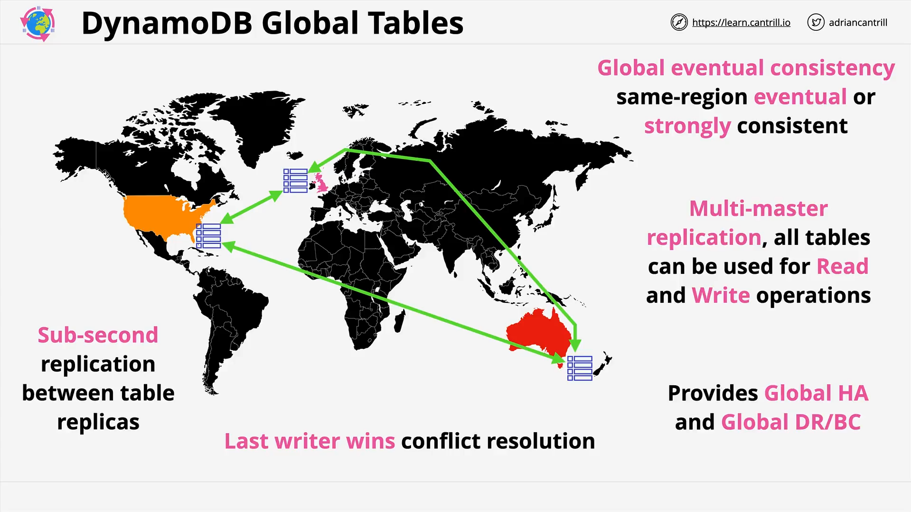

# DynamoDB Global Tables

## Overview

DynamoDB Global Tables enable **global, multi-region deployments** of your DynamoDB data by allowing **multi-master replication** between tables in different AWS regions. All tables in the Global Table are peers — none is the master or primary.

This is especially useful for:

- Global applications
- Reducing latency for international users
- Disaster recovery
- High availability and business continuity

## Key Concepts

### 1. **Multi-Master Replication**

- Each region's table can **read and write** independently.
- Changes in one region are **asynchronously** propagated to other regions.
- Replication uses a **"last write wins"** strategy to resolve conflicts.

### 2. **Conflict Resolution**

- When multiple writes happen on the same item at nearly the same time across regions, the **latest write (based on timestamp)** is retained.
- This is a **simple and predictable** conflict resolution mechanism.

### 3. **Replication Architecture**

- Global Tables consist of **regionally deployed DynamoDB tables**.
- You designate one table (in any region) to initiate the global table configuration.
- DynamoDB handles the setup of replication between all included tables.

#### Visualized Steps:

1. Select the AWS regions (e.g., `us-east-1`, `eu-west-2`, `ap-southeast-2`).
2. Create a DynamoDB table in each region.
3. Pick any one table to start global table creation and link the others.
4. AWS sets up the **replication mesh** among these tables.

### 4. **Consistency**

- **Same region reads** can be **strongly consistent**.
- **Cross-region reads** are **eventually consistent** due to async replication.
- Applications must be designed to tolerate **eventual consistency** if accessing cross-region tables.

## Use Cases

Global Tables are ideal for applications that require:

- **High availability** across multiple geographic zones
- **Reduced latency** for users in different continents
- **Cross-region disaster recovery**
- **Global performance improvements** through regional replication

## Exam-Relevant Details

Here’s what to remember for the AWS Certified Solutions Architect Associate exam:

| Feature                   | Description                                          |
| ------------------------- | ---------------------------------------------------- |
| Replication Latency       | Typically **sub-second**, but depends on region load |
| Consistency               | **Strong** in-region, **eventual** cross-region      |
| Conflict Resolution       | **Last write wins**                                  |
| Architecture Type         | **Multi-master** (all tables are peers)              |
| Implementation Complexity | **Low**, simple setup via console or API             |
| Best Use Cases            | Global apps, DR, regional latency optimization       |

## Summary Points

- Global Tables are **simple to use** but provide **powerful global capabilities**.
- They support **multi-region active-active architectures**.
- Must account for **eventual consistency** and **last write wins** logic in design.
- **Exam tip**: Focus on understanding the architecture and behavior, not the implementation steps.
