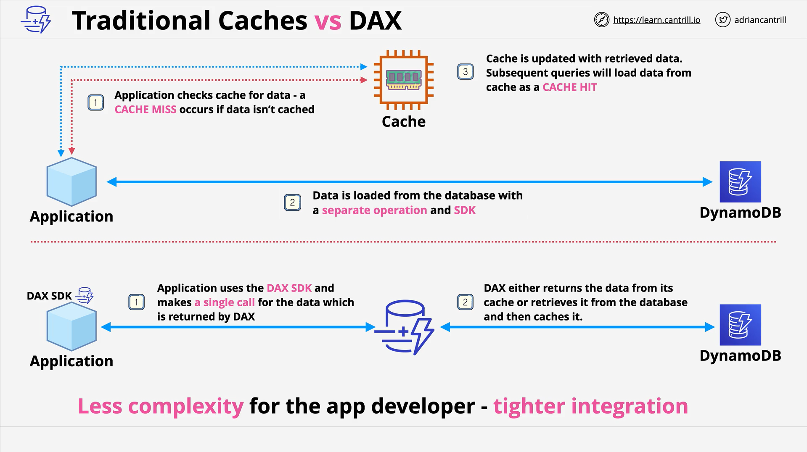
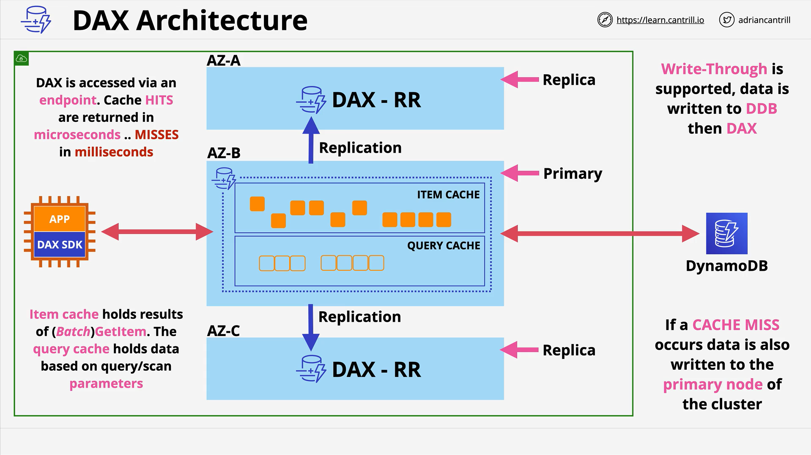

# DynamoDB Accelerator (DAX)

## Overview

**DAX (DynamoDB Accelerator)** is a fully managed, in-memory caching service designed to optimize read performance for DynamoDB. Unlike generic caching solutions like Redis or Memcached, DAX integrates directly with DynamoDB and abstracts caching operations away from the application, simplifying implementation and reducing admin overhead.

## Traditional Cache vs DAX

### Traditional Cache Flow

1. Application checks a generic in-memory cache.
2. **Cache miss?** App fetches data from DynamoDB.
3. App updates the cache with the fetched data.
4. Subsequent reads result in **cache hits**, improving performance.

**Limitations:**

- Manual integration required.
- Separate SDKs for cache and DynamoDB.
- Increased admin overhead.

### DAX Flow

1. Application uses **DAX SDK** (replaces native DynamoDB SDK).
2. The application queries DAX directly.
3. **Cache hit?** DAX returns data.
4. **Cache miss?**
   - DAX fetches data from DynamoDB.
   - Caches it.
   - Returns it to the app.

**Advantages:**

- Seamless integration.
- One API and SDK.
- Minimal code/config changes.
- Fully managed service.

## DAX Architecture

- **Deployed within a VPC** and spans **multiple AZs** for high availability.
- **DAX Cluster Components:**
  - **Primary Node**: Handles read/write and replicates to replicas.
  - **Replica Nodes**: Handle read-only traffic.
- Accessed through a **single cluster endpoint** (like RDS).

### Two Types of Caches

- **Item Cache**: Stores individual items retrieved via `GetItem` or `BatchGetItem`.
- **Query Cache**: Stores results from `Query` or `Scan`, along with request parameters.

## Performance

- **Cache hits** return data in microseconds (~400μs typical).
- **Cache misses** are served via DynamoDB with latency in single-digit milliseconds.
- **Write-through caching** supported:
  - Writes go to both DAX and DynamoDB simultaneously.

## Scaling Options

- **Scale up**: Use larger DAX instances.
- **Scale out**: Add more nodes to the cluster.
- **Failover supported**: If the primary fails, a replica is elected as the new primary.

## Cost and Efficiency Benefits

- Reduces **read traffic to DynamoDB**, lowering cost.
- Ideal for **read-heavy** and **repetitive-read** workloads.
- Helps avoid high **RCU (Read Capacity Unit)** consumption.

## Use Cases: When to Use DAX

### Use DAX if:

- Workload is **read-heavy** or **bursty**.
- Data is **frequently re-read** (same keys).
- You need **sub-millisecond response times**.
- High RCU cost is a concern.
- You want seamless integration with DynamoDB.

### Avoid DAX if:

- Strong consistency is required.
- Application is **write-heavy** with low read usage.
- Low-latency is not a priority.
- You prefer public AWS services (DAX is VPC-bound).

## Summary Points for Exam

- DAX = **in-memory, write-through cache** for DynamoDB.
- Works via **DAX SDK**, replacing DynamoDB SDK.
- Designed for **high performance, low latency** reads.
- **Primary node** supports writes; **replicas** support reads.
- Handles **cache miss logic automatically**.
- Use DAX when you see **caching + DynamoDB** requirements in exam questions.
- Not suitable if **strong consistency or write-heavy patterns** dominate.
