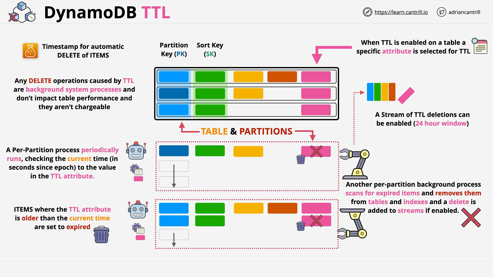

# DynamoDB TTL (Time to Live)

## Overview

**TTL (Time to Live)** is a DynamoDB feature that automatically deletes items from a table after a specified time. It’s simple but powerful, particularly useful for scenarios requiring temporary data, like session tokens or log entries. TTL is often tested on the exam and is important in real-world applications.

## Key Concepts

### What is TTL?

TTL allows each item in a DynamoDB table to carry an attribute that defines when the item becomes **expired**. After this time, the item will be automatically removed by DynamoDB.

### Use Cases for TTL

- Expiring session data or temporary records.
- Deleting stale IoT sensor data.
- Meeting **data retention** policies (e.g., GDPR or regulatory compliance).
- Reducing storage costs for data that loses relevance over time.

## How TTL Works

### 1. **Structure of a DynamoDB Table with TTL**

Each item includes:

- **Partition key** (required)
- **Sort key** (optional)
- Additional attributes (standard data)
- A special **TTL attribute**, e.g., `expireAt`

> This TTL attribute must contain a **UNIX epoch timestamp (in seconds)** indicating when the item should expire.

```json
{
  "userId": "123",
  "sessionId": "abc456",
  "data": "some temporary value",
  "expireAt": 1714502400 // Epoch time for April 30, 2024
}
```

## TTL Processing Architecture



### Step 1: **Enable TTL on the Table**

- You must select which attribute will be used as the TTL timestamp.
- This attribute must be a numeric type representing **seconds since Unix epoch (Jan 1, 1970)**.

### Step 2: **Two System Processes Are Involved**

#### 1. **Expiration Scanner**

- Periodically scans **all partitions** of the table.
- Compares the TTL timestamp with the **current time**.
- If the TTL value < current time, the item is **marked as expired**.
- The item is still queryable at this stage.

#### 2. **Deletion Process**

- Independently runs across partitions.
- Searches for items flagged as expired.
- **Permanently deletes** expired items:
  - From the main table
  - From all indexes
  - Generates a **delete event** for streams (if enabled)

## TTL Streams (Optional)

You can enable a **dedicated stream** to monitor TTL deletions:

- Useful for logging or audit processes.
- TTL stream provides a **24-hour rolling window** of deletions.
- Can trigger automation such as **Lambda functions** for cleanup or analytics.

## Performance and Cost

- TTL deletions are **background processes**.
- **No additional cost** or performance impact.
- Deletes are handled **automatically**, with no manual overhead.

## Example Use Case

> Automatically remove user sessions 1 week after creation.

**Step-by-Step:**

1. Enable TTL on attribute `expireAt`.
2. When writing session data, set:
   - `expireAt = currentEpoch + 604800` (seconds in 7 days)
3. DynamoDB handles expiry/deletion in background.

## TTL Summary Table

| Feature                  | Description                                     |
| ------------------------ | ----------------------------------------------- |
| Trigger Condition        | Epoch timestamp in TTL attribute < current time |
| TTL Attribute Type       | Number (in seconds since Jan 1, 1970)           |
| Configuration            | Must be enabled per-table                       |
| Data Deletion            | Automated, permanent                            |
| Query Behavior (Expired) | Expired items still queryable until deleted     |
| Stream Support           | 24h TTL-specific stream optional                |
| Use Case Examples        | Session expiry, log retention, GDPR cleanup     |

## TTL Considerations for the Exam

- TTL is **eventually consistent** — deletion doesn’t happen at the exact expiration moment.
- TTL deletions are **not billed** and have **no effect on write throughput**.
- Ideal for **read-heavy tables** or **temporary data**.
- Combine with DynamoDB Streams for **auditing or post-deletion workflows**.
- Do **not** use TTL if you need **immediate** or **strongly consistent** deletion logic.
