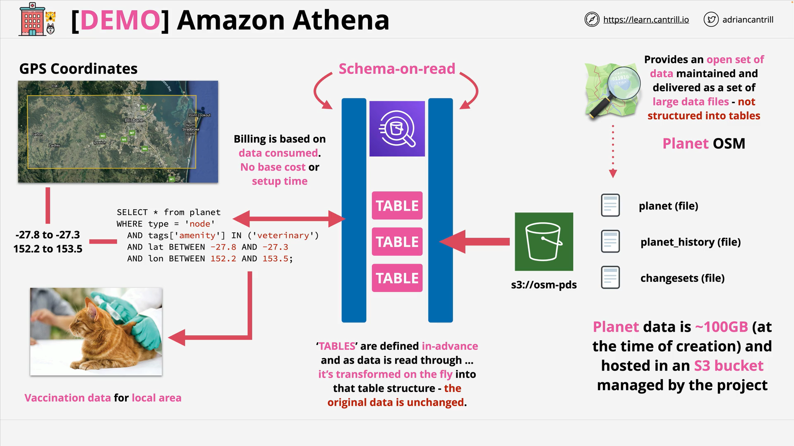

# AWS Athena Deep Dive: Querying OpenStreetMap Data

## Overview

This lesson demonstrates how to use **Amazon Athena**, a **serverless, interactive query service**, to explore **open geospatial data** from OpenStreetMap (OSM). The goal is to assist a fictional organization, _Animals for Life_, in querying nearby veterinary clinics using **lat/lon coordinates** without setting up any infrastructure.

## Table of Contents

1. [Use Case & Architecture](#use-case--architecture)
2. [Athena Setup](#athena-setup)
3. [Creating the Database and Table](#creating-the-database-and-table)
4. [Querying the Data](#querying-the-data)
5. [Schema Explanation](#schema-explanation)
6. [Athena Query Cost Model](#athena-query-cost-model)
7. [External Resources](#external-resources)

## Use Case & Architecture



**Scenario**:  
_Animals for Life_ has mobile teams that need real-time information on local veterinary services to vaccinate animals. The requirements are:

- No infrastructure setup.
- No maintenance burden.
- No base cost (pay-per-query only).

**Solution**: Use **Amazon Athena** with the **OpenStreetMap (OSM) "Planet" dataset** hosted on S3.

- **Data Source**: `s3://osm-pds/planet/` (in ORC format)
- **Athena** allows querying this directly using **Schema-on-Read**.
- No data ingestion or transformation is needed.

**Data Elements in OSM**:

- **Nodes**: Points with metadata (e.g., places, clinics).
- **Ways**: Boundaries, roads, areas.
- **Relations**: Logical grouping of nodes/ways.

## Athena Setup

### Step 1: Configure Query Result Location

1. Go to the Athena Console.
2. Open **Settings > Manage**.
3. Set up an **S3 bucket** to store query results (e.g., `a4l-query-results-<unique-suffix>`).
4. Grant bucket access via AWS account ID and save settings.

## Creating the Database and Table

### Step 2: Create Athena Database

```sql
CREATE DATABASE A4L;
```

> This command registers a logical database in Athena. It doesn’t store any data but groups related tables.

### Step 3: Define External Table (Schema-on-Read)

```sql
CREATE EXTERNAL TABLE planet (
  id BIGINT,
  type STRING,
  tags MAP<STRING,STRING>,
  lat DECIMAL(9,7),
  lon DECIMAL(10,7),
  nds ARRAY<STRUCT<ref: BIGINT>>,
  members ARRAY<STRUCT<type: STRING, ref: BIGINT, role: STRING>>,
  changeset BIGINT,
  timestamp TIMESTAMP,
  uid BIGINT,
  user STRING,
  version BIGINT
)
STORED AS ORCFILE
LOCATION 's3://osm-pds/planet/';
```

### Line-by-Line Explanation:

- `id BIGINT`: Unique identifier for the element.
- `type STRING`: Type of OSM element (e.g., node, way, relation).
- `tags MAP<STRING,STRING>`: Metadata tags like `amenity`, `name`, etc.
- `lat`, `lon`: Geographic coordinates.
- `nds ARRAY<STRUCT<ref: BIGINT>>`: References to node elements (used in ways).
- `members ARRAY<STRUCT<type: STRING, ref: BIGINT, role: STRING>>`: Defines relationships between entities.
- `changeset`, `timestamp`: Track data modification metadata.
- `uid`, `user`: Identify the contributor.
- `version`: Revision number of the data.

> This creates a **logical view** into data stored in ORC files on S3. The data isn't moved or altered.

## Querying the Data

### Step 4: Run a Test Query

```sql
SELECT * FROM planet LIMIT 100;
```

- Retrieves the first 100 rows from the dataset.
- Useful to validate schema correctness and table configuration.

### Step 5: Query Veterinary Clinics in Specific Area

```sql
SELECT * FROM planet
WHERE type = 'node'
  AND tags['amenity'] IN ('veterinary')
  AND lat BETWEEN -27.8 AND -27.3
  AND lon BETWEEN 152.2 AND 153.5;
```

### Query Breakdown:

- `type = 'node'`: Only look at point-based data entries.
- `tags['amenity'] IN ('veterinary')`: Filter for vet clinics using the `amenity` tag.
- `lat BETWEEN ... AND lon BETWEEN ...`: Geographical bounding box (near Brisbane, Australia).

> This efficiently finds vet clinics in the specified region.

## Schema Explanation

| Column        | Type                             | Description                                  |
| ------------- | -------------------------------- | -------------------------------------------- |
| `id`          | `BIGINT`                         | Unique identifier                            |
| `type`        | `STRING`                         | Element type: `node`, `way`, `relation`      |
| `tags`        | `MAP<STRING, STRING>`            | Key-value metadata (e.g., `amenity`, `name`) |
| `lat`, `lon`  | `DECIMAL`                        | Geographic coordinates                       |
| `nds`         | `ARRAY<STRUCT<ref: BIGINT>>`     | Used for complex spatial elements like roads |
| `members`     | `ARRAY<STRUCT<type, ref, role>>` | Relationship links among nodes/ways          |
| `changeset`   | `BIGINT`                         | Change log tracking                          |
| `timestamp`   | `TIMESTAMP`                      | Last update time                             |
| `uid`, `user` | `BIGINT`, `STRING`               | Contributor metadata                         |
| `version`     | `BIGINT`                         | Revision/version control                     |

## Athena Query Cost Model

- **No infrastructure**: Athena is serverless.
- **Pay-per-query**: Cost is based on the amount of data scanned.
- **Compression + Columnar Format (ORC)** helps reduce cost and improve performance.

## External Resources

- [Cantrill Lesson Commands](https://learn-cantrill-labs.s3.amazonaws.com/awscoursedemos/0051-aws-mixed-athena/lesson_commands.txt)
- [Latitude/Longitude Info](https://journeynorth.org/tm/LongitudeIntro.html)
- [Google Earth](https://www.google.com/earth/)
- [AWS Athena Documentation](https://docs.aws.amazon.com/athena/index.html)
- [OSM Public Dataset on AWS](https://registry.opendata.aws/osm/)

## Conclusion

This lesson shows how powerful Athena is for querying large public datasets directly from S3 using SQL. You can gain insights from gigabytes of data in seconds—without deploying or managing servers. This workflow is especially valuable for **geospatial analytics**, rapid **ad-hoc querying**, and scenarios with strict **infrastructure cost constraints**.
