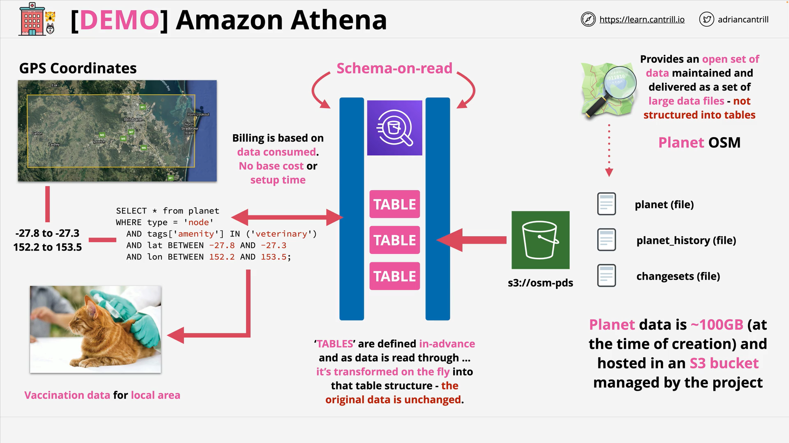

# Athena OpenStreetMap (OSM) Data Query Lesson

This demo lesson focuses on using **Amazon Athena** to query geospatial data from the **OpenStreetMap (OSM)** public dataset stored in an S3 bucket. You will learn how to define an area of interest, query for specific points of interest (e.g. veterinary clinics), and work with the data using SQL—all in a **serverless and cost-efficient** way.

## Resources Used

- **Lesson Commands**  
  [lesson_commands.txt](https://learn-cantrill-labs.s3.amazonaws.com/awscoursedemos/0051-aws-mixed-athena/lesson_commands.txt)

- **Latitude/Longitude Reference**  
  https://journeynorth.org/tm/LongitudeIntro.html

- **Google Earth (for coordinate visualization)**  
  https://www.google.com/earth/

## Step-by-Step Athena Setup and Execution

### 1. **Create Athena Database**

```sql
CREATE DATABASE A4L;
```

**Explanation:**

- `CREATE DATABASE A4L;` initializes a new database in Athena called `A4L` to house your tables.

### 2. **Create External Table in Athena**

```sql
CREATE EXTERNAL TABLE planet (
  id BIGINT,
  type STRING,
  tags MAP<STRING,STRING>,
  lat DECIMAL(9,7),
  lon DECIMAL(10,7),
  nds ARRAY<STRUCT<ref: BIGINT>>,
  members ARRAY<STRUCT<type: STRING, ref: BIGINT, role: STRING>>,
  changeset BIGINT,
  timestamp TIMESTAMP,
  uid BIGINT,
  user STRING,
  version BIGINT
)
STORED AS ORCFILE
LOCATION 's3://osm-pds/planet/';
```

**Line-by-Line Breakdown:**

| Line | Purpose |
|||
| `CREATE EXTERNAL TABLE planet (...)` | Defines a schema for data stored in S3; no data is ingested. |
| `id`, `type`, `tags`, etc. | Define the structure of each map object (nodes, ways, relations). |
| `tags MAP<STRING,STRING>` | Stores key-value metadata such as `amenity: veterinary`. |
| `lat`, `lon` | Decimal values used for geospatial queries. |
| `nds`, `members` | Represent relationships and node references. |
| `STORED AS ORCFILE` | Specifies the data format. |
| `LOCATION 's3://osm-pds/planet/'` | Points to the public OSM dataset in S3. |

### 3. **Initial Data Test Query**

```sql
SELECT * FROM planet LIMIT 100;
```

**Purpose:**

- Simple test to validate the table is working.
- Returns 100 rows of OSM data from the `planet` table.

## Defining Area of Interest: Brisbane, Australia

1. **Use Google Earth**:

   - Set **latitude/longitude format to decimal** in settings.
   - Enable **grid lines** for easier coordinate reading.
   - Use the "Draw Shape" tool to define a bounding box around Brisbane.

2. **Identify coordinate boundaries**:
   - **Latitude**: From `-27.8` to `-27.3`
   - **Longitude**: From `152.2` to `153.5`
   - These define a square over the **Greater Brisbane Area**.

### 4. **Perform Locational Query**

```sql
SELECT * FROM planet
WHERE type = 'node'
  AND tags['amenity'] IN ('veterinary')
  AND lat BETWEEN -27.8 AND -27.3
  AND lon BETWEEN 152.2 AND 153.5;
```

**Query Breakdown:**

| Condition                               | Purpose                                                        |
| --------------------------------------- | -------------------------------------------------------------- |
| `type = 'node'`                         | Filters for individual map objects (e.g. buildings, services). |
| `tags['amenity'] IN ('veterinary')`     | Narrows the result to veterinary clinics only.                 |
| `lat BETWEEN ...` and `lon BETWEEN ...` | Further restricts results to the Brisbane area only.           |

**Result:**

- Lists all **veterinary clinics** in the Brisbane region.
- Metadata such as names, operating hours, etc. may also be returned.

## Cleanup: Drop Table and Database

```sql
DROP TABLE planet;
DROP DATABASE A4L;
```

**Explanation:**

- **`DROP TABLE`** deletes the `planet` table definition.
- **`DROP DATABASE`** removes the Athena database `A4L`.

## What You Learned



- How to **query OSM data** stored in AWS S3 using **Amazon Athena**.
- Defined a **schema-on-read** using SQL for an external ORC-formatted dataset.
- Used **Google Earth** to derive bounding box coordinates for Brisbane.
- Filtered data using **SQL geospatial conditions** and **metadata tags**.
- Queried **large-scale public data without managing infrastructure**.

## Athena Use Cases Beyond This Lesson

Amazon Athena can also query:

- AWS **CloudTrail logs**
- **VPC Flow Logs**
- **Elastic Load Balancer logs**
- **Federated data sources** via Lambda connectors

Athena is a **pay-per-query** service—you are charged based on the amount of data scanned, making it a powerful tool for **ad-hoc analysis** with minimal overhead.
