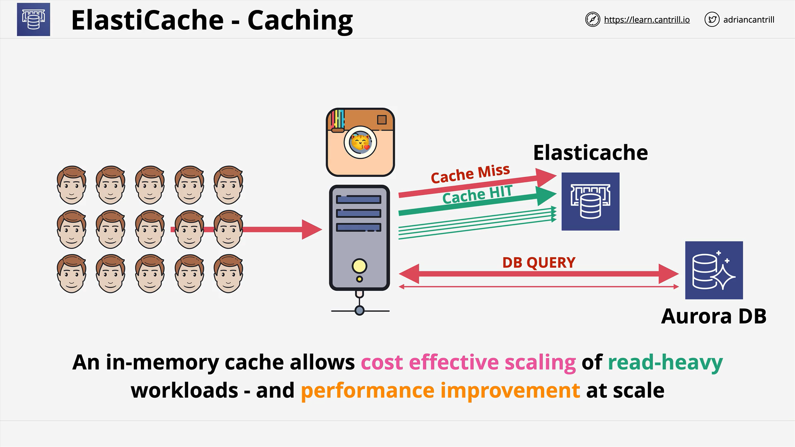
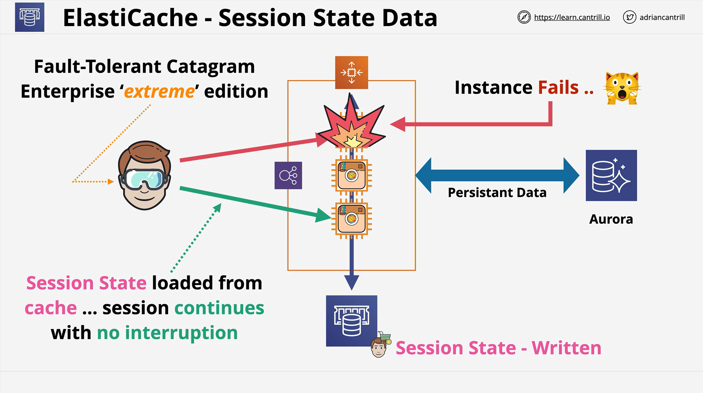

# ElastiCache Deep

## Overview

Amazon **ElastiCache** is a **fully managed in-memory caching service** that supports two engines: **Redis** and **Memcached**. It is commonly tested in the AWS Associate and Professional exams and is a vital tool for **high-performance, scalable applications**.

## Key Concepts

### What is ElastiCache?

- An **in-memory data store/cache**.
- Designed for **applications with high throughput and low-latency requirements**.
- Complements traditional databases like RDS or Aurora by reducing their workload.

### Why Use ElastiCache?

- **High-speed access** to frequently used data (orders of magnitude faster than disk).
- Ideal for:
  - **Read-heavy workloads**.
  - **Session data storage**.
  - **Reducing backend database cost and latency**.
- Helps in making applications **stateless**, enhancing scalability and fault tolerance.

## Use Cases

### 1. **Caching Read-Heavy Data**

#### Architecture Flow:

1. **User requests data** via application.
2. App **checks ElastiCache** (cache).
3. If **cache miss**, app queries the **database**.
4. Retrieved data is **stored in cache**.
5. Next request for the same data becomes a **cache hit** – **faster and cheaper**.

#### Benefits:

- Reduces **direct reads** to database.
- Cost-effective at **scale**.
- **Improves application performance**.

### 2. **Session State Management**

#### Example Scenario:

- App deployed in **Auto Scaling Group** behind a **Load Balancer**.
- User session data is stored in **ElastiCache**.
- If an EC2 instance fails, **another instance can retrieve session state**, ensuring **seamless user experience**.

#### Benefits:

- Enables **fault tolerance**.
- Makes applications **stateless**.
- Improves **availability and resiliency**.

## Application Integration Considerations

> ElastiCache **requires application changes**.

- The app must:
  - Know when to **read/write** from/to cache.
  - Handle **cache invalidation**.
  - Fallback to DB on cache misses.

🛑 **If exam scenario states "no application changes," ElastiCache is not a valid answer.**

## Redis vs Memcached

| Feature          | Redis                                | Memcached                          |
| ---------------- | ------------------------------------ | ---------------------------------- |
| Data Structures  | Strings, Lists, Sets, Hashes, etc.   | Strings only                       |
| Replication & HA | Supports replication across AZs      | No built-in replication            |
| Backup/Restore   | Supported                            | Not supported                      |
| Persistence      | Optional                             | None                               |
| Transactions     | Supported                            | Not supported                      |
| Thread Model     | Single-threaded                      | Multi-threaded                     |
| Use Cases        | Complex data models, fault tolerance | Simpler use cases, max performance |

### Example Use Case for Redis:

- Storing **game leaderboard** with **sorted sets**, allowing retrieval based on ranking.

### High Availability:

- Redis can **replicate across AZs** and **scale read replicas**.
- Memcached lacks **HA features**.

## Exam Tips

- Use ElastiCache for:

  - **Read-heavy workloads**
  - **Session state storage**
  - **Low-latency access (sub-millisecond)**

- Choose **Redis** if:

  - You need **persistence**, **HA**, **backups**, or **data structures** beyond simple strings.
  - **Recovery or replication** is mentioned.

- Choose **Memcached** if:
  - You need **simple, high-throughput caching**.
  - Multi-threading is critical.

## Summary

ElastiCache is a **powerful caching layer** that reduces database load and latency, supports **fault-tolerant architectures**, and is a common component in **scalable AWS systems**. Choosing between Redis and Memcached depends on your **application requirements**, especially around **data complexity, availability, and recoverability**.
