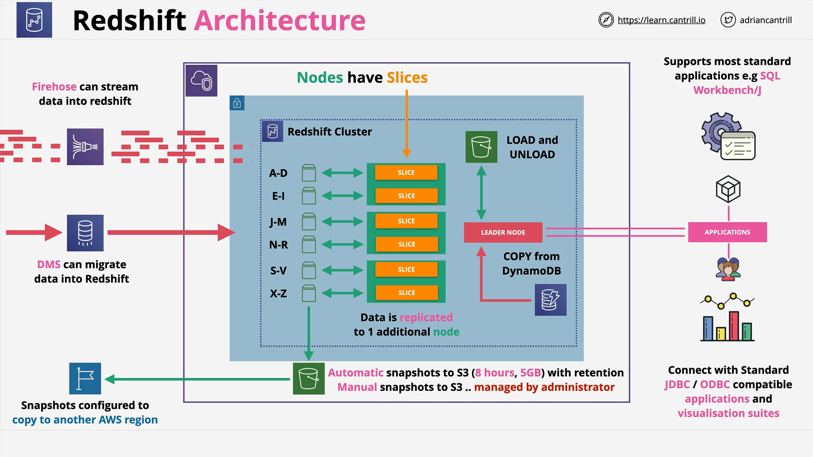

# Amazon Redshift

## Overview of Amazon Redshift

Amazon Redshift is a **petabyte-scale, fully managed data warehouse** service designed for **analytical workloads**. It allows multiple operational databases to feed into a central repository used for **reporting and long-term trend analysis**.

Key points:

- Redshift is **optimized for Online Analytical Processing (OLAP)**.
- It is **not suited for transactional (OLTP)** workloads like Amazon RDS.
- Redshift is ideal for **large-scale analytical queries** across vast amounts of historical data.

## OLAP vs OLTP

| Feature     | OLTP (e.g., RDS)                          | OLAP (e.g., Redshift)                     |
| ----------- | ----------------------------------------- | ----------------------------------------- |
| Use Case    | Transactional (inserts, updates, deletes) | Analytical (aggregates, trends, insights) |
| Data Format | Row-based                                 | Column-based                              |
| Example     | E-commerce order systems                  | Business intelligence dashboards          |

> **Example Explained**:

- **OLTP**: Updating the age of a specific cat in a row-based table.
- **OLAP**: Querying the _average age_ of all cats using columnar storage for efficiency.

## Columnar Storage in Redshift

- Stores data in **columns** rather than rows.
- Enhances **performance for analytical queries**.
- Improves compression and **I/O efficiency**.

### Benefit:

Only the relevant **columns are scanned**, reducing the processing overhead during complex queries.

## Key Redshift Features

### Redshift as a Service

- Provisioned via AWS (like RDS).
- Fast to set up and easy to scale.
- Not designed for **ad-hoc querying** like Amazon Athena.

### Redshift Spectrum

- Enables **querying data directly from S3**.
- No need to load data into Redshift first.
- Still requires a Redshift cluster.

### Federated Query

- Lets you **query remote databases** directly from Redshift.
- Similar to how federated identities work for identity management.

### Integration with AWS Ecosystem

- Compatible with **QuickSight** for visual analytics.
- Supports **SQL-like syntax**.
- Connects through **JDBC/ODBC** drivers.

## Redshift Architecture

### Cluster-Based Design

- Comprises a **leader node** and **compute nodes**.
- **Leader node** handles client communication and query planning.
- **Compute nodes** run the actual queries and store data.

### Node Slices

Each compute node is divided into **slices**, each with:

- Allocated memory and disk.
- A portion of the overall workload.

**Parallel Processing**: All slices work in tandem for fast, distributed execution of queries.

## Availability & Networking

### Availability

- Redshift resides in **a single Availability Zone (AZ)**.
- Not inherently highly available across AZs.
- **Data replication within nodes** for localized fault tolerance.

### Backup and Recovery

- **Automated backups to S3** every 8 hours or 5GB of data written.
- **Manual snapshots** also supported.
- **Snapshots can be copied to other regions** for disaster recovery.

### Networking: Enhanced VPC Routing

#### Default Behavior:

- Uses **public routes** for data ingestion from services like S3.

#### Enhanced VPC Routing:

- Routes traffic **within your VPC**.
- Enables:
  - Security groups and NACLs
  - Custom DNS
  - Usage of NAT/internet gateways or VPC endpoints

> 🔥 **Critical Exam Tip**: Enable **Enhanced VPC Routing** if you have customized network security requirements.

## Visual Architecture Summary

- Redshift cluster is accessed via the **leader node**.
- Data within compute nodes is processed and stored in **parallel slices**.

## Data Ingestion Methods

- **S3** (via COPY or Spectrum)
- **DynamoDB**
- **AWS Database Migration Service (DMS)**
- **Kinesis Firehose** (real-time streaming)

## Exam-Relevant Takeaways

- Understand the **differences between OLAP and OLTP**.
- Know the **Redshift architectural components** and how they interact.
- Be aware of **integration capabilities** (S3, QuickSight, Spectrum, etc.).
- Learn **when to use Redshift vs Athena**.
- Know the significance of **Enhanced VPC Routing** for security.
- Understand **backup and disaster recovery features** (automated/manual, cross-region).
