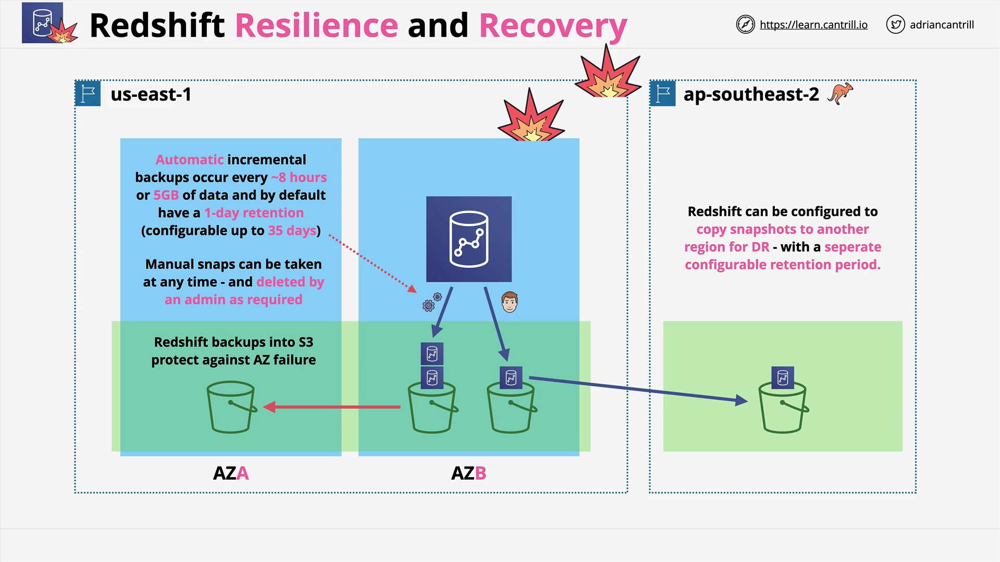

# Redshift – Backup and Resilience

## Overview

Amazon Redshift is a **single-AZ** (Availability Zone) data warehouse solution. By default, Redshift is **not highly available across multiple AZs**, which poses a risk in the event of an AZ failure. To mitigate this, AWS provides various **backup and resilience features** that architects must understand and apply when designing reliable data warehouse solutions.

## Redshift Resilience Challenges

- Redshift operates **within one AZ only** (e.g., AZ-B in us-east-1).
- If the **AZ fails**, the entire **Redshift cluster is at risk**.
- Therefore, backups and data replication strategies must be used to improve resilience.

## Redshift Backup Options

Redshift offers two types of backups:

### 1. **Automatic Backups**

- Occur every **8 hours** or after **5 GB** of data changes—whichever comes first.
- **Stored in Amazon S3**.
- **Default retention**: 1 day (can be extended up to **35 days**).
- **Free** up to the size of your cluster.
- **Incremental**: Only stores changes since the last backup, which reduces storage cost.

### 2. **Manual Snapshots**

- Triggered manually by a **user**, **script**, or **management tool**.
- **Persist indefinitely** until deleted explicitly.
- Useful for **long-term retention**, compliance, or migrations.

### S3 Benefits

- All backups are stored in S3, giving them **resilience across 3+ AZs** in the **same region**.
- While Redshift itself isn't AZ-resilient, **your data can be**.

## Redshift Snapshot Restore

- You can **restore** a snapshot to create a **new Redshift cluster**.
- During restore, you can **select a different AZ** to avoid the original failure zone.
- This forms the basis of an **AZ-level disaster recovery (DR)** approach.

## Cross-Region Snapshot Copy

For **regional-level resilience**, Redshift supports **snapshot replication to other AWS regions**.

### Example:

- Your Redshift cluster is in **us-east-1**.
- You configure snapshots to replicate to **ap-southeast-2 (Australia)**.
- In case **us-east-1 fully fails**, you can spin up a **new cluster** in **Australia** using the copied snapshot.

### Additional Notes:

- **Cross-region snapshots** can have their own **retention policies**.
- Helps manage **costs** and **compliance**.
- Enables **global disaster recovery (DR)** strategies.

## Key Takeaways for the SA-C03 Exam

| Feature           | Description                                                |
| ----------------- | ---------------------------------------------------------- |
| Single-AZ         | Redshift clusters run in one AZ only                       |
| Snapshots         | Provide resilience via automatic and manual S3 backups     |
| S3 Backups        | Resilient across AZs by default                            |
| Restore Options   | New cluster can be launched in a different AZ              |
| Cross-Region Copy | Ensures regional failure protection                        |
| Retention Config  | Both automatic and manual snapshots offer custom retention |

## Summary

- Redshift is **not inherently highly available** due to single-AZ deployment.
- Backups are **critical** to mitigate failure risks.
- **Automatic and manual snapshots** offer flexibility and cost-effective retention.
- Using **S3 and cross-region snapshot copy**, you can achieve **resilience across AZs and regions**.
- These features are vital for **designing robust architectures** and are **frequently tested** in the **AWS SA-C03 exam**.
