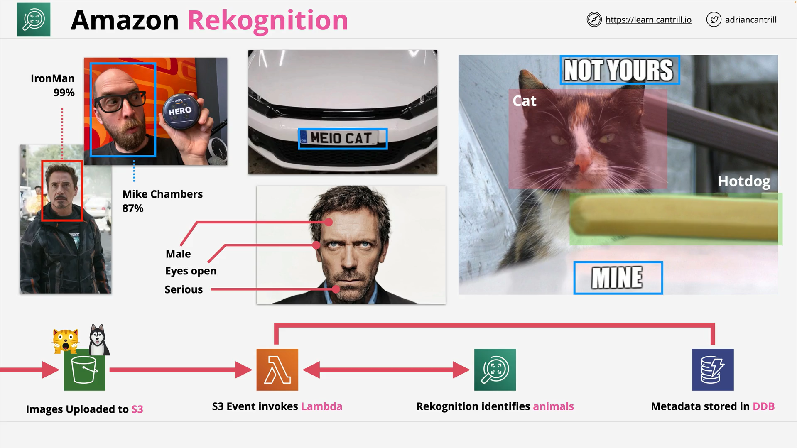

# Amazon Rekognition

## Overview

**Amazon Rekognition** is an AWS service for **image and video analysis**, powered by **deep learning**, which is a subset of machine learning. It provides advanced capabilities to detect, analyze, and extract data from visual media.

Rekognition is primarily used for:

- Object and scene detection
- Facial recognition and analysis
- Text detection
- Content moderation
- Activity recognition
- Celebrity recognition
- Real-time video stream analysis

## Key Capabilities

### 1. **Object and Scene Detection**

- Identifies general items in images and videos such as:
  - Animals (dogs, cats, chickens)
  - Objects (vehicles, hot dogs, furniture)
  - Scenes (beaches, cities, etc.)

### 2. **Facial Detection and Analysis**

- Detects faces in images or video frames.
- Analyzes attributes:
  - **Emotion** (happy, sad, angry, etc.)
  - **Eyes open/closed**
  - **Gender**
  - **Smile detection**
  - **Pose (head orientation)**

### 3. **Facial Comparison**

- Compares two facial images to determine if they represent the **same person**.
- Useful in authentication and identity verification scenarios.

### 4. **Text Detection (OCR)**

- Detects and reads **text** in images or video frames.
  - Use cases: License plates, signs, documents, memes.

### 5. **Content Moderation**

- Detects **inappropriate content** including nudity, violence, and other restricted categories.
- Useful in user-generated content platforms or compliance workflows.

### 6. **Activity Recognition**

- Identifies what individuals are doing in a video:
  - Walking, running, jumping, waving, etc.

### 7. **Celebrity Recognition**

- Identifies well-known individuals in media.
  - Examples: Celebrities, politicians, public figures.

### 8. **Video Stream Analysis with Kinesis**

- Can analyze **live video streams** using Amazon **Kinesis Video Streams**.
- Enables real-time use cases such as:
  - Security camera face recognition.
  - Monitoring entry points in facilities.

## Integration and Event-Driven Design



### Example Architecture (Image Analysis Flow)

**Step-by-step workflow:**

1. **Image Upload to S3**

   - User uploads an image (e.g., of pets) to an S3 bucket.

2. **Trigger via S3 Event**

   - S3 event notification triggers a **Lambda function**.

3. **Call Rekognition API**

   - Lambda function sends the image to **Amazon Rekognition** for analysis.

4. **Receive Results**

   - Rekognition returns metadata such as detected objects, text, emotions, etc.

5. **Store Metadata in DynamoDB**
   - Lambda stores results (e.g., labels, confidence scores) in **DynamoDB**, along with an S3 image link.

#### Code Representation (Conceptual Example):

```python
import boto3

def lambda_handler(event, context):
    rekognition = boto3.client('rekognition')

    response = rekognition.detect_labels(
        Image={
            'S3Object': {
                'Bucket': 'my-image-bucket',
                'Name': 'puppy.jpg'
            }
        },
        MaxLabels=10,
        MinConfidence=80
    )

    # Store response in DynamoDB or perform further actions
    print(response)
```

#### Code Explanation:

- **`boto3.client('rekognition')`** – Initializes the Rekognition client.
- **`detect_labels()`** – Sends the image to Rekognition for label detection.
- **`Image`** – Specifies the image location in S3.
- **`MaxLabels`** – Limits number of labels returned.
- **`MinConfidence`** – Filters results by confidence score.
- **`response`** – Contains detected labels (e.g., "Dog", "Animal") and confidence values.

## Use Case Examples

- **Security Systems** – Real-time facial identification from surveillance feeds.
- **Social Media** – Automatic image tagging, inappropriate content filtering.
- **Retail** – Customer emotion analysis or behavior tracking.
- **Legal/Compliance** – Detect sensitive content in public uploads.
- **Entertainment** – Tagging celebrities in media archives.

## Cost Model

- **Pay-as-you-go**:
  - **Per image** for static analysis.
  - **Per minute** for video analysis.
- No upfront costs, scales automatically with use.

## Exam Tip

For AWS certification exams (including SA-C03), **any question related to image or video analysis** — especially involving:

- Emotion detection,
- Face comparison,
- Text in images,
- Content safety,
- Celebrity detection,

...you should default to **Amazon Rekognition** as the service of choice.

## Summary Table

| Feature                  | Description                                               |
| ------------------------ | --------------------------------------------------------- |
| Object Detection         | Identifies objects, scenes, and animals                   |
| Face Detection/Analysis  | Detects faces, emotions, gender, and facial attributes    |
| Face Comparison          | Compares two faces to check for matches                   |
| Text Detection           | Detects text in images and videos                         |
| Content Moderation       | Flags inappropriate content                               |
| Activity Recognition     | Understands actions performed in a scene                  |
| Celebrity Detection      | Identifies famous personalities                           |
| Real-Time Video Analysis | Analyzes live streams via Kinesis Video Streams           |
| Integration Methods      | API, event-driven via Lambda and S3, storage via DynamoDB |
| Pricing Model            | Pay per image or per minute of video                      |
