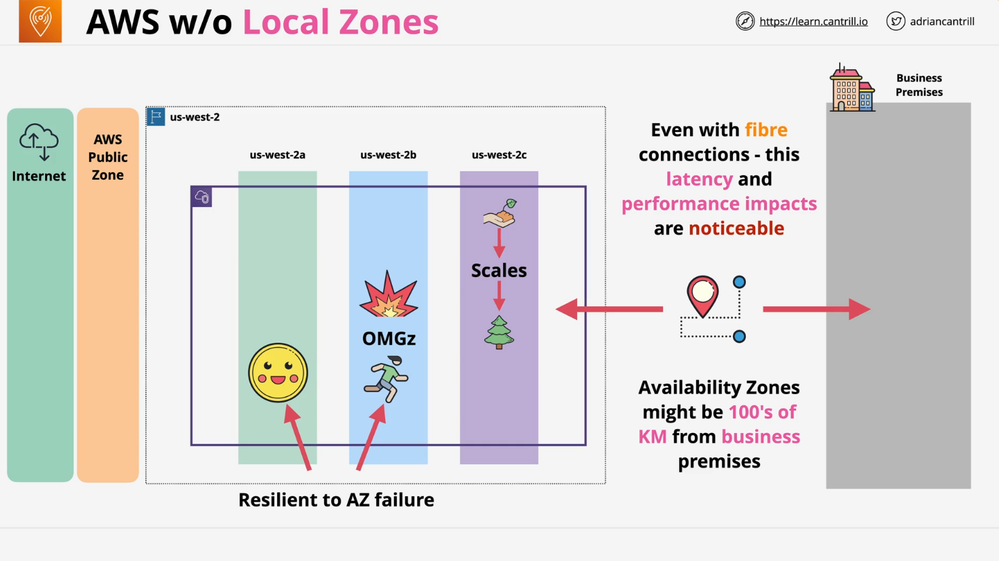
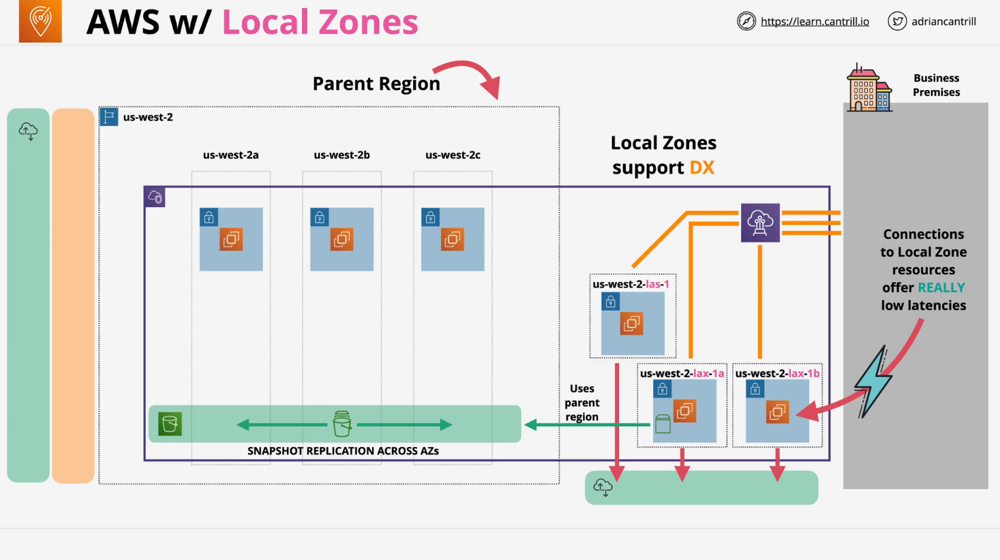

# AWS Local Zones

## Overview

**AWS Local Zones** are an extension of the **AWS Global Infrastructure**, designed to reduce **latency** by placing compute, storage, and select AWS services **closer to end users** and business premises. This architecture is crucial for latency-sensitive applications and is especially relevant for real-world architecture and AWS certification exams.

## Standard AWS Region Architecture (Without Local Zones)



Before understanding Local Zones, it's important to review the traditional AWS region setup:

- A **region** (e.g., `us-west-2`) includes multiple **Availability Zones (AZs)** (e.g., `us-west-2a`, `us-west-2b`, `us-west-2c`).
- A **VPC** spans across these AZs.
- AWS maintains **resilient internet connections** and separates **public** and **private zones**.
- This architecture is:
  - **Scalable**
  - **Highly available**
  - **Resilient to failures**, assuming resources are properly distributed across AZs.

### Latency Challenge

However, physical **distance** between a business premises and a region can introduce **latency** — even over high-speed fiber.

- For latency-sensitive use cases (e.g., financial trading), even **milliseconds** can impact performance.
- Latency increases as **geographic separation** grows.

## Introduction to AWS Local Zones

**AWS Local Zones** address this issue by placing AWS infrastructure **physically closer** to users or applications.

### How Local Zones Extend Architecture



- Local Zones are **tied to a parent region** (e.g., `us-west-2`).
- They appear as extensions of a region using naming conventions such as:

```bash
us-west-2-lax-1a
```

- Here:
  - `us-west-2` → parent region
  - `lax` → Los Angeles (IATA city code)
  - `1a` → zone identifier in that city

### Local Zone Characteristics

- Multiple Local Zones can exist in a city (`us-west-2-lax-1a`, `us-west-2-lax-1b`).
- Each zone:
  - Has its **own network edge infrastructure**
  - Supports **high-performance private connectivity** (e.g., AWS Direct Connect)

## Local Zones with EC2 and VPC

### VPC Integration

- Your existing **VPC is extended** into Local Zones by creating **subnets** within those zones.
- Resources like **EC2 instances** can then be launched in Local Zone subnets.

```bash
VPC (us-west-2)
│
├── Subnet A (us-west-2a)
├── Subnet B (us-west-2b)
├── Subnet C (us-west-2c)
└── Subnet D (us-west-2-lax-1a) ← Local Zone
```

### Key Benefit

- These resources are now **closer to your business premises**, drastically reducing latency for edge workloads.

## Networking and Data Flow Considerations

- **Private networking** exists between the Local Zone and the parent region.
- Some AWS services still operate in or rely on the **parent region**.

### Example: EBS Snapshots

- When you take a snapshot in a Local Zone:
  - Snapshot data is stored in **S3 in the parent region**.
  - Benefits from **AZ replication**, like normal region-based EBS snapshots.

## Summary Points for Local Zones

| Feature                      | Description                                                                   |
| ---------------------------- | ----------------------------------------------------------------------------- |
| **Latency**                  | Very low; ideal for high-performance, low-latency use cases                   |
| **Location**                 | Physically closer to users than regional AZs                                  |
| **Parent Region Dependency** | Still dependent on parent region for services like snapshots, S3, etc.        |
| **Not Multi-AZ by Default**  | Local Zones are **single-zone** constructs; not inherently fault-tolerant     |
| **Supported Services Vary**  | Not all AWS services are supported; support is **opt-in and region-specific** |
| **Direct Connect**           | Commonly supported to Local Zones for ultra-low latency                       |

## When to Use AWS Local Zones

Use **Local Zones** when:

- Your application demands **ultra-low latency** (e.g., gaming, financial trading, video rendering).
- You require **compute/storage near end users** or **on-premises systems**.
- You're architecting for **edge-based hybrid workloads**.

> Think of a Local Zone as a **mini availability zone placed next door** to your business.

## Important Reminders

- Always **check the AWS documentation** for supported services in your desired Local Zone.
- Be aware of **service limitations** and the **parent region dependencies** when planning.

## Conceptual Diagram (Text Version)

```
                 +---------------------+
                 |    AWS Region       |
                 |  (us-west-2)        |
                 | +--+  +--+  +--+     |
                 | |AZ|  |AZ|  |AZ|     |
                 | +--+  +--+  +--+     |
                 +---------------------+
                        |
                        |
             +----------+---------+
             |                    |
     +---------------+    +--------------------+
     | Business Prem |<-->| AWS Local Zone     |
     | (Los Angeles) |    | (us-west-2-lax-1a) |
     +---------------+    +--------------------+
```

## Final Thoughts

AWS Local Zones are a **powerful architectural tool** that allow solution architects to:

- Optimize performance through proximity
- Extend VPCs without sacrificing security
- Support hybrid deployments with minimal latency

They are especially useful when **proximity to end users or systems matters more than redundancy**.
