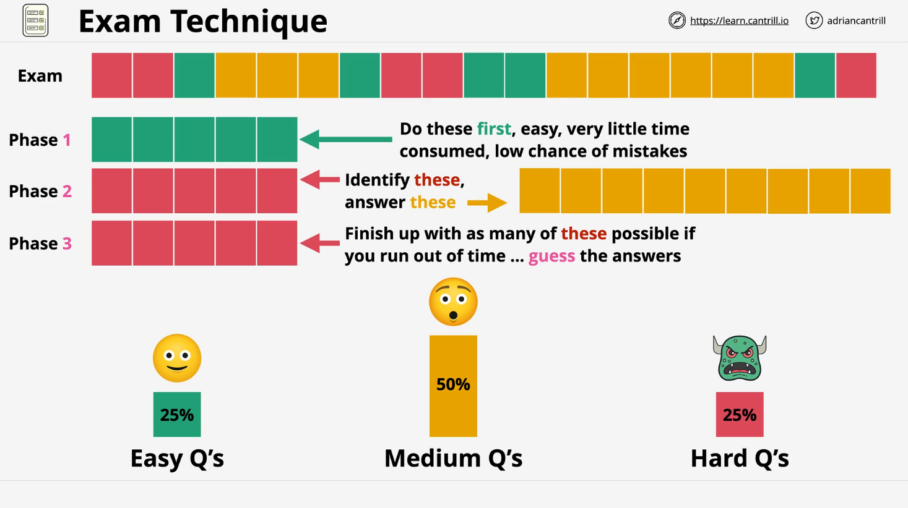

# Exam Strategy and Techniques

## Overview

This lesson is the first part of a two-part series, focused entirely on **exam strategy** rather than technical content. It covers how to manage your time and mental energy effectively during the AWS SAA-C03 exam using a structured, three-phase method.

## Understanding AWS Exam Difficulty Distribution

The AWS exams typically follow a perceived difficulty spread:

- **25% Easy**
- **50% Medium**
- **25% Hard**

This distribution assumes good preparation and no major knowledge gaps. However, the questions appear in **random order**, so you might face difficult ones early or late.

## The 3-Phase Exam Strategy

To manage time and reduce the chances of burnout or error, use this structured three-phase approach:

### Phase 1: Quick Wins (Green Questions)

- Go through all 65 questions quickly.
- Answer only those questions that:
  - You can confidently answer within 10 seconds.
  - Require minimal thought and no second-guessing.
- Mark anything you're not 100% sure about for review.
- These questions help you build early momentum with minimal risk.

### Phase 2: Core Focus (Yellow Questions)

- Return to the questions that were **not easy** but **not intimidating**.
- Skip and mark all obviously hard questions (Red).
- Spend the bulk of your time here, working through medium-difficulty questions that:
  - Require thought.
  - Can realistically be answered with time and focus.
- These are the **most important** questions for passing the exam.

### Phase 3: Final Push (Red Questions)

- After completing Phase 2, evaluate your remaining time.
- Use remaining time to tackle the hard questions you marked.
  - If you have 40 minutes: Take your time.
  - If you have 4 minutes: Make educated guesses or select randomly.
- These questions should not impact your earlier performance or stress level.

## Time Management Tips

- The AWS SAA-C03 exam provides **130 minutes for 65 questions**, which is roughly **2 minutes per question**.
- Don’t spend too long on difficult questions early on.
- Use your time efficiently by focusing first on high-confidence wins and then medium-level questions.
- Reserve guessing only for the end.

## Additional Hints and Tips

### 1. Assume You’ll Run Out of Time (Especially for First-Timers)

- Most first-time test takers run out of time.
- Without a structured approach, exam pacing can fall apart quickly.
- Efficient processing is key to completing the exam confidently.

### 2. Use “Mark for Review” Effectively

- Any question can be marked for later review.
- Useful for:
  - Tough questions.
  - Questions where you’re unsure and might remember something later.
- You’ll be able to review all marked questions before submitting the exam.

### 3. Don’t Guess Early

- Guessing should only happen:
  - At the end.
  - On red questions that were previously skipped.
- Never guess on green or yellow questions.

### 4. Later Questions May Trigger Recall

- Sometimes a later question can remind you of something useful for a prior question.
- Marking and returning is a good way to capitalize on this.

## Practice Testing Recommendations

- Take **all available practice exams** before the real one.
- Recommended source: **Tutorials Dojo**
  - Their questions are **harder than the actual exam**, which helps with over-preparation.
- Strategy:
  1. Complete the Cantrill.io course.
  2. Take the course’s included practice exams.
  3. Use **Tutorials Dojo practice tests**.
  4. For every incorrect answer, study the related topic.
  5. Repeat the process until consistently scoring **above 90%**.

## Summary Table

| Phase   | Purpose                                  | Action                                      |
| ------- | ---------------------------------------- | ------------------------------------------- |
| Phase 1 | Build momentum with easy wins            | Answer fast, obvious questions only         |
| Phase 2 | Core work that determines pass/fail      | Focus on medium questions, skip the hardest |
| Phase 3 | Final push to attempt or guess hard ones | Use leftover time to address hard questions |

## What’s Next

The next lesson will focus on **techniques for answering exam questions**, such as:

- How to break down the question stem.
- Keyword scanning.
- Elimination techniques.
- Improving your decision-making under pressure.
