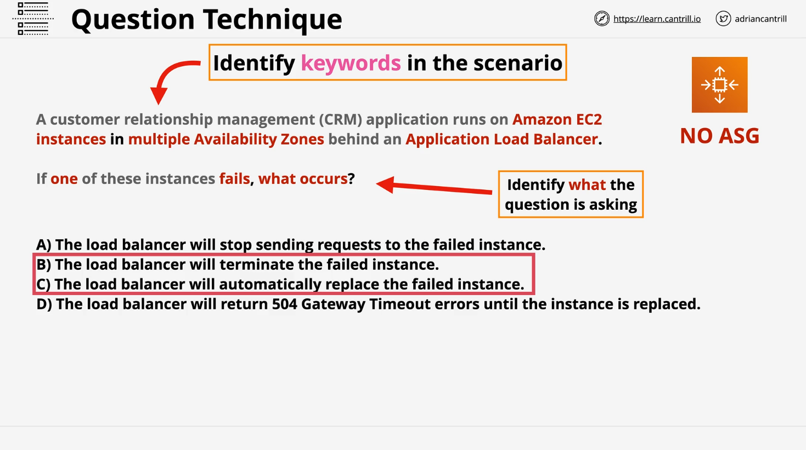
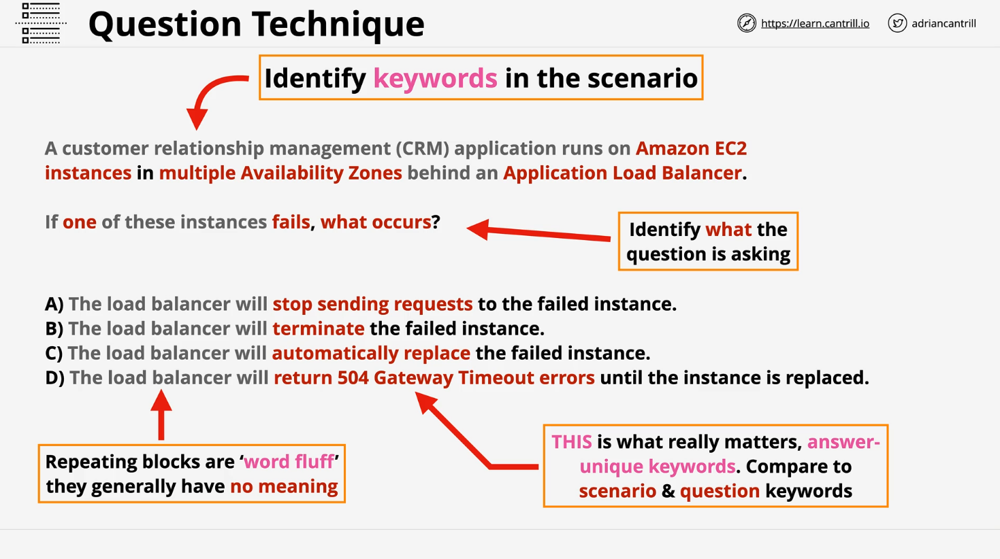

# Exam Question Strategy

## Overview

This lesson focuses on effective techniques for answering individual exam questions in the AWS Certified Solutions Architect - Associate (SAA-C03) exam. It builds on the previous lesson on general exam technique by zeroing in on **how to read, evaluate, and answer questions efficiently**.

## Understanding the Question Structure

AWS exam questions generally follow a standard structure:

- **Preamble**: A scenario is presented (e.g., a photo-sharing app).
- **Question**: The actual query follows the scenario.
- **Answer Choices**: Typically 4–5 options.
  - **Multiple Choice**: Select one correct answer.
  - **Multi-Select**: Select multiple correct answers (usually 2 or 3).

> Note: "Choose all that apply" is rare at the Associate level and more common in Professional-level exams.

## Strategy for Tackling Questions

### 1. **Skip Irrelevant Details in the Preamble**

- Focus on **keywords and core concepts**.
- Ignore scenario-specific fluff like company names or unnecessary background.

### 2. **Answer Elimination First**

- Look for **obviously incorrect answers** to reduce mental load.
- If you can exclude even one or two options early, it makes analysis faster and more accurate.

> Example: Identify options that reference AWS services or features that clearly don't fit or are misused.

### 3. **Understand Themes or Constraints**

Questions often revolve around one of the following:

#### Cost

- Keywords: “cost-effective”, “budget”, “cost-conscious”.
- Choose cheaper option if functionality is equivalent.

#### Best Practice

- Means: **Do what AWS recommends**.
- Example: Use **EC2 instance roles** over manually assigning IAM credentials.

#### Performance

- Focus on **speed or throughput**.
- Example: Choose **Direct Connect** over **VPN** for higher performance.

#### Time Constraints

- Example: If you only have **one week**, eliminate options like Direct Connect (which takes longer to set up).

## Example Question Walkthrough

### Step-by-Step Approach

#### 1. **Initial Elimination**

Check if any options can be eliminated without even reading the question.

#### 2. **Identify Key Preamble Details**

Highlight meaningful details:

- Is it using EC2?
- Is there an **Application Load Balancer**?
- Are there **multiple Availability Zones**?

> Example insight: If **auto scaling groups (ASG)** are **not mentioned**, they likely aren’t used, and functionality tied to ASGs (like auto-replacement of failed instances) doesn’t apply.

#### 3. **Determine the True Focus of the Question**

Check what **exactly** is being asked:

- “What happens if **one instance fails**?”

Look for **quantifiers** like:

- "One", "Any", "All", "Multiple"

This changes how the answer is interpreted.

#### 4. **Reevaluate Answer Options**

Evaluate answers based on key concepts and context.

> Example keywords:
>
> - `stop sending requests` (valid behavior for Load Balancer)
> - `terminate` or `replace` (requires auto scaling group)

#### 5. **Use "Word Fluff" Technique**

Ignore repeated phrases in all answers:

- Often, answer choices start or end the same way.
- If all answers share a phrase, ignore it—it doesn’t help distinguish between options.

#### 6. **Focus on Action Keywords**

Identify **verbs** or actions that indicate what’s happening:

- “Terminate”
- “Replace”
- “Return 504”
- “Stop sending requests”

Evaluate these against:

- What is configured (ALB yes, ASG no)
- What AWS actually does

## Final Analysis

In the sample question:

### Given:

- Multiple EC2 instances
- Application Load Balancer
- **No Auto Scaling Group**

### Question:

What happens if **one EC2 instance fails**?

### Valid Reasoning:

- **No auto scaling group** = No termination or replacement
- ALB simply **stops sending requests** to unhealthy instance
- It **won’t return a 504 error** because other instances are still healthy

### Elimination:

- **B & C** (terminate/replace) – INVALID (require ASG)
- **D** (504 error) – INVALID (would only happen if **all** instances fail)
- **A** (stop sending requests) – CORRECT

## Conclusion

By methodically breaking down questions:

- Skipping fluff
- Identifying keywords
- Matching action verbs to AWS services
- Eliminating impossible options early

...you can **save time**, **reduce errors**, and **increase confidence** in selecting the right answers, especially under exam pressure.
