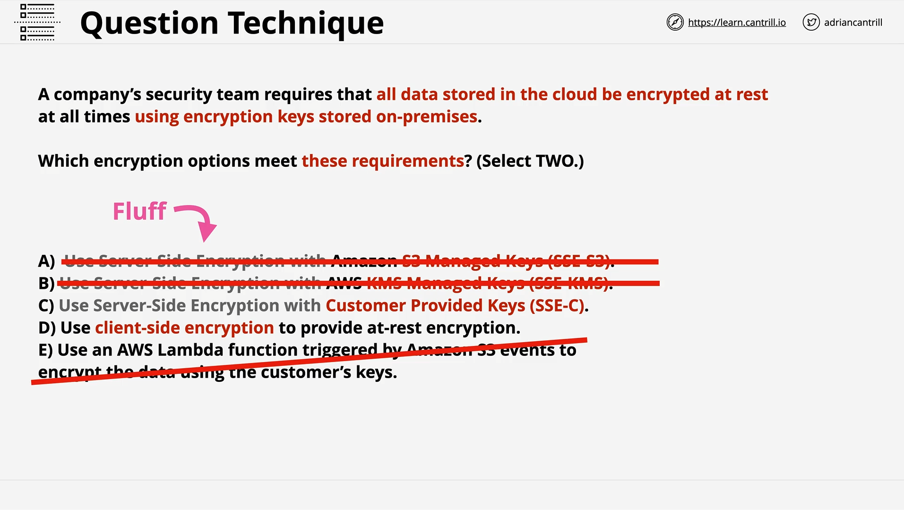

# Exam Technique & Encryption Question Walkthrough

## Lesson Summary (Part 2)

This lesson continues the strategy for tackling AWS certification exam questions effectively, especially multi-select questions. It walks through a specific encryption-based question to illustrate the step-by-step process used to find the correct answers.

## Exam Strategy Review



### 1. Follow a Consistent Process

- Start by eliminating obviously wrong answers.
- Identify what the question is truly asking (highlight keywords).
- Filter out fluff—irrelevant words or phrases that don't add technical value.
- Compare answer choices against _ALL_ requirements in the question.

### 2. Example Question Breakdown

**Question Requirements:**

- **Encrypt data at rest**
- **Store encryption keys on-premises**

### 3. Analyzing Answer Choices

The key concept is understanding the difference between types of encryption and where the encryption keys are stored.

#### Types of Encryption Mentioned:

| Encryption Type                | AWS Service Term                                   | Who Manages Keys? | Keys On-Premises? | Valid? |
| ------------------------------ | -------------------------------------------------- | ----------------- | ----------------- | ------ |
| SSE-S3                         | Server-Side Encryption with S3 Managed Keys        | AWS               | No                | No     |
| SSE-KMS                        | Server-Side Encryption with KMS Managed Keys       | AWS (via KMS)     | No                | No     |
| SSE-C                          | Server-Side Encryption with Customer-Provided Keys | Customer          | Yes               | Yes    |
| Client-Side                    | Encryption Done Before Uploading to AWS            | Customer          | Yes               | Yes    |
| Lambda + Encryption (Answer E) | Vague Context                                      | Unclear           | ?                 | No     |

### 4. Correct Answer Justification

- **Answer C (SSE-C):**
  S3 encrypts data using keys provided by the customer. This meets both conditions:

  - Data is encrypted at rest.
  - Keys are managed and stored by the customer (i.e., potentially on-premises).

- **Answer D (Client-Side Encryption):**
  Data is encrypted _before_ it reaches S3, and the encrypted data is uploaded. The customer retains full control over the keys.

**Correct Answers: C and D**

## Encryption Types: Explained

### SSE-S3 (Server-Side Encryption with Amazon S3 Managed Keys)

```text
S3 handles encryption and key management entirely.
```

- Encryption happens on the server side.
- AWS manages the encryption keys.
- Not suitable when keys must be stored on-premises.

### SSE-KMS (Server-Side Encryption with AWS KMS)

```text
S3 uses AWS KMS for encryption key management.
```

- Slightly more control than SSE-S3.
- Keys are still managed by AWS, not stored on-premises.

### SSE-C (Server-Side Encryption with Customer-Provided Keys)

```text
You provide your encryption key in the request headers.
S3 uses that key to encrypt your data, then discards it.
```

- Full control over keys.
- Suitable when keys must remain on-premises.

### Client-Side Encryption

```python
# Pseudocode-style explanation
key = generate_customer_key()
data = encrypt_locally(data, key)
upload_to_s3(data)
```

**Explanation:**

- The data is encrypted _before_ being uploaded to S3.
- AWS never sees the unencrypted data or the key.
- Most secure from a customer control perspective.

## Final Strategy Tips

- Eliminate immediately invalid answers first.
- Match **keywords** in the question to keywords in answers.
- Look for:

  - Cost implications
  - Performance limitations
  - Time sensitivity
  - Violations of AWS best practices

**Pro Tip:** You’re either:

- Identifying the correct answers, or
- Eliminating wrong answers
  Stick to the one that works best for you.

## Stay Calm Under Pressure

- Time management is critical.
- Most candidates fail due to poor **exam technique**, not lack of technical skill.
- Save difficult questions for later.
- Use the logical elimination process under time constraints.

## Conclusion

- This lesson reinforced **practical test-taking techniques** using a real encryption-based example.
- The core approach is to **analyze, eliminate, and validate**.
- Practice is key to mastering these strategies.
